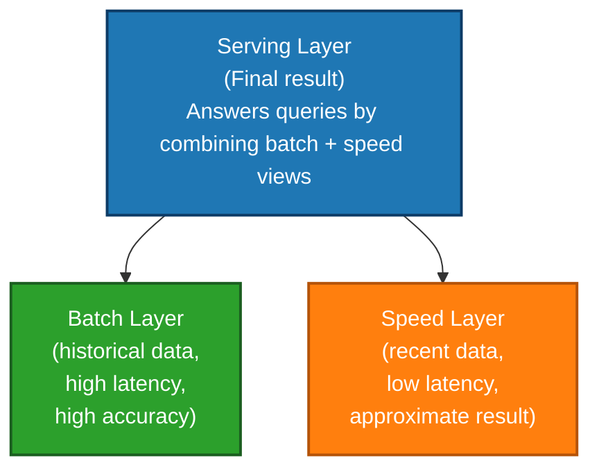
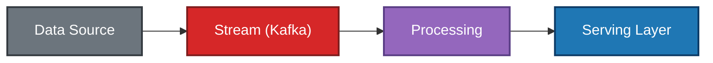
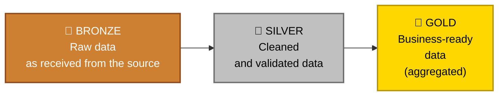
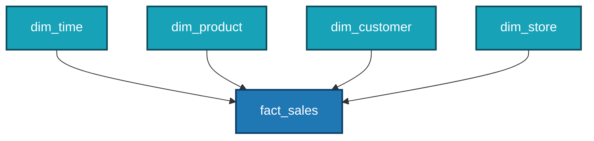
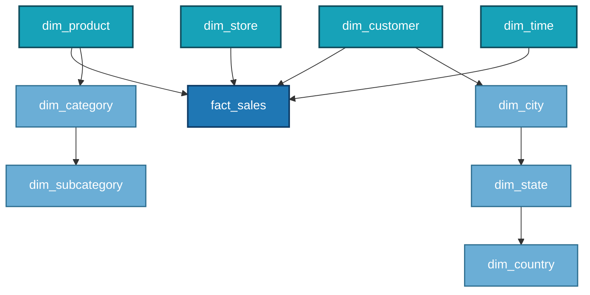
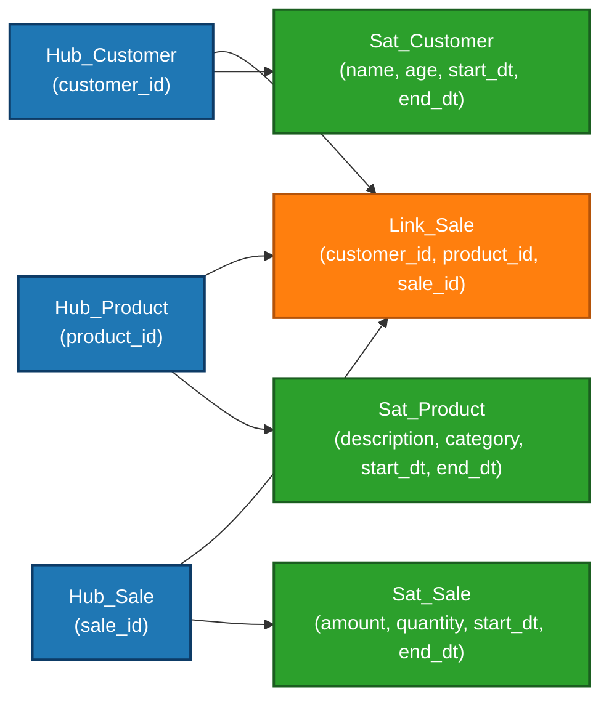
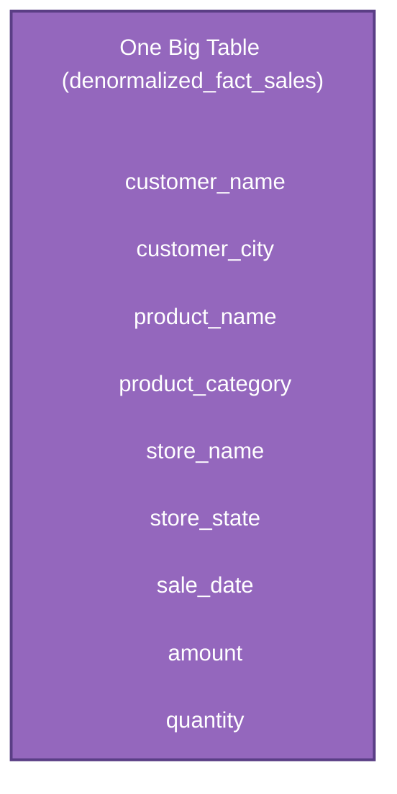

# Data Architecture

> *"Architecture is the silent foundation that determines whether a data system scales gracefully or collapses under pressure."*

← [Back to index](./0-data-engineering.md)

## What Is Data Architecture?

Data Architecture is the set of **decisions, patterns, and models** that define how data is collected, stored, transformed, integrated, and consumed within an organization.

It answers fundamental questions such as:
- Where will the data live?
- How will it get there?
- Who will access it, and in what way?
- How does the system behave when volume grows 10x?

Good architecture is **invisible when it works** and catastrophic when it fails. It anticipates future needs without over-engineering the present.

## Why Architecture Matters

Poor architectural choices are expensive and difficult to reverse. Migrating a poorly designed Data Warehouse years later costs time, money, and credibility. On the other hand, a well-designed architecture:

- Reduces rework and technical debt
- Enables horizontal scalability
- Allows different teams to consume data independently
- Guarantees traceability and governance from the start

## Foundational Components

Before exploring architectural patterns, it is important to understand the building blocks that make up any data architecture:

### Data Sources
Where the data originates. They can be:
- **Transactional systems (OLTP):** relational databases used by applications (PostgreSQL, MySQL, Oracle)
- **External APIs:** third-party services, social networks, market data
- **Files:** CSVs, JSONs, XMLs, Parquet
- **Events and streams:** application logs, clickstream, IoT
- **Unstructured data:** images, audio, documents

### Ingestion Layer
Responsible for moving data from source systems to the centralized environment. It can be batch or streaming. Detailed in [Data Ingestion](./5-data-ingestion.md).

### Storage Layer
Where data persists. Choosing the storage type is one of the most critical architectural decisions. Detailed in [Data Storage](./7-data-storage.md).

### Processing and Transformation Layer
Where raw data is cleaned, enriched, and transformed into useful information. Detailed in [Data Processing](./8-data-processing.md).

### Consumption Layer
Where data reaches the end user: dashboards, reports, APIs, ML models, applications.

## Architectural Patterns

### 🏛️ Data Warehouse

The most traditional model. A Data Warehouse (DW) is a centralized and structured repository optimized for **analytical queries (OLAP)**. Data arrives already transformed and modeled, ready for consumption by BI tools.

**Characteristics:**
- Schema defined before loading (*schema-on-write*)
- Structured and modeled data (for example: Star Schema, Snowflake Schema)
- High performance for analytical queries
- Easier governance and quality assurance

**When to use:** when use cases are well defined, data is mostly structured, and the team prioritizes reliability and query performance.

**Tools:** Snowflake, Google BigQuery, Amazon Redshift, Azure Synapse.

**Limitation:** not very flexible for unstructured data and ad hoc exploration. Schema changes can be expensive.

### 🏞️ Data Lake

A centralized repository that stores data **in its raw and original format**, structured or not, at large scale and low cost. Transformation happens only when the data is consumed (*schema-on-read*).

**Characteristics:**
- Stores any type of data (JSON, Parquet, images, videos, logs)
- Much lower storage cost (object storage: S3, GCS, ADLS)
- Full flexibility for exploration and experimentation
- Nearly unlimited scalability

**When to use:** when volume is massive, use cases are varied or still unknown, and there is a need for raw data for data science and ML.

**Tools:** AWS S3 + Glue, Google Cloud Storage + Dataproc, Azure Data Lake Storage.

**Limitation:** without strict governance and organization, it can turn into a *Data Swamp* — a disorganized environment that is difficult or impossible to use effectively.

### 🏠 Data Lakehouse

A hybrid architecture that combines the **flexibility of the Data Lake** with the **structure and performance of the Data Warehouse**. It emerged to solve the limitations of both.

**Characteristics:**
- Data stored in object storage (cheap and scalable)
- Transactional layer on top of files (support for ACID, updates, deletes)
- Support for SQL, streaming, and ML workloads on the same platform
- Optional schema enforcement (flexible, but governance is still possible)

**When to use:** it is the preferred modern pattern for most new architectures, especially when you want to unify analytics and ML on a single platform.

**Open-source table formats:** Delta Lake, Apache Iceberg, Apache Hudi.

**Platforms:** Databricks, Apache Spark + Delta Lake, Dremio.

### ⚡ Lambda Architecture

Proposed by Nathan Marz, Lambda Architecture solves the challenge of processing **large volumes of historical data** and **real-time data** at the same time while maintaining consistency.

It is divided into three layers:

**Limitation:** it keeps **two processing systems running in parallel** (batch and streaming), which doubles development and maintenance complexity.

### 🌊 Kappa Architecture

Proposed by Jay Kreps (creator of Kafka) as a simplification of Lambda. The core idea is: **everything is a stream**. Historical and real-time data are treated the same way, using only a streaming processing layer.

**Advantages:** lower operational complexity, a single code path to maintain.

**Limitation:** reprocessing large historical volumes through streaming can be expensive and slow. It does not always replace batch well for heavy workloads.

### 🥇 Medallion Architecture (Bronze / Silver / Gold)

Popularized by Databricks with Delta Lake, this is a pattern for organizing data into **progressive quality layers**, widely adopted in Lakehouse implementations.

| Layer | Also called | Characteristic |
|--------|-------------------|----------------|
| Bronze | Raw / Landing Zone | Raw data with little or no transformation, exactly as it came from the source |
| Silver | Cleansed / Refined | Cleaned, deduplicated, validated data, with schema applied |
| Gold | Curated / Aggregated | Data modeled for specific use cases (metrics, KPIs, ML features) |

**Advantages:**
- Full traceability (it is always possible to go back to the raw data)
- Clear separation of responsibilities
- Easier reprocessing
- Natural progression of quality

### 🕸️ Data Mesh

A more recent architectural and organizational approach, proposed by Zhamak Dehghani. Instead of a centralized platform, Data Mesh distributes **responsibility for data to the business domains** that produce it.

**Four principles:**
1. **Domain-oriented ownership:** each business team owns its own data
2. **Data as a product:** each domain exposes its data as a product with SLA and documentation
3. **Self-service infrastructure:** a shared platform that makes it easier for domains to publish data
4. **Federated governance:** global policies with local execution

**When to consider it:** large organizations with multiple business domains, where the centralized model creates bottlenecks and excessive dependency on a single data team.

**Limitation:** requires high organizational maturity. It is not just a technical solution — it is a cultural and structural change.

## How to Choose an Architecture?

There is no universally correct architecture. The choice depends on:

| Factor | Questions to answer |
|-------|-----------------------|
| **Volume** | Gigabytes or Petabytes? Expected growth? |
| **Velocity** | Is batch enough or is real time required? |
| **Variety** | Structured, semi-structured, unstructured data? |
| **Team** | Team size, technical maturity, ability to maintain complexity? |
| **Use cases** | BI and reporting? ML? Real-time applications? |
| **Budget** | Storage cost, processing cost, managed tool cost? |
| **Regulation** | LGPD, GDPR, data residency requirements? |

**General principle:** start simple. A modern Data Warehouse such as BigQuery or Snowflake solves 80% of use cases. Add complexity only when there is a real and proven need.

## Data Modeling Patterns

How data is organized within storage is also part of the architecture.

For a complete view of conceptual, logical, and physical levels, see also [Data Modeling](./2-data-modeling.md).

### Star Schema
The most common model in Data Warehouses. It has a **central fact table** (metrics and events) connected to **dimension tables** (context: time, product, customer, etc.).

### Snowflake Schema
A variation of Star Schema where dimensions are **normalized** into subdimensions. It reduces redundancy, but increases query complexity.

### Data Vault
A model focused on **auditability and historical traceability**. It is composed of Hubs (business entities), Links (relationships), and Satellites (attributes and history). It is ideal for environments with many sources and high traceability requirements.

### One Big Table (OBT)
A denormalized model where everything is consolidated into a single wide table. It is simple to query, but can be costly in storage and difficult to maintain.

## Current Trends

- **Open Table Formats:** Apache Iceberg is becoming the dominant standard, with growing support from all major cloud providers.
- **Storage and compute separation:** platforms like Snowflake and BigQuery popularized this model, and it is now the default.
- **Streaming-first:** with tools such as Kafka, Flink, and Spark Structured Streaming, event-driven architectures are becoming more accessible.
- **Semantic Layer:** semantic layers (for example: dbt Semantic Layer, Cube) centralize metric definitions, reducing inconsistencies across consumption tools.

## References

- **Fundamentals of Data Engineering** — Joe Reis & Matt Housley (O'Reilly)
- **Designing Data-Intensive Applications** — Martin Kleppmann (O'Reilly)
- [Data Mesh Principles — martinfowler.com](https://martinfowler.com/articles/data-mesh-principles.html)
- [What is a Lakehouse? — Databricks](https://www.databricks.com/glossary/data-lakehouse)
- [Apache Iceberg docs](https://iceberg.apache.org/docs/latest/)

← [Back to index](./0-data-engineering.md) · [Data Modeling →](./2-data-modeling.md)

*Documentation in progress · Personal portfolio*
