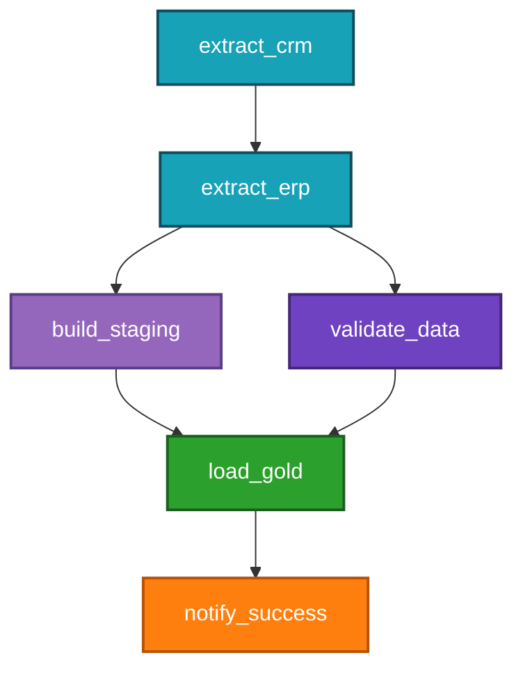

# Data Orchestration

> *"Without orchestration, pipelines are just scripts you hope will run in the correct order."*

← [Back to index](./0-data-engineering.md)


## What Is Orchestration?

Orchestration is the **automated management of execution, scheduling, monitoring, and failure recovery** for data pipelines.

As the number of pipelines grows, coordinating them manually becomes impractical. Orchestration answers questions such as:
- In what order should tasks run?
- What happens if a task fails?
- How do we ensure that Task B runs only after Task A succeeds?
- How do we reprocess only the executions that failed?
- Who should be alerted when something goes wrong?


## DAG — Directed Acyclic Graph

The central concept of modern orchestration is the **DAG (Directed Acyclic Graph)**.

- **Graph:** a set of nodes (tasks) connected by edges (dependencies)
- **Directed:** dependencies have direction (A → B means B depends on A)
- **Acyclic:** there are no cycles — no task can depend on itself, directly or indirectly



The orchestrator guarantees that each node is executed only after all of its predecessor nodes complete successfully.


## Fundamental Concepts

### Task / Operator
The basic unit of a DAG. A task represents an atomic action: running a Python script, executing a SQL query, calling an API, triggering a Spark job, and so on.

### Run / DAG Run
A complete execution of the DAG for a given time interval (execution date). It is possible to have multiple simultaneous runs or a history of previous runs.

### Schedule
Defines when the DAG should run. It can be based on:
- **Cron expression:** `0 2 * * *` (every day at 02:00)
- **Interval:** `@daily`, `@hourly`, `@weekly`
- **Event:** triggered by file arrival, sensor, API call

### Execution Date (Logical Date)
In Airflow and similar tools, the execution date is the **time interval represented by the run**, not necessarily the moment when it actually ran. A run for 2024-01-15 may execute at 02:00 on the 16th, but it represents the data for the 15th. This concept is crucial for backfills.

### Backfill
Retroactive execution of a DAG for past dates. Essential to:
- Populate a new table with historical data
- Reprocess after a bug fix
- Rerun after a logic change

### Sensor
A special type of task that **waits for a condition to be satisfied** before proceeding. Examples: waiting for a file in S3, waiting for a table update, waiting for a specific time.

### Retry and Retry Delay
Configuration that defines how many times a task should be retried in case of failure, and how long to wait between attempts.

### SLA
Maximum acceptable time for a task or DAG to complete. If exceeded, the orchestrator triggers alerts.

### Timeout
Maximum time a task can run before being automatically cancelled.


## Orchestration Tools

### 🌬️ Apache Airflow
The most popular and widely adopted orchestrator in the industry. DAGs are defined as Python code, which provides great flexibility.

**Characteristics:**
- DAGs defined in pure Python
- Rich web UI for monitoring and debugging
- Large provider ecosystem (AWS, GCP, dbt, Spark, and so on)
- Huge and well-documented community
- Moderate learning curve

**Managed versions:** Astronomer, Amazon MWAA, Google Cloud Composer.

**Example DAG:**
```python
from airflow import DAG
from airflow.operators.python import PythonOperator
from airflow.providers.dbt.cloud.operators.dbt import DbtCloudRunJobOperator
from datetime import datetime, timedelta

default_args = {
    "owner": "data-engineering",
    "retries": 2,
    "retry_delay": timedelta(minutes=5),
    "email_on_failure": True,
    "email": ["data-team@company.com"],
}

with DAG(
    dag_id="daily_sales_pipeline",
    default_args=default_args,
    schedule_interval="0 2 * * *",  # every day at 02:00
    start_date=datetime(2024, 1, 1),
    catchup=False,
    tags=["sales", "production"],
) as dag:

    extract_data = PythonOperator(
        task_id="extract_crm_data",
        python_callable=extract_crm,
    )

    validate_data = PythonOperator(
        task_id="validate_data",
        python_callable=validate_with_great_expectations,
    )

    transform_dbt = DbtCloudRunJobOperator(
        task_id="run_dbt",
        job_id=12345,
    )

    extract_data >> validate_data >> transform_dbt
```


### 🌊 Prefect
Modern orchestrator focused on developer experience and ease of use. Less verbose than Airflow.

**Characteristics:**
- Simpler and more intuitive Python API
- Flexible deployments (local, cloud, Kubernetes)
- Prefect Cloud for managed monitoring
- Better support for dynamic and parameterized flows
- Easier local testing

**Example:**
```python
from prefect import flow, task
from prefect.tasks import task_input_hash
from datetime import timedelta

@task(cache_key_fn=task_input_hash, cache_expiration=timedelta(hours=1))
def extract_data(start_date: str) -> list:
    # data extraction
    return data

@task(retries=3, retry_delay_seconds=60)
def transform(data: list) -> None:
    # transformation
    pass

@flow(name="sales-pipeline")
def sales_pipeline(start_date: str = "2024-01-01"):
    data = extract_data(start_date)
    transform(data)

if __name__ == "__main__":
    sales_pipeline()
```


### 🌟 Dagster
Orchestrator focused on **data assets** instead of tasks. Instead of thinking about "what to run," you think about "which data to produce." Excellent integration with dbt and native observability.

**Characteristics:**
- Asset-centric paradigm (Software-Defined Assets)
- Type system for inputs and outputs
- Native observability and lineage
- Deep integration with dbt, Spark, Airbyte
- Modern web interface

**When to prefer it:** teams that want observability and governance from the start, or new projects without Airflow legacy.


### ⚡ Mage
Newer orchestrator with visual interface + code. Focused on productivity and onboarding ease.

**When to prefer it:** smaller teams, rapid prototyping, or those who want a more visual experience.


## Tool Comparison

| Criterion | Airflow | Prefect | Dagster | Mage |
|----------|---------|---------|---------|------|
| Popularity | ⭐⭐⭐⭐⭐ | ⭐⭐⭐⭐ | ⭐⭐⭐ | ⭐⭐ |
| Learning curve | High | Medium | Medium | Low |
| Paradigm | Task-centric | Flow-centric | Asset-centric | Visual + code |
| Observability | Basic | Good | Excellent | Good |
| Ecosystem | Huge | Growing | Growing | Small |
| Self-hosted | Yes | Yes | Yes | Yes |
| Managed cloud | Astronomer, MWAA | Prefect Cloud | Dagster Cloud | Mage Cloud |


## Orchestration Patterns

### Sequential Dependencies
```text
task_a >> task_b >> task_c
```

### Parallel Dependencies
```text
task_a >> [task_b, task_c] >> task_d
```

### Cross-DAG Dependencies
One DAG waits for another DAG to complete before starting. Useful for separating responsibilities between pipelines.

### Sensor Pattern
A task polls while waiting for an external condition:
```text
wait_for_s3_file >> process_file >> notify
```

### Dynamic Tasks
Tasks generated at runtime based on the data. For example: creating one task per file found in a directory, without knowing beforehand how many files will exist.


## Monitoring and Alerts

An efficient orchestrator must proactively notify when something goes out of expected behavior:

**Types of alert:**
- Task failed after N retries
- DAG did not start at the expected time
- Execution time exceeded the SLA
- Data was not updated within the expected window (data freshness)

**Common channels:** Slack, email, PagerDuty, OpsGenie.

**Metrics to monitor:**
- DAG and task success rate
- Average execution time per DAG
- Number of retries per period
- Backlog of tasks waiting for execution (queue depth)


## Best Practices

**Atomic DAGs:** each DAG has one clear and well-defined responsibility. Avoid mega-DAGs with dozens of mixed responsibilities.

**Idempotency in all tasks:** every task must be safely re-runnable without side effects. See [Data Pipelines](./10-data-pipelines.md).

**Parameters, not hard-codes:** dates, environments, and configurations should be parameterized, not embedded in code.

**Use catchup carefully:** when enabling a DAG with `catchup=True` and an old `start_date`, Airflow will create runs for all past intervals. This can overload the environment.

**Version your DAGs:** use Git for all orchestration code. Never edit DAGs directly in production.

**Separate environments:** keep development and production DAGs in isolated environments, with different data and credentials.

**Document:** add descriptions and tags to DAGs to make them easier to discover and understand.


## References

- [Apache Airflow Documentation](https://airflow.apache.org/docs/)
- [Prefect Documentation](https://docs.prefect.io/)
- [Dagster Documentation](https://docs.dagster.io/)
- **Data Pipelines Pocket Reference** — James Densmore (O'Reilly)
- [Awesome Apache Airflow (GitHub)](https://github.com/jghoman/awesome-apache-airflow)


← [Data Pipelines](./10-data-pipelines.md) · [Back to index](./0-data-engineering.md) · [DataOps and CI/CD →](./12-dataops-and-cicd.md)


*Documentation in progress · Personal portfolio*
