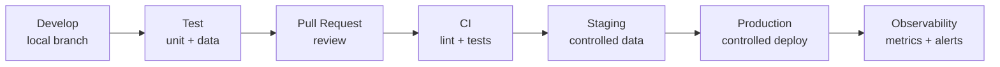

# DataOps and CI/CD for Data

> *"DataOps applies engineering discipline to the data lifecycle: version, test, publish, observe, and continuously improve."*

← [Back to index](./0-data-engineering.md)


## What Is DataOps?

DataOps is the set of practices that brings DevOps, software engineering, automation, and observability principles to pipelines, models, jobs, and data products.

The goal is to reduce manual failures, increase reliability, and allow frequent changes safely.

DataOps connects:

- Git and code review.
- Automated tests.
- CI/CD.
- Separate environments.
- Controlled deployment.
- Observability.
- Governance.
- Reprocessing and rollback.


## Why DataOps Matters

Data pipelines change frequently: sources alter schemas, business rules evolve, tables grow, consumers request new metrics, and platforms change. Without process, every change becomes risk.

**DataOps helps answer:**

- Who changed this pipeline?
- What changed between versions?
- Did tests pass before deployment?
- How do we promote from development to production?
- How do we return to a previous version?
- How do we audit a run?
- How do we know whether a deployment broke downstream data?


## Change Lifecycle




## Repository Structure

A common structure separates code, configuration, tests, and documentation.

```text
data-platform/
|-- dags/
|-- dbt/
|   |-- models/
|   |-- tests/
|   `-- macros/
|-- spark/
|   |-- jobs/
|   `-- tests/
|-- sql/
|-- infra/
|   |-- terraform/
|   `-- docker/
|-- config/
|   |-- dev.yml
|   |-- staging.yml
|   `-- prod.yml
`-- docs/
```

**Best practices:**

- Code versioned in Git.
- Environment configuration separated from code.
- Tests close to the code they validate.
- Documentation maintained with the implementation.
- No secrets stored in the repository.


## Environments

| Environment | Goal |
|---|---|
| Development | Build and test locally or in isolation |
| Staging | Validate with representative data and controlled permissions |
| Production | Official execution, with SLAs, alerts, and governance |

**Separate environments avoid:**

- Tests writing to production tables.
- Production credentials in local notebooks.
- Unreviewed changes affecting final consumers.
- Unexpected costs from experimental jobs.


## CI for Data Projects

CI (Continuous Integration) automatically validates each change before merge.

**Common validations:**

- Python, SQL, YAML, and Terraform linting.
- Unit tests.
- dbt tests.
- Airflow DAG validation.
- Schema checks.
- Query dry runs.
- Documentation checks.
- Formatting checks.

**Conceptual CI pipeline example:**

```yaml
name: data-ci

on:
  pull_request:

jobs:
  validate:
    runs-on: ubuntu-latest
    steps:
      - uses: actions/checkout@v4
      - name: Run tests
        run: |
          python -m pytest
          dbt deps
          dbt parse
          dbt test --select state:modified+
```


## CD for Data Projects

CD (Continuous Delivery/Deployment) promotes artifacts between environments with control.

**What can be deployed:**

- Airflow DAGs.
- Spark jobs.
- dbt projects.
- Versioned notebooks.
- Terraform infrastructure.
- Table configurations.
- Data contracts.

**Deployment patterns:**

| Pattern | Use |
|---|---|
| Branch-based deploy | Environments follow specific branches |
| Tag-based deploy | Production receives marked versions |
| Artifact-based deploy | CI-generated packages are promoted |
| Blue/green | New version runs in parallel before cutover |
| Canary | A small part of the workload uses the new version first |


## Data Testing

Data projects need more than one type of test.

| Test type | Example |
|---|---|
| Unit | Test a function that normalizes an ID or calculates a metric |
| Integration | Read fake source and write temporary destination |
| Schema | Required field exists with correct type |
| Quality | `total_amount >= 0`, `customer_id not null` |
| Regression | Metric did not change unexpectedly |
| Volume | Today's rows did not drop 90% without explanation |
| Freshness | Table was updated within SLA |

**Principle:** the closer to production, the more tests should validate real data behavior, not only syntax.


## Versioning

| Item | How to version |
|---|---|
| Code | Git, tags, releases |
| SQL queries | Versioned files, dbt models |
| Schemas | Data contracts, schema registry, migrations |
| Infrastructure | Terraform, Pulumi, CloudFormation |
| Configuration | Environment files, controlled variables |
| Data | Snapshots, table formats, time travel |
| ML models | Registry, artifact version, metrics |


## Configuration and Secrets

Configuration should be external to code and different by environment. Secrets should live in proper secret managers.

**Best practices:**

- Use environment variables for parameters.
- Use Secret Manager, Vault, AWS Secrets Manager, Azure Key Vault, or similar tools.
- Never store tokens in versioned notebooks or YAML.
- Separate read and write credentials.
- Apply least privilege.


## Notebook Deployment

Notebooks are useful for exploration, but they can become risky when moved to production without control.

**Best practices:**

- Version notebooks or export logic to modules.
- Avoid critical manual cells.
- Parameterize inputs and outputs.
- Execute through scheduled workflows.
- Record dependencies.
- Separate exploration from production.


## Rollback and Recovery

Every deployment strategy must answer how to go back.

**Possibilities:**

- Revert commit.
- Redeploy previous tag.
- Restore table using time travel.
- Reprocess affected partitions.
- Disable DAG/job.
- Restore snapshot.
- Run corrected backfill.

Rollback in data can be harder than application rollback because incorrect data may have been consumed by reports, models, or downstream systems.


## Production Checklist

- Is the code versioned?
- Is there a pull request and review?
- Do tests run in CI?
- Are environments separated?
- Are secrets outside the repository?
- Is deployment reproducible?
- Is there a rollback plan?
- Do critical tables have quality tests?
- Do pipelines have alerts?
- Are owners and SLAs documented?
- Are schema changes controlled?
- Is pipeline cost monitored?


## References

- [DataOps Manifesto](https://www.dataopsmanifesto.org/)
- [dbt Tests](https://docs.getdbt.com/docs/build/data-tests)
- [Apache Airflow Best Practices](https://airflow.apache.org/docs/apache-airflow/stable/best-practices.html)
- [Great Expectations Documentation](https://docs.greatexpectations.io/)
- [Terraform Documentation](https://developer.hashicorp.com/terraform/docs)


← [Orchestration](./11-orchestration.md) · [Back to index](./0-data-engineering.md) · [Data Quality →](./13-data-quality.md)


*Documentation in progress · Personal portfolio*

