# Cloud Comparison for Data Engineering

> *"The best cloud is the one that solves your problem — not the one that is currently fashionable."*

← [Back to index](./0-data-engineering.md)


## Provider Overview

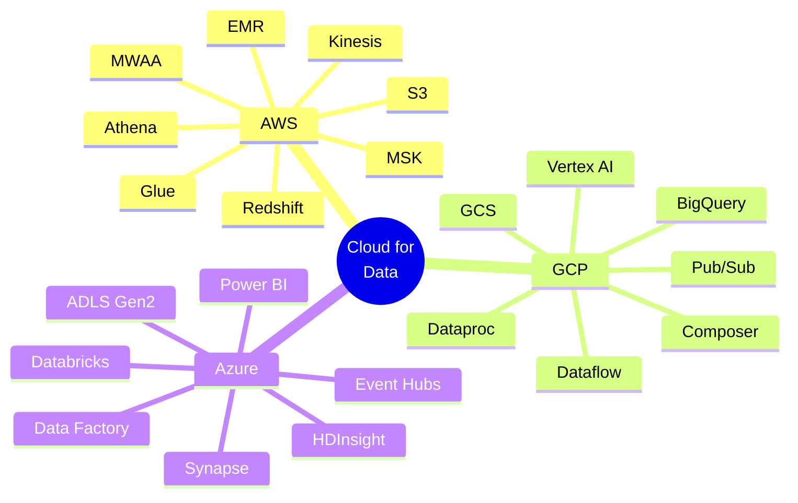


## Market Share and Positioning

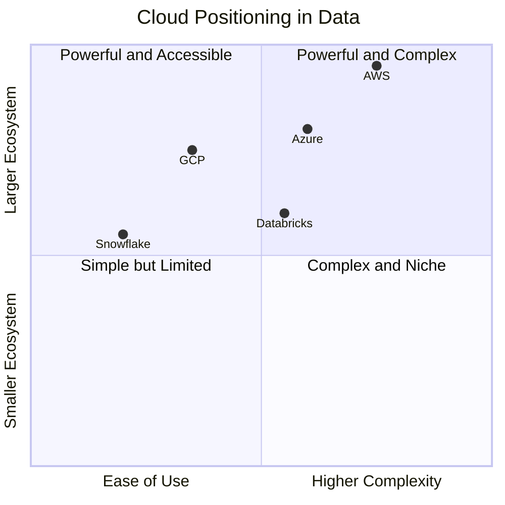

| Criterion | AWS | GCP | Azure |
|----------|-----|-----|-------|
| **Overall cloud market share** | ~33% | ~11% | ~22% |
| **Strength in data** | Full ecosystem | Analytics and ML | Enterprise and Microsoft |
| **Best data service** | S3 + Glue | BigQuery | Synapse + Power BI |
| **Learning curve** | High | Medium | Medium-High |
| **Microsoft integration** | Low | Low | Native |
| **Maturity** | ⭐⭐⭐⭐⭐ | ⭐⭐⭐⭐ | ⭐⭐⭐⭐ |


## Service Comparison by Category

### 🗄️ Object Storage (Data Lake)

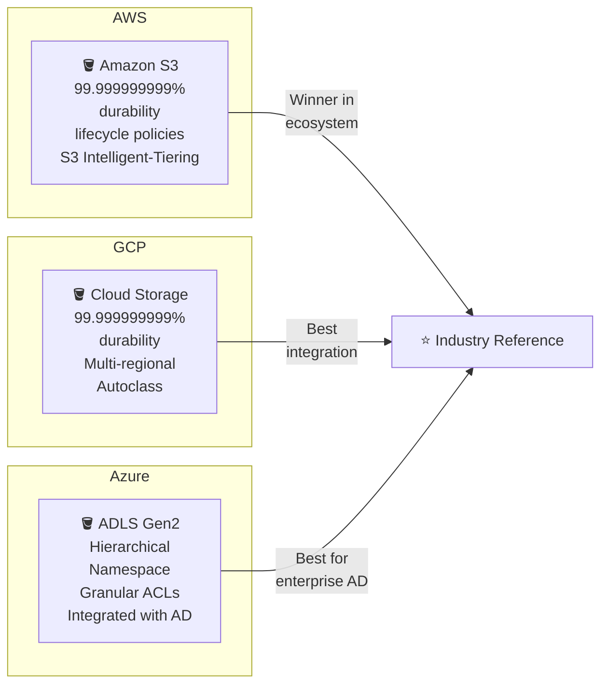

| Criterion | Amazon S3 | Google Cloud Storage | Azure Data Lake Gen2 |
|----------|-----------|----------------------|----------------------|
| **Durability** | 99.999999999% | 99.999999999% | 99.999999999% |
| **Availability** | 99.99% | 99.99% | 99.9% |
| **Storage cost (GB/month)** | ~$0.023 | ~$0.020 | ~$0.018 |
| **Storage tiers** | Standard, IA, Glacier, Deep Archive | Standard, Nearline, Coldline, Archive | Hot, Cool, Archive |
| **Access control** | IAM + Bucket Policies | IAM + ACLs | RBAC + hierarchical ACLs |
| **Versioning** | ✅ | ✅ | ✅ |
| **Event notifications** | SNS, SQS, Lambda | Pub/Sub, Cloud Functions | Event Grid, Functions |
| **Hierarchical namespace** | Emulated (prefixes) | Emulated (prefixes) | ✅ Native |
| **AD integration** | ❌ | ❌ | ✅ Azure AD |
| **Best for** | AWS ecosystem, reference | Cost-benefit, native GCP | Enterprise with AD |


### 📊 Data Warehouse (OLAP)

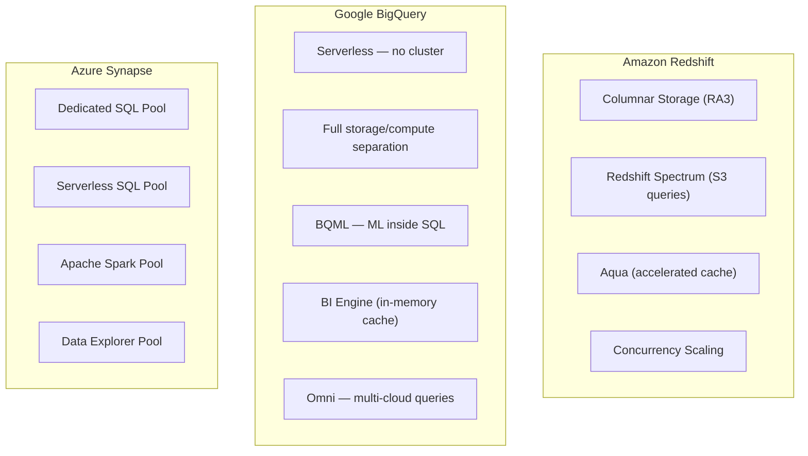

| Criterion | Amazon Redshift | Google BigQuery | Azure Synapse |
|----------|-----------------|-----------------|---------------|
| **Billing model** | Per cluster hour | Per TB scanned / slot | Per DWU or serverless |
| **Serverless** | ✅ Redshift Serverless | ✅ Native | ✅ Serverless SQL Pool |
| **Storage/compute separation** | ✅ RA3 nodes | ✅ Full | Partial |
| **Integrated ML support** | ❌ | ✅ BQML | ✅ via Synapse ML |
| **Out-of-the-box performance** | ⭐⭐⭐⭐ | ⭐⭐⭐⭐⭐ | ⭐⭐⭐ |
| **Ease of operation** | Medium | High | Medium |
| **Semi-structured data support** | Partial (SUPER type) | ✅ Native JSON | ✅ |
| **Concurrency** | Concurrency Scaling | Automatic | Workload Management |
| **Native BI integration** | QuickSight | Looker | Power BI |
| **Best for** | Heavy AWS workloads | Maximum-scale analytics | Microsoft enterprise |


### 🔄 Managed ETL / Ingestion

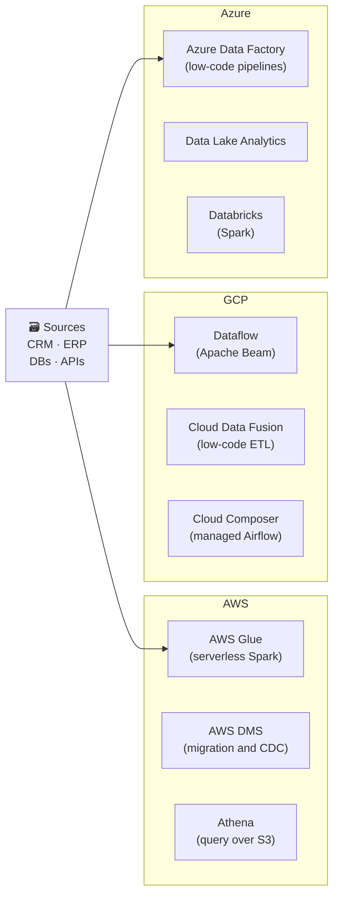

| Criterion | AWS Glue | GCP Dataflow | Azure Data Factory |
|----------|----------|--------------|--------------------|
| **Paradigm** | Serverless Spark | Apache Beam | Low-code + code |
| **Language** | Python, Scala | Python, Java | JSON + Python |
| **Learning curve** | Medium | High | Low |
| **Batch** | ✅ | ✅ | ✅ |
| **Streaming** | Limited | ✅ Native | ✅ via Event Hubs |
| **Integrated catalog** | ✅ Glue Data Catalog | ✅ Dataplex | ✅ Purview |
| **Native connector for other clouds** | Limited | Limited | ✅ via ADF |
| **Cost** | Per DPU-hour | Per vCPU-hour | Per activity |
| **Best for** | Spark workloads on AWS | Complex streaming | Enterprise integration |


### ⚡ Streaming and Messaging

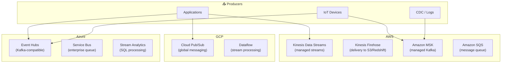

| Criterion | AWS Kinesis | AWS MSK (Kafka) | GCP Pub/Sub | Azure Event Hubs |
|----------|-------------|-----------------|-------------|-----------------|
| **Kafka compatibility** | ❌ | ✅ Full | ❌ | ✅ Partial |
| **Message retention** | 7-365 days | Configurable | 7 days (max 31) | 1-7 days |
| **Message replay** | ✅ | ✅ | Limited | ✅ |
| **Auto-scaling** | ✅ | Manual (brokers) | ✅ Automatic | ✅ Auto-inflate |
| **Operational overhead** | Low | Medium | Low | Low |
| **Cost** | Per shard/hour | Per broker/hour | Per GB | Per TU/hour |
| **Latency** | ~200ms | < 10ms | ~100ms | ~100ms |
| **Best for** | Simple AWS integration | Kafka-native apps | GCP serverless apps | Azure apps / Kafka compatibility |


### 🔥 Distributed Processing (Spark)

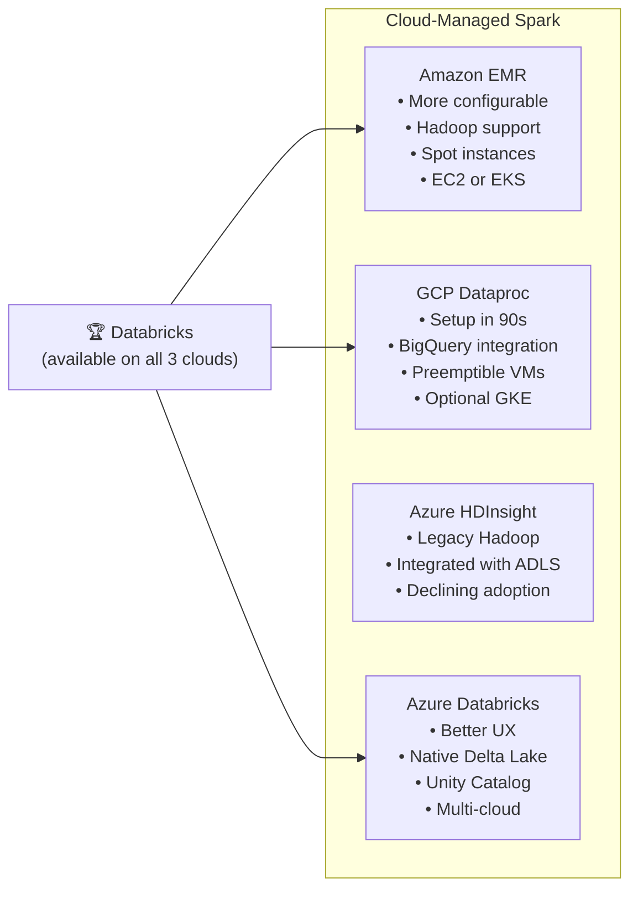

| Criterion | Amazon EMR | GCP Dataproc | Azure HDInsight | Databricks (all clouds) |
|----------|------------|--------------|-----------------|--------------------------|
| **Cluster startup time** | 5-10 min | ~90 seconds | 15-20 min | 2-5 min |
| **Ease of use** | Medium | High | Low | High |
| **Native Delta Lake** | Configurable | Configurable | Configurable | ✅ Full |
| **Integrated notebook** | EMR Studio | Dataproc Hub | Basic | ✅ Databricks Notebooks |
| **Auto-scaling** | ✅ | ✅ | Limited | ✅ |
| **Spot/preemptible instances** | ✅ | ✅ | ✅ | ✅ |
| **Serverless Spark** | ✅ EMR Serverless | ✅ Dataproc Serverless | ❌ | ✅ |
| **Multi-cloud** | ❌ | ❌ | ❌ | ✅ |
| **Best for** | AWS flexibility | Speed + GCP | Legacy | Modern Lakehouse |


### 🎼 Orchestration

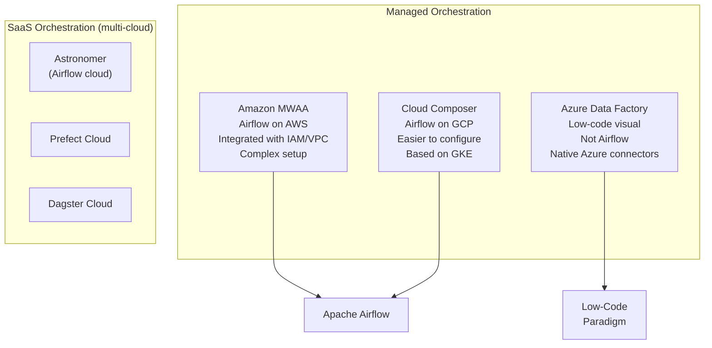

| Criterion | Amazon MWAA | GCP Cloud Composer | Azure Data Factory | Astronomer |
|----------|-----------|--------------------|-------------------|------------|
| **Based on Airflow** | ✅ | ✅ | ❌ (proprietary) | ✅ |
| **Ease of setup** | Low | Medium | High | High |
| **Base cost** | ~$0.49/hour | ~$0.37/hour | Per execution | Per task |
| **Scalability** | Auto | Auto (GKE) | Automatic | Auto |
| **Support for DAGs as code** | ✅ | ✅ | Partial (JSON) | ✅ |
| **Native cloud integration** | ✅ AWS | ✅ GCP | ✅ Azure | Multi-cloud |
| **Version upgrades** | Manual | Manual | Automatic | Automatic |
| **Best for** | Airflow on AWS | Airflow on GCP | Visual Azure integration | Multi-cloud Airflow |


## Architecture Comparison by Cloud

### Data Lake Architecture

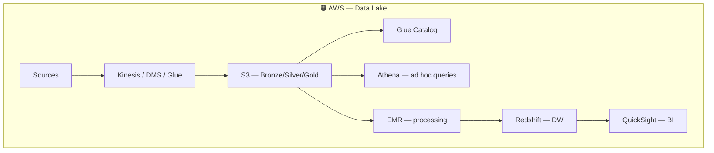

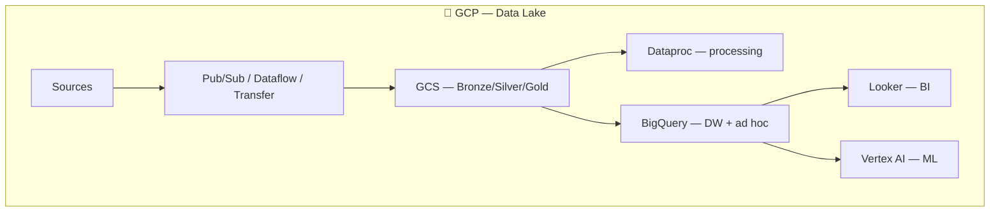

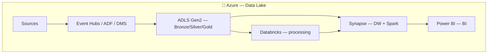


### Lakehouse Architecture

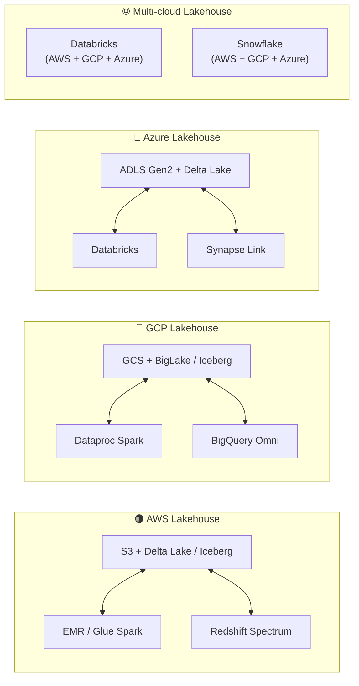


### Streaming Pipeline by Cloud

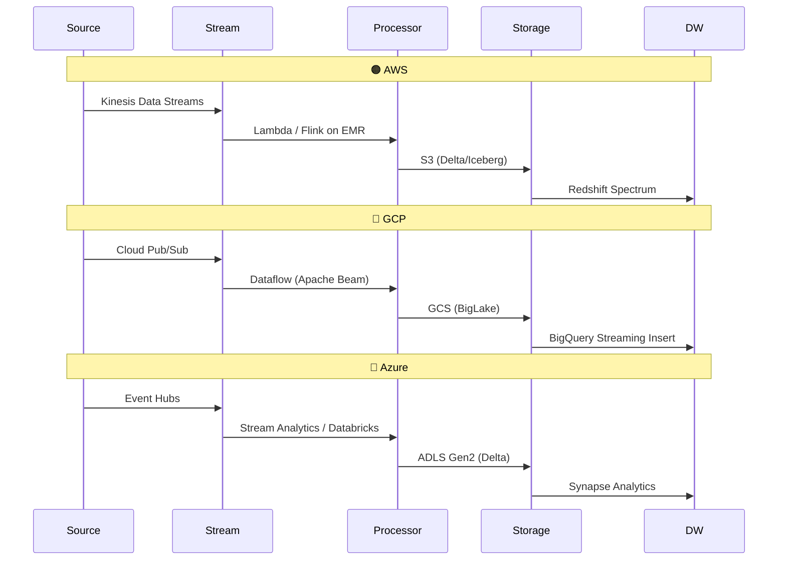


### Batch Pipeline by Cloud

```mermaid
gantt
    title Daily Batch Pipeline — Component Comparison
    dateFormat HH:mm
    axisFormat %H:%M

    section 🟠 AWS
    Extraction (DMS/Glue)         :a1, 02:00, 30m
    Processing (EMR/Glue)         :a2, after a1, 60m
    Load (Redshift COPY)          :a3, after a2, 20m
    BI available (QuickSight)     :milestone, after a3, 0m

    section 🔵 GCP
    Extraction (Dataflow/Transfer):b1, 02:00, 20m
    Processing (Dataproc)         :b2, after b1, 45m
    Load (BQ Load Job)            :b3, after b2, 10m
    BI available (Looker)         :milestone, after b3, 0m

    section 🔷 Azure
    Extraction (ADF Pipeline)     :c1, 02:00, 25m
    Processing (Databricks)       :c2, after c1, 50m
    Load (Synapse COPY)           :c3, after c2, 15m
    BI available (Power BI)       :milestone, after c3, 0m
```


## Open Source vs Cloud-Native Tools Comparison

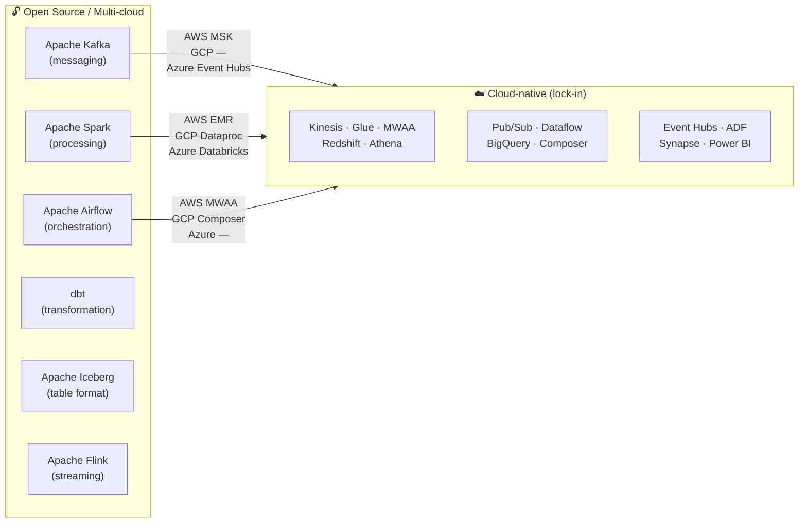

| Tool | AWS Equivalent | GCP Equivalent | Azure Equivalent | Lock-in? |
|------------|----------------|----------------|-------------------|----------|
| Apache Kafka | MSK | — (Pub/Sub is different) | Event Hubs | Low (MSK is pure Kafka) |
| Apache Spark | EMR / Glue | Dataproc | HDInsight / Databricks | Low |
| Apache Airflow | MWAA | Cloud Composer | — | Low |
| dbt | dbt Cloud / Redshift | dbt Cloud / BigQuery | dbt Cloud / Synapse | None |
| Apache Flink | Kinesis Analytics | Dataflow | Stream Analytics | Medium |
| Apache Iceberg | Glue + Athena | BigLake | Synapse / Databricks | None |


## Cost Comparison

### Billing Model by Service

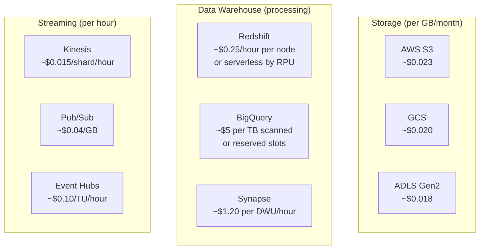

| Scenario | AWS | GCP | Azure | Notes |
|---------|-----|-----|-------|-------------|
| **Storage 100 TB/month** | ~$230 | ~$200 | ~$180 | Prices vary by region |
| **DW: 10 TB scanned/day** | ~$500/month (Redshift) | ~$1,500/month (on-demand) | ~$800/month (Synapse) | BigQuery has cheaper reserved slots at high volume |
| **Spark: 100 hours/month** | ~$200 (EMR Spot) | ~$150 (Dataproc preemptible) | ~$180 (HDInsight Spot) | Spot/preemptible reduces cost by 60-80% |
| **Kafka: 100 GB/day** | ~$400/month (MSK) | ~$120/month (Pub/Sub) | ~$200/month (Event Hubs) | MSK costs more because it is full managed Kafka |
| **Managed Airflow** | ~$350/month (minimum MWAA) | ~$270/month (minimum Composer) | Via ADF (per execution) | All have high base cost |

### Cost Reduction Strategies

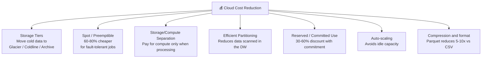


## Governance and Security by Cloud

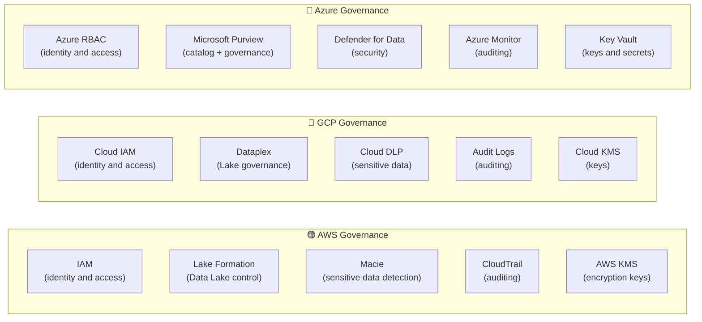

| Criterion | AWS | GCP | Azure |
|----------|-----|-----|-------|
| **Identity management** | AWS IAM | Cloud IAM | Azure AD + RBAC |
| **Data Lake control** | Lake Formation | Dataplex | ADLS ACLs + Purview |
| **Data catalog** | Glue Data Catalog | Dataplex / Data Catalog | Microsoft Purview |
| **Sensitive data detection** | Amazon Macie | Cloud DLP | Microsoft Purview |
| **Managed encryption** | AWS KMS | Cloud KMS | Azure Key Vault |
| **Auditing** | CloudTrail | Cloud Audit Logs | Azure Monitor |
| **Compliance frameworks** | SOC, PCI, LGPD, HIPAA | SOC, PCI, LGPD, HIPAA | SOC, PCI, LGPD, HIPAA |
| **Corporate AD integration** | ❌ (via SSO) | ❌ (via SSO) | ✅ Native |
| **Differentiator** | Granular Lake Formation | Automatic DLP | Unified Purview |


## Machine Learning and AI by Cloud

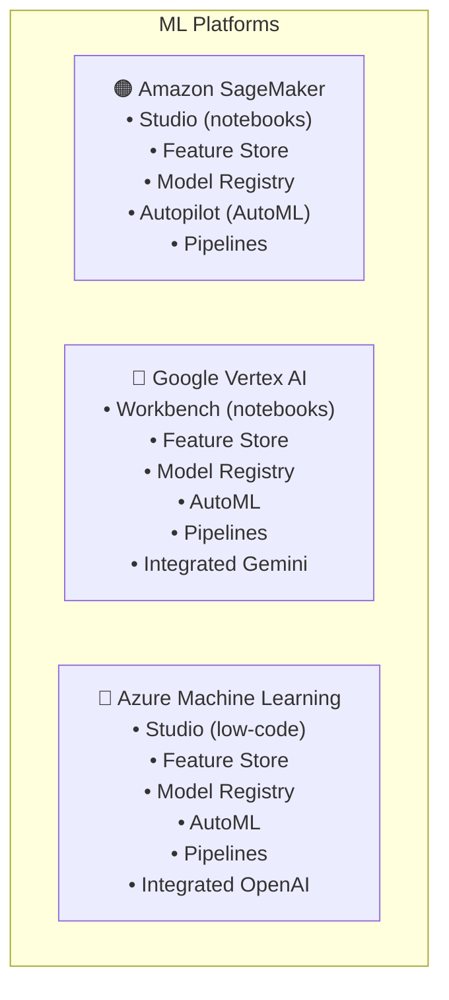

| Criterion | Amazon SageMaker | Google Vertex AI | Azure ML |
|----------|-----------------|-----------------|----------|
| **Managed Feature Store** | ✅ | ✅ | ✅ |
| **AutoML** | ✅ Autopilot | ✅ AutoML | ✅ |
| **ML Pipelines** | ✅ | ✅ | ✅ |
| **Foundation Models / LLMs** | Bedrock (third-party) | Gemini / PaLM | OpenAI (Azure OpenAI) |
| **Integrated MLOps** | ✅ | ✅ | ✅ |
| **SQL for ML** | ❌ | ✅ BigQuery ML | ✅ Synapse ML |
| **Data integration** | S3 + Redshift | Native BigQuery | ADLS + Synapse |
| **Differentiator** | Most complete | BigQuery ML + Gemini | OpenAI + Microsoft |


## When to Choose Each Cloud?

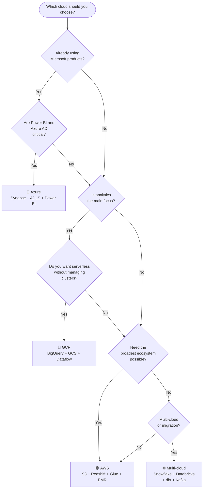

| Scenario | Recommended Cloud | Rationale |
|---------|------------------|---------------|
| Analytics startup with no legacy | GCP | Serverless BigQuery, lower overhead, excellent cost-benefit |
| Enterprise with Active Directory | Azure | Native AD integration, Power BI, Microsoft ecosystem |
| High-volume e-commerce | AWS | Largest ecosystem, Kinesis for streaming, market maturity |
| ML/AI as business core | GCP | Vertex AI + BigQuery ML + Gemini, best data-ML integration |
| Company with everything on AWS | AWS | Native integration, less overhead, egress savings |
| Multi-cloud / portability | Snowflake + Databricks | Avoid lock-in, same API across all 3 clouds |
| Regulated data (health/finance) | Any of the three | All 3 support compliance. Depends on the business partner |


## Executive Summary

```mermaid
graph LR
    subgraph Strengths["✅ Strengths"]
        AWS_S["🟠 AWS<br/>Largest ecosystem<br/>Largest community<br/>Most services available<br/>Best for generalists"]
        GCP_S["🔵 GCP<br/>Unmatched BigQuery<br/>Best pure analytics<br/>Cost-benefit<br/>Integrated ML"]
        Az_S["🔷 Azure<br/>Best for enterprise<br/>Microsoft integration<br/>Native Power BI<br/>Azure OpenAI"]
    end
```

| | 🟠 AWS | 🔵 GCP | 🔷 Azure |
|-|--------|--------|---------|
| **Win when...** | You need the broadest ecosystem and flexibility | Analytics and ML are the core | You already use Microsoft and Power BI |
| **Avoid when...** | Simplicity is the main priority | You want the broadest overall ecosystem | You do not use Active Directory |
| **Iconic service** | S3 | BigQuery | Power BI + Synapse |
| **Streaming** | ⭐⭐⭐⭐ | ⭐⭐⭐ | ⭐⭐⭐ |
| **Batch Analytics** | ⭐⭐⭐⭐ | ⭐⭐⭐⭐⭐ | ⭐⭐⭐⭐ |
| **ML/AI** | ⭐⭐⭐⭐ | ⭐⭐⭐⭐⭐ | ⭐⭐⭐⭐ |
| **Enterprise** | ⭐⭐⭐⭐ | ⭐⭐⭐ | ⭐⭐⭐⭐⭐ |
| **Storage cost** | ⭐⭐⭐ | ⭐⭐⭐⭐ | ⭐⭐⭐⭐⭐ |
| **Documentation** | ⭐⭐⭐⭐⭐ | ⭐⭐⭐⭐ | ⭐⭐⭐⭐ |


## References

- [AWS Data Analytics Overview](https://aws.amazon.com/big-data/datalakes-and-analytics/)
- [Google Cloud Data Analytics](https://cloud.google.com/solutions/data-analytics)
- [Azure Analytics Services](https://azure.microsoft.com/en-us/solutions/data-analytics/)
- [Gartner Magic Quadrant for Cloud Database Management Systems](https://www.gartner.com/en/documents/cloud-dbms)
- **Fundamentals of Data Engineering** — Joe Reis & Matt Housley (O'Reilly)


← [Frameworks and Ecosystem](./16-frameworks-and-ecosystem.md) · [Back to index](./0-data-engineering.md) · [Advanced Techniques →](./18-advanced-techniques.md)


*Documentation in progress · Personal portfolio*
