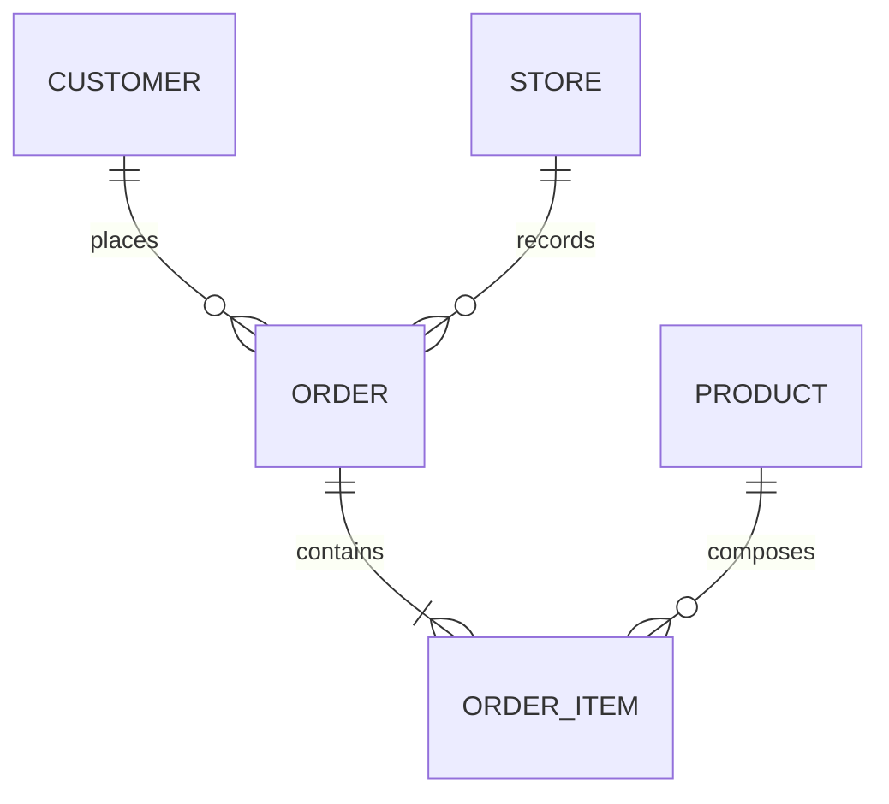
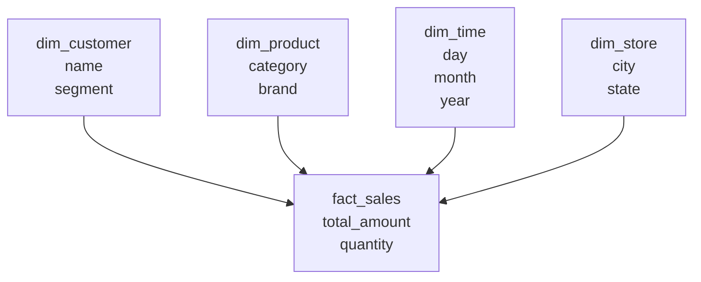

# Data Modeling

> *"Data modeling turns business language into structures that systems can store, validate, and query."*

← [Back to index](./0-data-engineering.md)


## What Is Data Modeling?

Data modeling is the process of representing entities, attributes, relationships, rules, and constraints from a business domain. It creates a bridge between conceptual business understanding and physical implementation in databases, Data Warehouses, Data Lakes, or Lakehouses.

In data engineering, modeling is essential because it influences:

- Data quality and consistency.
- Ease of querying for analysts and applications.
- Read and write performance.
- Governance, documentation, and lineage.
- Storage and processing cost.
- The system's ability to evolve.


## The Three Levels of Modeling

| Level | Focus | Main audience | Output |
|---|---|---|---|
| Conceptual | Business | Stakeholders, analysts, product | High-level entities and relationships |
| Logical | Structure | Analysts, engineers, architects | Tables, attributes, keys, and rules |
| Physical | Implementation | Engineers, DBAs, platform | DDL, types, indexes, partitions, formats |


## Conceptual Modeling

Conceptual modeling describes the domain without being tied to technology, database, or implementation details. The goal is to align language and understanding.

**Main questions:**
- What are the important business entities?
- How do they relate to each other?
- Which events need to be recorded?
- Which business rules must be respected?
- Which concepts have different names across areas?

**Sales domain example:**



**Common entities:**
- Customer
- Product
- Order
- Order item
- Store
- Payment

At this level, it does not matter yet whether the target will be PostgreSQL, BigQuery, Snowflake, Delta Lake, or Iceberg.


## Logical Modeling

Logical modeling translates the conceptual model into a more precise structure, with entities, attributes, keys, cardinalities, and constraints.

**It defines:**
- Tables or equivalent structures.
- Columns and logical types.
- Primary keys.
- Foreign keys.
- Nullability rules.
- Cardinalities.
- Uniqueness constraints.
- History and versioning when needed.

**Simplified logical example:**

| Table | Main fields | Notes |
|---|---|---|
| `customer` | `customer_id`, `name`, `email`, `document` | `customer_id` as primary key |
| `product` | `product_id`, `name`, `category`, `current_price` | Product category may change |
| `order` | `order_id`, `customer_id`, `store_id`, `order_date`, `status` | Relates customer and store |
| `order_item` | `order_id`, `product_id`, `quantity`, `unit_price` | Represents item-level granularity |

**Important decision:** define the grain. In analytics, a fact table must make clear what each row represents.

```text
Grain of fact_sales: one row per sold item in an order.
```


## Physical Modeling

Physical modeling adapts the logical model to a specific technology. It considers performance, cost, volume, latency, governance, and access patterns.

**It defines:**
- Physical types (`INT64`, `STRING`, `NUMERIC`, `TIMESTAMP`, etc.).
- Partitioning strategy.
- Clustering, indexes, or ordering.
- File format (`Parquet`, `ORC`, `Avro`).
- Compression.
- Data distribution.
- Constraints implemented or only documented.
- Historical storage strategy.

**Physical example in a Data Warehouse:**

```sql
CREATE TABLE analytics.fact_sales (
    sale_id STRING,
    order_id STRING,
    customer_id STRING,
    product_id STRING,
    store_id STRING,
    sale_date DATE,
    quantity INT64,
    unit_price NUMERIC,
    total_amount NUMERIC
)
PARTITION BY sale_date
CLUSTER BY customer_id, product_id;
```

**Physical example in a Data Lake:**

```text
s3://datalake/sales/gold/fact_sales/
  year=2026/
    month=07/
      part-00001.parquet
      part-00002.parquet
```


## Entities, Attributes, and Relationships

| Concept | Definition | Example |
|---|---|---|
| Entity | Relevant object or concept | Customer, Product, Order |
| Attribute | Characteristic of an entity | name, email, order_date |
| Relationship | Association between entities | Customer places Order |
| Cardinality | Number of related occurrences | 1:N, N:N, 1:1 |
| Primary key | Unique identifier | `customer_id` |
| Foreign key | Reference to another entity | `order.customer_id` |


## Normalization

Normalization organizes data to reduce redundancy and inconsistency, usually in transactional systems.

| Normal form | Main idea |
|---|---|
| 1NF | Atomic values, no lists inside one column |
| 2NF | Attributes depend on the full key |
| 3NF | Attributes do not depend on other non-key attributes |

**When to use:** OLTP systems, master data, reference data, and domains where transactional integrity is the priority.

**When to avoid excess:** analytics. Analytical queries often benefit from less normalized models, such as Star Schema.


## Dimensional Modeling

Dimensional modeling is optimized for analysis. It organizes data into facts and dimensions.

### Fact Tables

Represent measurable events.

**Examples:**
- Sale
- Payment
- Click
- Delivery
- Product usage

**Common metrics:**
- Quantity
- Amount
- Duration
- Cost
- Count

### Dimension Tables

Represent descriptive context.

**Examples:**
- Customer
- Product
- Time
- Store
- Channel
- Region




## Star Schema, Snowflake, and OBT

| Model | Characteristic | When to use |
|---|---|---|
| Star Schema | Central fact table with denormalized dimensions | BI, dashboards, recurring metrics |
| Snowflake Schema | Dimensions normalized into subdimensions | Complex hierarchies and redundancy reduction |
| One Big Table (OBT) | Wide and denormalized table | Simple consumption, final layer, performance in some engines |

These patterns are also discussed in [Data Architecture](./1-data-architecture.md), but here the focus is the modeling decision.


## Data Vault

Data Vault is a pattern focused on historical and auditable integration from multiple sources.

| Component | Function |
|---|---|
| Hub | Main business key |
| Link | Relationship between hubs |
| Satellite | Attributes and history |

**Use it when:**
- There are many sources with frequent changes.
- Historical traceability is critical.
- The environment needs to preserve the origin and moment of each change.

**Avoid it when:** the project is simple, small, or only needs a direct dimensional model for BI.


## Modeling for Data Lake and Lakehouse

In Data Lakes and Lakehouses, modeling also involves layers and formats.

| Layer | Modeling role |
|---|---|
| Bronze | Preserves raw data and ingestion metadata |
| Silver | Applies cleansing, deduplication, types, and keys |
| Gold | Models data for analytical consumption, metrics, or products |

**Best practices:**
- Preserve raw data whenever possible.
- Define contracts and schemas in the Silver layer.
- Model the Gold layer according to the use case.
- Use table formats when you need upserts, deletes, and time travel.
- Document the grain of each table.


## Important Modeling Decisions

| Decision | Question |
|---|---|
| Grain | What does one row represent? |
| Key | How is each record uniquely identified? |
| History | Do changes overwrite or create a new version? |
| Nullability | Can the field be null? What does null mean? |
| Cardinality | How many records can one entity relate to? |
| Denormalization | Is it worth duplicating data to simplify querying? |
| Performance | How will data be filtered, aggregated, and joined? |
| Governance | Who owns it, what is the SLA, and what are the access rules? |


## Common Mistakes

- Not defining the grain of the fact table.
- Mixing metrics with different granularities in the same table.
- Using technical names the business does not understand.
- Creating unstable keys.
- Ignoring change history.
- Over-normalizing analytical models.
- Denormalizing too early without understanding query patterns.
- Not documenting calculation rules.
- Not distinguishing event date, processing date, and ingestion date.


## Modeling Checklist

- Was the conceptual model validated with the business?
- Does the logical model have clear keys, cardinalities, and rules?
- Does the physical model consider the target technology?
- Is the grain of each fact documented?
- Do dimensions have a strategy for historical changes?
- Do tables have owners and descriptions?
- Were sensitive fields classified?
- Does the model support reprocessing and auditing?
- Is naming consistent?
- Were the main queries considered?


## References

- **The Data Warehouse Toolkit** — Ralph Kimball and Margy Ross
- **Building the Data Warehouse** — W. H. Inmon
- **Data Modeling Made Simple** — Steve Hoberman
- **Fundamentals of Data Engineering** — Joe Reis and Matt Housley
- [Kimball Group Techniques](https://www.kimballgroup.com/data-warehouse-business-intelligence-resources/kimball-techniques/)


← [Data Architecture](./1-data-architecture.md) · [Back to index](./0-data-engineering.md) · [Cloud and Infrastructure →](./3-cloud-and-infrastructure.md)


*Documentation in progress · Personal portfolio*
