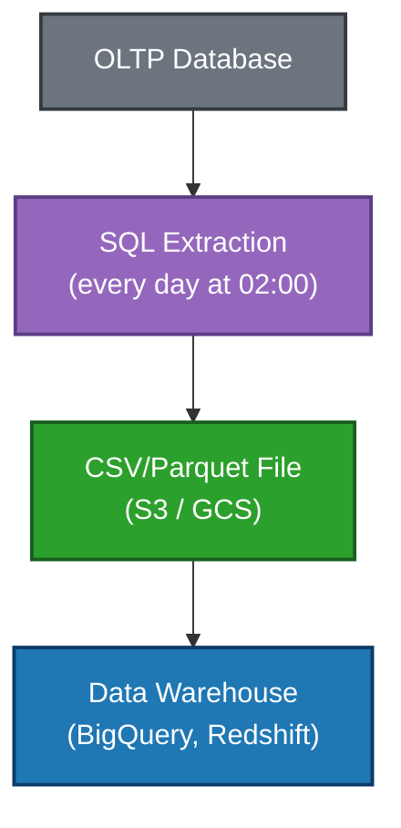
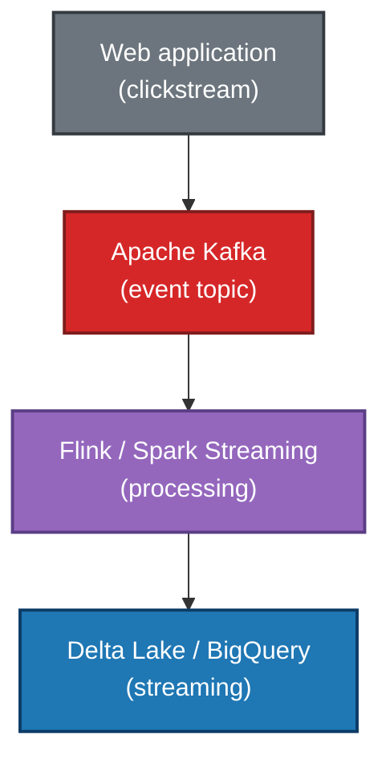

# Data Ingestion

> *"If data never arrives, it effectively does not exist. Ingestion is the front door of every data system."*

← [Back to index](./0-data-engineering.md)

## What Is Data Ingestion?

Data ingestion is the process of **capturing data from diverse sources and transporting it into a centralized environment** — whether a Data Lake, Data Warehouse, or any other storage destination.

It is the first stage of any data pipeline and, quite often, the most critical one: if ingestion fails, everything that comes after fails with it.

A good ingestion layer should be:
- **Reliable:** guarantee that no data is lost
- **Scalable:** handle volume spikes without degradation
- **Traceable:** know exactly what was ingested, when, and from where
- **Resilient:** recover from failures without manual intervention

## Types of Ingestion

### 📦 Batch

Data is collected and moved at **regular time intervals** — hourly, once a day, weekly, and so on. It is the most traditional model and still widely used.

**Characteristics:**
- High latency (data is not available immediately)
- Easier to implement and debug
- Ideal for large volumes that do not require real time
- Usually cheaper to process

**Use cases:** daily reports, nightly ERP loads, database exports, traditional ETL.

**Example flow:**

### ⚡ Streaming (Real Time)

Data is captured and processed **continuously**, event by event, with latency from milliseconds to seconds. It requires a more sophisticated infrastructure, but delivers fresh data.

**Characteristics:**
- Low latency (data becomes available almost instantly)
- Greater implementation and operational complexity
- Requires special attention to ordering, duplicates, and failures
- Operational cost is usually higher

**Use cases:** real-time fraud detection, system monitoring, real-time personalization, IoT telemetry, financial feeds.

**Example flow:**

### 🔄 Micro-batch

A middle ground between batch and streaming. Data is collected in **very short time windows** (seconds or a few minutes), creating a near-real-time experience with lower complexity than pure streaming.

Apache Spark Structured Streaming operates, by default, in this model.

## Extraction Patterns

### Full Load
All data from the source is extracted at every execution. Simple, but inefficient for large volumes and sources that continuously grow.

**When to use:** small tables, data without a time identifier, initial loads (bootstrap).

### Incremental Load
Only **new or modified** data since the last extraction is captured. Much more efficient for large volumes.

Common strategies:
- **Timestamp / modification date:** filter records with `updated_at > last_execution`
- **Sequential key (ID):** capture records with `id > last_processed_id`
- **CDC (Change Data Capture):** capture changes directly from the database transaction log

### CDC — Change Data Capture

CDC is one of the most powerful techniques for incremental ingestion. Instead of querying the table, it monitors the **database transaction log** (binlog in MySQL, WAL in PostgreSQL) and captures every INSERT, UPDATE, and DELETE in real time.

**Advantages:**
- Very low latency
- Does not impact the performance of the source database
- Captures deletes (something timestamp does not do)
- Complete history of changes

**CDC tools:** Debezium (open source), AWS DMS, Fivetran, Airbyte.

## Common Data Sources

| Source Type | Examples | Typical Method |
|---------------|----------|---------------|
| Relational database | PostgreSQL, MySQL, Oracle | Incremental SQL, CDC |
| REST API | Stripe, Salesforce, HubSpot | Periodic polling, webhooks |
| Files | CSV, JSON, Parquet, Avro | Upload to object storage |
| Messaging | Kafka, RabbitMQ, SQS | Continuous consumer |
| NoSQL database | MongoDB, DynamoDB, Cassandra | Change streams, export |
| SaaS | Google Analytics, Ads, ERP | Prebuilt connectors (Fivetran, Airbyte) |
| IoT / Sensors | MQTT, proprietary protocols | IoT gateways, Kinesis |
| Logs | Applications, servers, infrastructure | Fluentd, Logstash, CloudWatch |

## Ingestion Tools

### Managed Connectors (EL / ETL without code)

Ideal for ingesting data from SaaS sources and popular databases with little configuration.

**Fivetran**
- Prebuilt connectors for hundreds of sources
- Fully managed, zero maintenance
- Native CDC for relational databases
- Cost based on the volume of rows processed

**Airbyte**
- Open source (self-hosted) or managed cloud
- Large catalog of community connectors
- More flexible and customizable than Fivetran
- Free option for self-hosting

**Stitch**
- Simpler and cheaper alternative
- Focused on batch, with less support for streaming

### Messaging and Streaming

**Apache Kafka**
- Distributed streaming platform, the industry standard
- Stores events in a durable and replayable way
- High throughput, low latency
- Rich ecosystem: Kafka Connect, Kafka Streams, ksqlDB
- Managed versions: Confluent Cloud, AWS MSK, Aiven

**AWS Kinesis**
- AWS-managed alternative to Kafka
- Native integration with the AWS ecosystem
- Kinesis Data Streams (ingestion), Kinesis Firehose (delivery to S3/Redshift)

**Google Pub/Sub**
- GCP's managed messaging service
- Native integration with Dataflow and BigQuery

### Batch Ingestion Orchestration

**Apache Sqoop** *(legacy)*
Tool for moving data between HDFS and relational databases. Still found in legacy Hadoop environments.

**dlt (data load tool)**
Modern Python library for building ingestion pipelines programmatically. Lightweight, with no need for dedicated infrastructure.

**Singer**
Open-source protocol with taps (sources) and targets (destinations) that can be freely combined.

### Stream Processing

**Apache Flink**
High-performance stateful stream processing engine. Native support for event time, watermarks, and exactly-once semantics. Preferred for complex streaming use cases.

**Spark Structured Streaming**
Spark’s unified API for batch and streaming. Makes life easier for teams that already use Spark for batch. Operates in micro-batch mode by default.

## Important Concepts

### Idempotency
An ingestion operation is **idempotent** when it can be executed multiple times without causing side effects — in other words, reprocessing the same data does not create duplicates. Fundamental for resilient pipelines.

### Exactly-Once Semantics
Guarantee that each event is processed **exactly once**, no more and no less. It is the ideal, but also the hardest to achieve. Alternatives:
- **At-least-once:** may process duplicates (more common, requires downstream deduplication)
- **At-most-once:** may lose data (rarely acceptable)

### Backfill and Reprocessing
The ability to reingest historical data when there is a failure, logic change, or need to correct data. A good ingestion architecture should support safe backfills.

### Schema Evolution
Data sources change over time: columns are added, renamed, or removed. The ingestion layer must handle these changes without breaking the pipeline. Formats such as Avro and Protobuf with Schema Registry help control this.

### Watermarks
In stream processing, events arrive out of order. **Watermarks** are time markers that indicate how far the system can assume that all events from a given period have already arrived, allowing aggregation windows to close safely.

## Common Anti-patterns

❌ **Full load on large tables:** extracting the entire table every time is slow and expensive. Use incremental.

❌ **No failure handling:** a pipeline that breaks silently is worse than one that does not exist. Always implement retries, alerts, and dead-letter queues.

❌ **Tight coupling with the source:** complex queries directly against the production database can bring the system down. Prefer read replicas or CDC.

❌ **Ignoring duplicates:** networks fail, retries happen. Assume duplicates will exist and handle them.

❌ **No volume monitoring:** an ingestion run returning zero records may be a silent bug. Monitor expected counts.

## Comparison: Batch vs Streaming

| Criterion | Batch | Streaming |
|----------|-------|-----------|
| Latency | Minutes to hours | Milliseconds to seconds |
| Complexity | Low | High |
| Cost | Lower | Higher |
| Failure tolerance | Simpler | Requires special attention |
| Use cases | Reporting, ETL, ML training | Fraud, alerts, personalization |
| Tools | Airbyte, Fivetran, dlt | Kafka, Flink, Kinesis |

## References

- **Fundamentals of Data Engineering** — Joe Reis & Matt Housley (O'Reilly)
- [Debezium Documentation](https://debezium.io/documentation/)
- [Airbyte Docs](https://docs.airbyte.com/)
- [Apache Kafka Documentation](https://kafka.apache.org/documentation/)
- [dlt (data load tool)](https://dlthub.com/docs/intro)

← [Modern Data Platforms](./4-modern-data-platforms.md) · [Back to index](./0-data-engineering.md) · [Streaming and Events →](./6-streaming-and-events.md)

*Documentation in progress · Personal portfolio*
