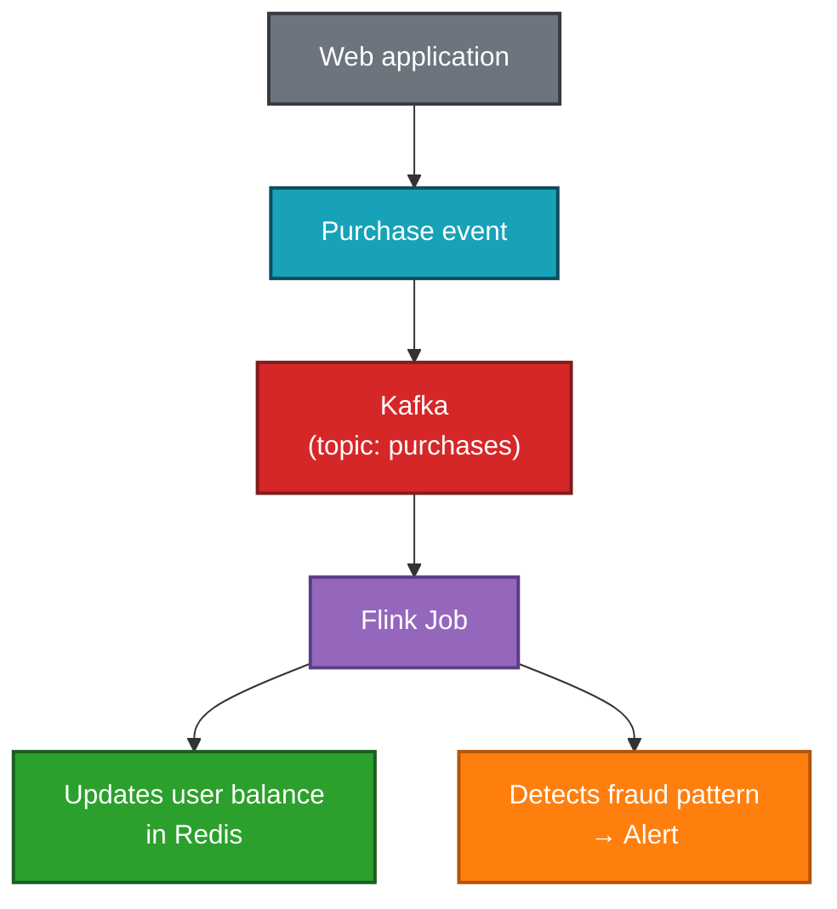
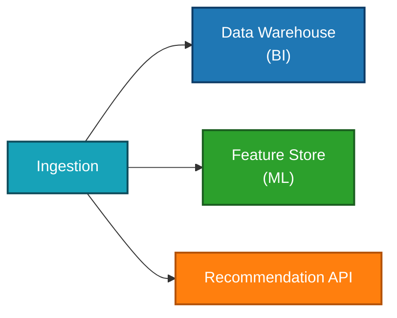
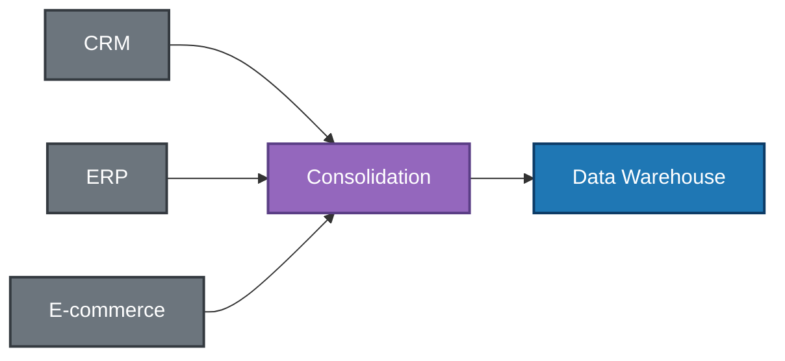
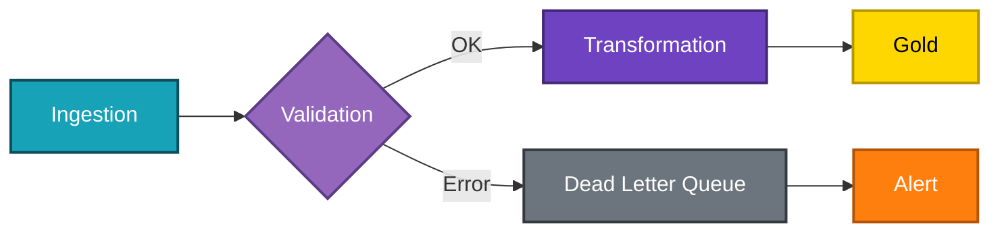

# Data Pipelines

> *"A well-built pipeline is invisible. A poorly built pipeline becomes the only topic in Monday's meeting."*

← [Back to index](./0-data-engineering.md)


## What Is a Data Pipeline?

A data pipeline is the **series of automated, connected steps** that move, transform, and deliver data from its origin to the final destination — whether a Data Warehouse, a dashboard, an ML model, or an API.

The plumbing analogy is accurate: the pipeline transports data from one point to another, and just like physical pipes, it must be robust, observable, and capable of handling pressure (volume) without leaking (losing data) or clogging (stalling).

A typical pipeline follows this flow:


## Anatomy of a Pipeline

### Source
Where the data originates. It can be a transactional database, an API, a file, a Kafka topic, an application event, and so on.

### Ingestion
The step that collects data from the source and moves it into the data environment. It can be batch or streaming. See [Data Ingestion](./2-data-ingestion.md).

### Intermediate Storage (Staging)
Raw data is stored before any transformation. This layer guarantees that reprocessing from the original data is always possible. See [Data Storage](./3-data-storage.md).

### Transformation
Data is cleaned, modeled, and enriched to meet the requirements of the use case. See [Data Processing](./4-data-processing.md).

### Destination (Sink)
Where transformed data arrives to be consumed: analytical tables, dashboards, APIs, feature stores, and so on.

### Orchestration
The system that schedules, monitors, and manages the execution of the entire pipeline. See [Orchestration](./6-orchestration.md).


## Pipeline Types

### Batch Pipeline
Runs at **regular intervals** (for example: every day at 03:00). It processes a dataset with a defined beginning and end. It is the most common and simplest type to implement.

**Characteristics:**
- Latency: minutes to hours
- Easy to debug and rerun
- Suitable for most analytical use cases

**Example of a daily batch pipeline:**
```text
02:00 → Extract sales from production PostgreSQL
02:15 → Load raw data into S3 (Bronze layer)
02:30 → Transform with dbt (Silver layer: cleansing)
03:00 → Aggregate with dbt (Gold layer: metrics)
03:30 → Dashboard updated in Looker/Power BI
```


### Streaming Pipeline
Processes data **continuously**, in real time or near real time. Each event is processed as soon as it arrives.

**Characteristics:**
- Latency: milliseconds to seconds
- Higher operational complexity
- Necessary when latency has a real business impact

**Example of a streaming pipeline:**



### Hybrid Pipeline (Lambda)
Combines batch and streaming to support use cases that need both: complete historical data (batch) and recent updates (streaming). See [Data Architecture](./1-data-architecture.md).


## Properties of a Good Pipeline

### ✅ Idempotency
The pipeline can be executed **multiple times with the same result**. Re-running it does not create duplicates or corrupt data. This is the most important property for resilience.

How to guarantee it:
- Use `MERGE` / `UPSERT` instead of plain `INSERT`
- Use unique deduplication keys
- Keep track of the state of the last run (watermark)

### ✅ Atomicity
Pipeline steps should succeed or fail as a unit. There must be no inconsistent intermediate states (for example: data loaded into the destination but transformation not completed).

### ✅ Traceability (Lineage)
It must be possible to know where each piece of data came from, what transformations it went through, and when it was processed. Essential for debugging and auditing.

### ✅ Observability
The pipeline must emit enough metrics, logs, and alerts so that problems can be detected quickly. See [Observability](./8-observability.md).

### ✅ Resilience and Retry
Failures happen. The pipeline must automatically recover from transient errors (network timeouts, unavailable service) without manual intervention.

### ✅ Scalability
The pipeline must support volume growth without major architectural changes.

### ✅ Testability
Transformations and business logic must be testable in isolation, with representative test data.


## Pipeline Design Patterns

### Fan-out
A pipeline produces data that feeds **multiple destinations or consumers** in parallel.



### Fan-in
Multiple sources are **consolidated into a single pipeline** before transformation.



### Conditional Pipeline
The flow branches based on data conditions or the results of previous steps.



### Backfill Pipeline
Auxiliary pipeline to **reprocess historical data** — whether to correct errors, apply new logic, or retroactively populate a new table.


## Dead Letter Queue (DLQ)

A **dead letter queue** is a destination for records that failed processing and could not be automatically reprocessed. Instead of losing the data or blocking the pipeline, the record is sent to the DLQ for later investigation.

This is an essential practice in streaming pipelines and high-availability ingestion setups.


## Versioning and CI/CD for Pipelines

Data pipelines must be treated like software: versioned, tested, and deployed with discipline.

**Best practices:**
- All pipeline code in Git (Python, SQL, configurations)
- Pull requests with code review
- Automated tests in every PR (unit and integration)
- Separate development/staging environment from production
- Automated deployment through CI/CD (GitHub Actions, GitLab CI)
- Easy rollback in case of failure

**Typical repository structure:**
```text
my-data-project/
├── ingestion/
│   ├── sources/
│   │   ├── crm_connector.py
│   │   └── erp_connector.py
│   └── tests/
├── models/              ← dbt models
│   ├── staging/
│   ├── intermediate/
│   └── marts/
├── pipelines/           ← DAG definitions (Airflow/Prefect)
│   ├── daily_sales.py
│   └── realtime_events.py
├── tests/
└── dbt_project.yml
```


## Pipeline Monitoring

A pipeline without monitoring is a pipeline waiting for a silent disaster. Essential metrics to monitor:

| Metric | What it indicates |
|---------|--------------|
| Execution time | Performance, degradation over time |
| Volume of processed records | Anomalies (zero records can mean a bug) |
| Error and rejection rate | Source or logic quality issues |
| Lag | In streaming: how delayed processing is |
| Data freshness | How long since data was updated |
| Execution cost | Cloud processing spend |

See more in [Observability](./8-observability.md).


## Common Anti-patterns

❌ **Pipelines without tests:** a source change silently breaks the destination.

❌ **Implicit dependencies:** one pipeline assumes another has already run without explicitly checking.

❌ **Hard-coded credentials:** passwords and tokens embedded in code. Use environment variables or secret managers.

❌ **No error handling:** the pipeline fails silently or without alerts.

❌ **Complex transformations in a single step:** makes debugging harder. Prefer small, traceable steps.

❌ **Monolithic pipeline:** a single job does ingestion + cleaning + aggregation + load. Impossible to test and maintain.

❌ **Re-execution that creates duplicates:** lack of idempotency leads to incorrect data.


## Complete Example: Sales Pipeline

```text
┌─────────────────────────────────────────────────────────────────┐
│                     DAILY SALES PIPELINE                        │
└─────────────────────────────────────────────────────────────────┘

1. [02:00] INGESTION
   PostgreSQL (prod) → Airbyte CDC → S3 Bronze
   Tables: orders, order_items, customers, products

2. [02:30] VALIDATION
   Great Expectations checks:
   - orders: no records with negative value
   - customers: email field not null
   → If it fails: alert in Slack, pipeline paused

3. [03:00] SILVER TRANSFORMATION (dbt)
   - stg_orders: cleaning, correct types, duplicate removal
   - stg_customers: normalization of addresses and names
   - stg_products: join with category table

4. [03:30] GOLD TRANSFORMATION (dbt)
   - fct_sales: fact table with all metrics
   - dim_customer: denormalized dimension
   - mart_daily_revenue: revenue by day, category, region

5. [04:00] DELIVERY
   - Gold tables available in BigQuery
   - Looker dashboard updated automatically
   - ML model retrained using previous day's data

6. [04:30] EXECUTION REPORT
   - Success log with processed volumes
   - Alert if total time > 3h
```


## References

- **Fundamentals of Data Engineering** — Joe Reis & Matt Housley (O'Reilly)
- [dbt Best Practices](https://docs.getdbt.com/guides/best-practices)
- [The Twelve-Factor App (adapted for data)](https://12factor.net/)
- [Data Pipeline Design Patterns — Google Cloud](https://cloud.google.com/architecture/data-lifecycle-cloud-platform)


← [Data Processing](./4-data-processing.md) · [Back to index](./0-data-engineering.md) · [Orchestration →](./6-orchestration.md)


*Documentation in progress · Personal portfolio*
