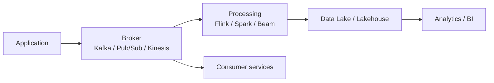

# Streaming and Event-Driven Architectures

> *"In event-driven systems, data is not only stored; it flows, signals change, and triggers decisions."*

← [Back to index](./0-data-engineering.md)


## What Is Streaming?

Streaming is the continuous processing of data as events arrive. Unlike batch, which processes closed datasets, streaming deals with constant flow, low latency, out-of-order events, state, and fault tolerance.

**Use cases:**

- Fraud detection.
- Sensor monitoring.
- Clickstream.
- CDC from transactional databases.
- Operational alerts.
- Near real-time dashboard updates.
- User experience personalization.


## Event

An event represents something that happened.

```json
{
  "event_id": "evt_123",
  "event_type": "order_created",
  "order_id": "ord_456",
  "customer_id": "cus_789",
  "event_time": "2026-07-09T10:30:00Z"
}
```

**Best practices:**

- Events should be immutable.
- Include a unique identifier.
- Include event timestamp.
- Include schema version.
- Avoid relying only on processing time.


## Event-Driven Architecture



Event-driven architectures decouple producers and consumers. One system publishes events and multiple consumers can react without the producer knowing every destination.


## Kafka: Essential Concepts

| Concept | Description |
|---|---|
| Topic | Logical channel where events are published |
| Partition | Topic split for parallelism and ordering by key |
| Producer | Application that publishes events |
| Consumer | Application that reads events |
| Consumer group | Group that divides consumption across instances |
| Offset | Read position in a partition |
| Retention | Time or size policy for event storage |
| Broker | Kafka server |

**Key point:** Kafka preserves order within a partition, not necessarily across the whole topic.


## Event Partitioning

The event key defines the partition.

```text
key = customer_id
```

This ensures that events from the same customer tend to land in the same partition and keep relative order.

**Choose a good key when:**

- Ordering by entity matters.
- Processing keeps state by entity.
- You need to distribute load without creating skew.


## Schema Registry

Schema Registry controls event schema versions and prevents breaking consumers.

**Benefits:**

- Compatibility validation.
- Controlled evolution.
- Contract documentation.
- Fewer errors between teams.

**Common formats:**

- Avro
- Protobuf
- JSON Schema


## CDC with Debezium

CDC (Change Data Capture) captures database changes from transaction logs.

```text
PostgreSQL WAL → Debezium → Kafka → Stream processor → Lakehouse
```

**Considerations:**

- Insert, update, and delete events.
- Initial snapshot.
- Ordering by key.
- Reprocessing from offsets.
- Schema evolution.
- Physical and logical delete handling.


## Event Time, Processing Time, and Ingestion Time

| Time type | Meaning |
|---|---|
| Event time | When the event happened at the source |
| Processing time | When the system processed the event |
| Ingestion time | When the event entered the platform |

For analytics and business windows, `event_time` is usually the most correct. For operations and SLAs, `processing_time` and `ingestion_time` also matter.


## Watermarks and Late Events

Events can arrive out of order. A watermark defines how long the system waits for late events.

```text
Window: 10 minutes
Watermark: accept up to 5 minutes of lateness
```

**Trade-off:** greater tolerance improves correctness, but increases state, memory, and cost.


## Delivery Semantics

| Semantics | Result |
|---|---|
| At-most-once | May lose events, but does not duplicate |
| At-least-once | Does not lose events, but may duplicate |
| Exactly-once | Final result has no observable duplication |

Exactly-once depends on the combination of broker, processing, checkpointing, transactional sink, and idempotent logic.


## DLQ and Error Handling

DLQ (Dead Letter Queue) stores events that could not be processed.

**Use DLQ for:**

- Invalid payload.
- Incompatible schema.
- Missing required data.
- Non-recoverable transformation error.

**Do not use DLQ to:** hide systemic failures, destination unavailability, or widespread bugs.


## Replay

Replay means reprocessing old events from offsets or retention.

**Useful for:**

- Fixing transformation bugs.
- Recreating a table.
- Feeding a new consumer.
- Recalculating a historical window.

**Prerequisite:** enough retention and idempotent consumers.


## Streaming vs Batch

| Criterion | Batch | Streaming |
|---|---|---|
| Latency | Minutes, hours, or days | Seconds or less |
| Complexity | Lower | Higher |
| State | Simpler | Stateful and continuous |
| Cost | Can be occasional | Usually always active |
| Reprocessing | Simpler | Requires replay/checkpoints |
| Best for | Reports, backfills | Alerts, fraud, live events |


## Best Practices

- Model events as immutable facts.
- Choose partition keys carefully.
- Version schemas.
- Define retention policy.
- Ensure consumer idempotency.
- Monitor lag, throughput, and errors.
- Separate event from command.
- Avoid huge payloads.
- Document contracts between producers and consumers.
- Plan replay before you need it.


## Checklist

- Does the event have a unique ID?
- Does the event have `event_time`?
- Is there a versioned schema?
- Is the partition key correct?
- Is there a strategy for late events?
- Are consumers idempotent?
- Is the DLQ monitored?
- Is there a replay policy?
- Is lag monitored?
- Is there an owner for each topic/event?


## References

- [Apache Kafka Documentation](https://kafka.apache.org/documentation/)
- [Confluent Schema Registry](https://docs.confluent.io/platform/current/schema-registry/index.html)
- [Debezium Documentation](https://debezium.io/documentation/)
- [Apache Flink Documentation](https://nightlies.apache.org/flink/flink-docs-stable/)
- [Spark Structured Streaming](https://spark.apache.org/docs/latest/structured-streaming-programming-guide.html)
- [Google Cloud Pub/Sub](https://cloud.google.com/pubsub/docs)
- [Amazon Kinesis Documentation](https://docs.aws.amazon.com/kinesis/)


← [Data Ingestion](./5-data-ingestion.md) · [Back to index](./0-data-engineering.md) · [Data Storage →](./7-data-storage.md)


*Documentation in progress · Personal portfolio*

