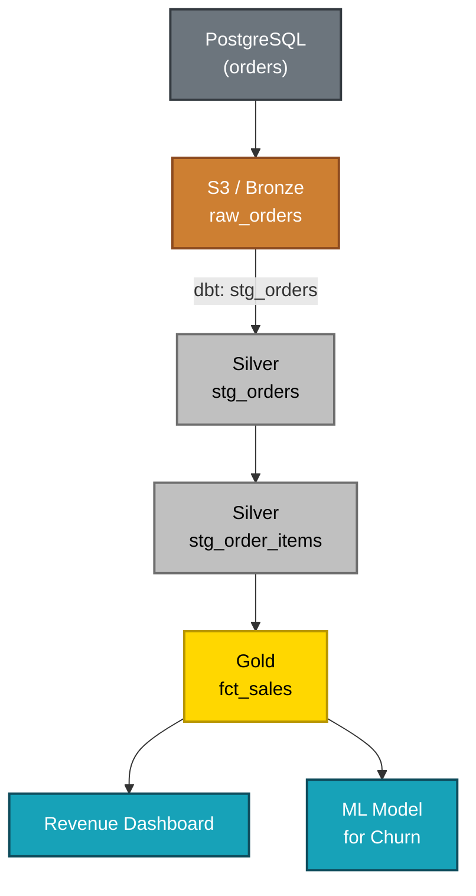

# Observability and Monitoring

> *"You cannot improve what you cannot see. In data, operational blindness is a silent risk."*

← [Back to index](./0-data-engineering.md)


## What Is Observability in Data?

Observability is the ability to **understand the internal state of a system based on its external outputs** — logs, metrics, and traces. In data engineering, it means having enough visibility into pipelines, data, and infrastructure to detect, diagnose, and resolve problems quickly.

The difference between monitoring and observability:

- **Monitoring:** checks whether a known condition is healthy (for example: "did the pipeline run?")
- **Observability:** allows you to answer questions you did not anticipate (for example: "why is yesterday’s revenue 15% lower?")

An observable data system quickly answers questions such as:
- Are pipelines running at the expected time?
- Is the data fresh enough?
- Where in the pipeline was a specific piece of data transformed?
- Why did this metric change from yesterday to today?


## The Three Pillars

### 📋 Logs
Detailed and structured records of events that occurred. They allow you to reconstruct what happened during an execution.

**What to log in data pipelines:**
- Start and end of each step
- Volume of records processed in each step
- Errors and exceptions with full stack trace
- Execution parameters (dates, configurations)
- Duration of each step

**Best practices:**
- Structured logs in JSON (easier to query and filter)
- Appropriate log level: DEBUG for development, INFO and ERROR for production
- Include context: pipeline name, run ID, execution date

```python
import logging
import json

logger = logging.getLogger(__name__)

def process_sales(execution_date: str):
    logger.info(json.dumps({
        "event": "pipeline_start",
        "pipeline": "daily_sales",
        "execution_date": execution_date,
    }))

    try:
        records = extract_data(execution_date)
        logger.info(json.dumps({
            "event": "extraction_completed",
            "records_extracted": len(records),
        }))
    except Exception as e:
        logger.error(json.dumps({
            "event": "extraction_failed",
            "error": str(e),
        }))
        raise
```


### 📊 Metrics
Numerical values collected over time that represent system behavior.

**Essential metrics for data pipelines:**

| Metric | Description |
|---------|-----------|
| `pipeline.duration_seconds` | Total execution time |
| `pipeline.success_rate` | % of successful executions |
| `task.records_processed` | Records processed per task |
| `task.records_failed` | Records rejected due to errors |
| `data.freshness_seconds` | Time since last update |
| `data.row_count` | Record count per table |
| `pipeline.retry_count` | Number of retries per execution |
| `infra.cost_usd` | Processing cost (cloud) |


### 🔍 Traces
Distributed tracing that allows following the path of a request or data across multiple systems and stages. In data, this translates into **Data Lineage**.


## Data Lineage (Traceability)

Lineage is the ability to **track the origin and path of a piece of data** from its source to the final destination, including all transformations it went through along the way.



**Why lineage is essential:**
- **Impact analysis:** "If I change table X, which dashboards will be affected?"
- **Debugging:** "Where did this incorrect dashboard value come from?"
- **Compliance:** "Where is customer personal data processed and stored?"
- **Trust:** business teams know how the numbers were produced

**Lineage tools:**
- **OpenLineage:** open-source standard for emitting lineage events
- **Marquez:** open-source backend for collecting and visualizing lineage through OpenLineage
- **DataHub:** full catalog and lineage platform (LinkedIn, open source)
- **Atlan / Collibra:** commercial data catalog platforms with lineage
- **dbt:** automatically generates lineage between SQL models


## Data Catalog

A data catalog is a **centralized and searchable inventory** of all data assets in an organization — tables, pipelines, dashboards, metrics — with documentation, metadata, and quality information.

**What a data catalog provides:**
- Data discovery: "Is there a table with customer data by region?"
- Documentation: description of tables, columns, and business rules
- Data owner: who is responsible for each asset
- Popularity: which tables are most used
- Quality: data health indicators
- Lineage: where data comes from and where it goes

**Tools:**

| Tool | Type | Highlight |
|------------|------|----------|
| DataHub | Open source | LinkedIn, lineage and metadata |
| Apache Atlas | Open source | Hadoop/HDP ecosystem |
| OpenMetadata | Open source | Modern, API-first |
| Atlan | Commercial | Modern UX, collaboration |
| Collibra | Commercial | Enterprise governance |
| Alation | Commercial | Smart search and ML |


## Data Freshness (Timeliness)

Freshness is the monitoring of **how recent the data is** in each table. It is one of the most critical metrics — stale data can lead to wrong decisions without anyone noticing.

**Simple implementation with dbt:**
```yaml
# schema.yml
models:
  - name: fct_sales
    config:
      meta:
        owner: "data-team@company.com"
    freshness:
      warn_after: {count: 12, period: hour}
      error_after: {count: 24, period: hour}
    loaded_at_field: updated_at
```

**Monitoring query:**
```sql
SELECT
    table_name,
    MAX(updated_at) AS last_update,
    DATEDIFF('hour', MAX(updated_at), NOW()) AS hours_since_update,
    CASE
        WHEN DATEDIFF('hour', MAX(updated_at), NOW()) > 24 THEN 'CRITICAL'
        WHEN DATEDIFF('hour', MAX(updated_at), NOW()) > 12 THEN 'WARNING'
        ELSE 'OK'
    END AS status
FROM information_schema.tables
-- adapted by database
```


## Alerts and Notifications

Observability only creates value when issues reach the right people at the right time.

**Severity hierarchy:**

| Severity | Example | Channel | Response Time |
|------------|---------|-------|-------------------|
| **Critical** | Revenue pipeline failed | PagerDuty + Slack | Immediate |
| **High** | Data more than 24h delayed | Slack (alerts channel) | < 1 hour |
| **Medium** | Volume 20% below expected | Slack | < 4 hours |
| **Low** | Non-blocking quality warning | Email / ticket | Next business day |

**Alerting best practices:**
- Avoid alert fatigue: a few high-quality alerts > many ignored alerts
- Include context in the alert: what failed, when, what is the likely impact
- Direct link to the log or monitoring dashboard
- Clearly define who is responsible for each type of alert


## Observability Tools

### Pipeline Observability

**Apache Airflow UI:** native DAG monitoring, execution history, per-task logs.

**Grafana + Prometheus:** classic stack for infrastructure metrics. Builds custom dashboards using data from Airflow, Spark, Kafka, and more.

**Datadog:** complete commercial platform for logs, metrics, traces, and APM. Integrates with Airflow, Spark, and major data tools.

### Data Observability

**Monte Carlo:** market leader in data observability. Automatically monitors volume, freshness, distribution, and schema of tables. Detects anomalies using ML without requiring manually defined thresholds.

**Bigeye:** similar to Monte Carlo, with a focus on faster setup.

**Elementary:** open source, integrated with dbt. Generates quality and observability reports from dbt tests.

**Metaplane:** focused on Data Warehouses (BigQuery, Snowflake).


## Implementing Observability in Practice

### Step 1: Structured Logs
Ensure all pipelines emit structured logs (JSON) with enough context.

### Step 2: Pipeline Metrics
Instrument pipelines to emit duration, volume, and error metrics. Create centralized dashboards.

### Step 3: Freshness Monitoring
Implement freshness monitoring for all critical tables, with alerts configured.

### Step 4: Data Quality Checks
Add quality tests (dbt tests, Great Expectations) and monitor success rates over time.

### Step 5: Lineage
Implement lineage for the most critical tables, enabling impact analysis and debugging.

### Step 6: Catalog
Centralize documentation of data assets in a catalog, with defined owners.


## Data SLAs and SLOs

Just as software services have SLAs (Service Level Agreements), data teams should define **SLOs (Service Level Objectives)** for their data products:

**Examples of SLOs:**
- Revenue dashboard updated by 08:00 every business day (99.5% of the time)
- `fct_sales` table with previous day data available by 06:00
- Critical pipeline success rate ≥ 99% in the month
- Critical data incident resolution time < 2 hours

Defining SLOs creates accountability, aligns expectations with stakeholders, and guides investment in reliability.


## References

- [OpenLineage Specification](https://openlineage.io/)
- [DataHub Documentation](https://datahubproject.io/docs/)
- [Elementary Data](https://www.elementary-data.com/)
- [Monte Carlo Data](https://www.montecarlodata.com/)
- **Fundamentals of Data Engineering** — Joe Reis & Matt Housley (O'Reilly)


← [Data Quality](./7-data-quality.md) · [Back to index](./0-data-engineering.md) · [Governance and Security →](./9-governance-and-security.md)


*Documentation in progress · Personal portfolio*
