# Comparativo de Clouds para Engenharia de Dados

> *"A melhor cloud é aquela que resolve o seu problema — não a que está na moda."*

← [Voltar ao índice](./0-engenharia-de-dados.md)


## Visão Geral dos Provedores

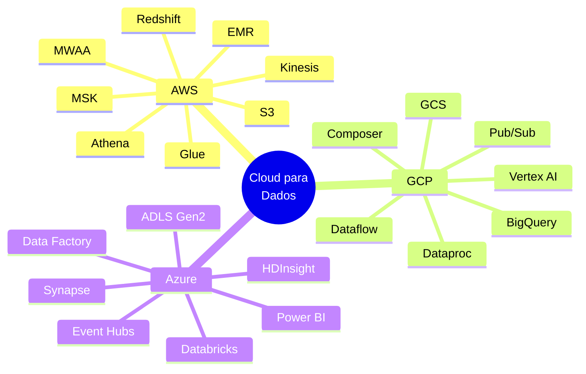


## Market Share e Posicionamento

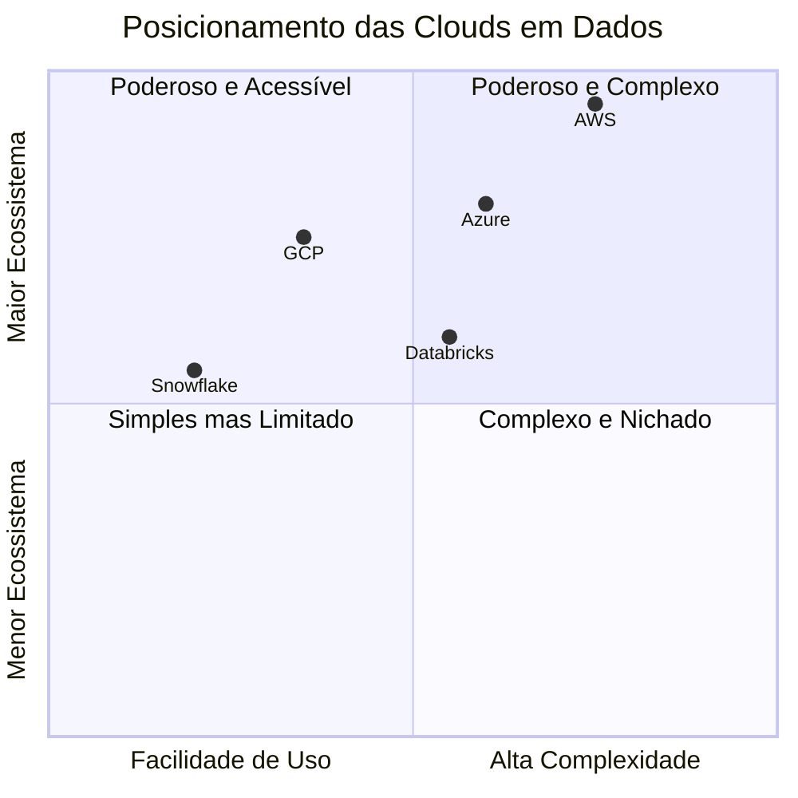

| Critério | AWS | GCP | Azure |
|----------|-----|-----|-------|
| **Market Share Cloud Geral** | ~33% | ~11% | ~22% |
| **Ponto forte em dados** | Ecossistema completo | Analytics e ML | Enterprise e Microsoft |
| **Melhor serviço de dados** | S3 + Glue | BigQuery | Synapse + Power BI |
| **Curva de aprendizado** | Alta | Média | Média-Alta |
| **Integração Microsoft** | Baixa | Baixa | Nativa |
| **Maturidade** | ⭐⭐⭐⭐⭐ | ⭐⭐⭐⭐ | ⭐⭐⭐⭐ |


## Comparativo de Serviços por Categoria

### 🗄️ Object Storage (Data Lake)

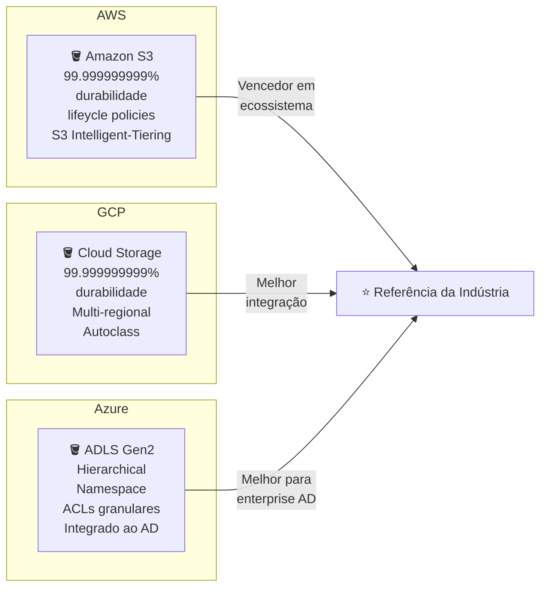

| Critério | Amazon S3 | Google Cloud Storage | Azure Data Lake Gen2 |
|----------|-----------|----------------------|----------------------|
| **Durabilidade** | 99.999999999% | 99.999999999% | 99.999999999% |
| **Disponibilidade** | 99.99% | 99.99% | 99.9% |
| **Custo storage (GB/mês)** | ~$0.023 | ~$0.020 | ~$0.018 |
| **Camadas de storage** | Standard, IA, Glacier, Deep Archive | Standard, Nearline, Coldline, Archive | Hot, Cool, Archive |
| **Controle de acesso** | IAM + Bucket Policies | IAM + ACLs | RBAC + ACLs hierárquicas |
| **Versionamento** | ✅ | ✅ | ✅ |
| **Notificações de eventos** | SNS, SQS, Lambda | Pub/Sub, Cloud Functions | Event Grid, Functions |
| **Namespace hierárquico** | Emulado (prefixos) | Emulado (prefixos) | ✅ Nativo |
| **Integração com AD** | ❌ | ❌ | ✅ Azure AD |
| **Melhor para** | Ecossistema AWS, referência | Custo-benefício, GCP nativo | Enterprise com AD |


### 📊 Data Warehouse (OLAP)

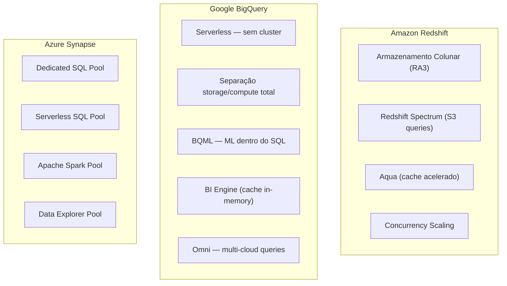

| Critério | Amazon Redshift | Google BigQuery | Azure Synapse |
|----------|-----------------|-----------------|---------------|
| **Modelo de cobrança** | Por hora de cluster | Por TB escaneado / slot | Por DWU ou serverless |
| **Serverless** | ✅ Redshift Serverless | ✅ Nativo | ✅ Serverless SQL Pool |
| **Separação storage/compute** | ✅ Nós RA3 | ✅ Total | Parcial |
| **Suporte a ML integrado** | ❌ | ✅ BQML | ✅ via Synapse ML |
| **Performance out-of-the-box** | ⭐⭐⭐⭐ | ⭐⭐⭐⭐⭐ | ⭐⭐⭐ |
| **Facilidade de operação** | Média | Alta | Média |
| **Suporte a dados semi-estruturados** | Parcial (SUPER type) | ✅ JSON nativo | ✅ |
| **Concorrência** | Concurrency Scaling | Automático | Workload Management |
| **Integração BI nativa** | QuickSight | Looker | Power BI |
| **Melhor para** | Workloads AWS pesados | Analytics de escala máxima | Enterprise Microsoft |


### 🔄 ETL / Ingestão Gerenciada

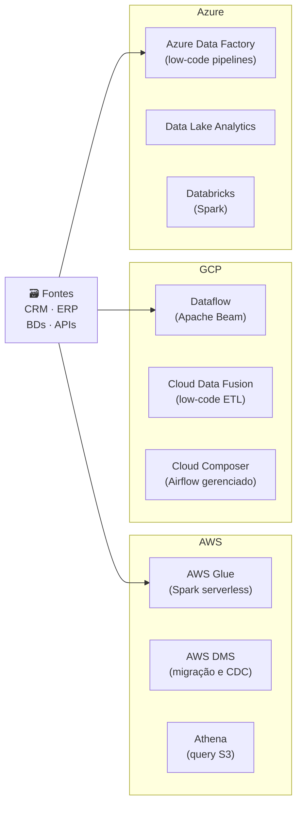

| Critério | AWS Glue | GCP Dataflow | Azure Data Factory |
|----------|----------|--------------|--------------------|
| **Paradigma** | Spark serverless | Apache Beam | Low-code + code |
| **Linguagem** | Python, Scala | Python, Java | JSON + Python |
| **Curva de aprendizado** | Média | Alta | Baixa |
| **Batch** | ✅ | ✅ | ✅ |
| **Streaming** | Limitado | ✅ Nativo | ✅ via Event Hubs |
| **Catálogo integrado** | ✅ Glue Data Catalog | ✅ Dataplex | ✅ Purview |
| **Conector nativo para outros clouds** | Limitado | Limitado | ✅ via ADF |
| **Custo** | Por DPU-hora | Por vCPU-hora | Por atividade |
| **Melhor para** | Workloads Spark na AWS | Streaming complexo | Integração enterprise |


### ⚡ Streaming e Mensageria

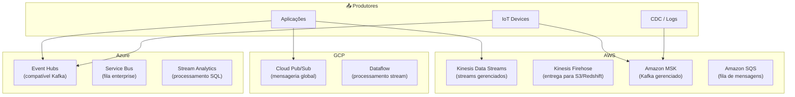

| Critério | AWS Kinesis | AWS MSK (Kafka) | GCP Pub/Sub | Azure Event Hubs |
|----------|-------------|-----------------|-------------|-----------------|
| **Compatibilidade Kafka** | ❌ | ✅ Total | ❌ | ✅ Parcial |
| **Retenção de mensagens** | 7-365 dias | Configurável | 7 dias (max 31) | 1-7 dias |
| **Replay de mensagens** | ✅ | ✅ | Limitado | ✅ |
| **Escala automática** | ✅ | Manual (brokers) | ✅ Automático | ✅ Auto-inflate |
| **Overhead operacional** | Baixo | Médio | Baixo | Baixo |
| **Custo** | Por shard/hora | Por broker/hora | Por GB | Por TU/hora |
| **Latência** | ~200ms | < 10ms | ~100ms | ~100ms |
| **Melhor para** | Integração AWS simples | Kafka-native apps | Apps GCP serverless | Apps Azure / Kafka compat |


### 🔥 Processamento Distribuído (Spark)

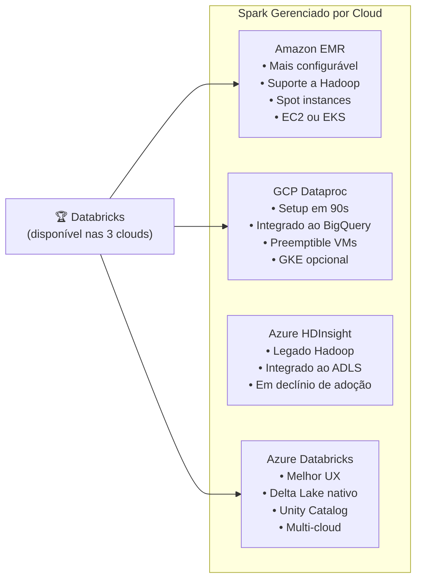

| Critério | Amazon EMR | GCP Dataproc | Azure HDInsight | Databricks (todas) |
|----------|------------|--------------|-----------------|---------------------|
| **Tempo de startup do cluster** | 5-10 min | ~90 segundos | 15-20 min | 2-5 min |
| **Facilidade de uso** | Média | Alta | Baixa | Alta |
| **Delta Lake nativo** | Configurável | Configurável | Configurável | ✅ Total |
| **Notebook integrado** | EMR Studio | Dataproc Hub | Básico | ✅ Databricks Notebooks |
| **Auto-scaling** | ✅ | ✅ | Limitado | ✅ |
| **Instâncias spot/preemptível** | ✅ | ✅ | ✅ | ✅ |
| **Serverless Spark** | ✅ EMR Serverless | ✅ Dataproc Serverless | ❌ | ✅ |
| **Multi-cloud** | ❌ | ❌ | ❌ | ✅ |
| **Melhor para** | Flexibilidade AWS | Velocidade + GCP | Legado | Lakehouse moderno |


### 🎼 Orquestração

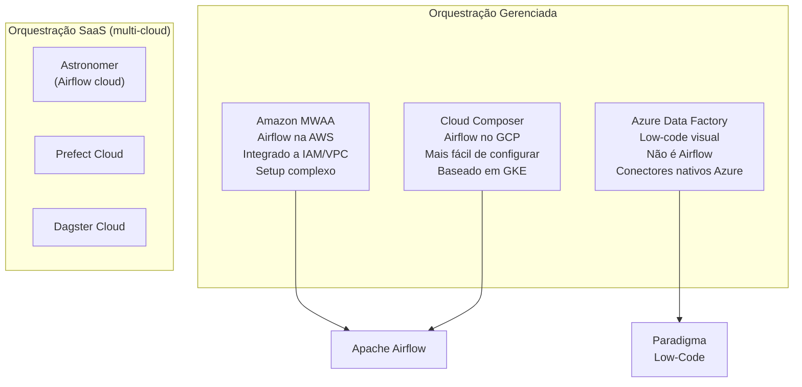

| Critério | Amazon MWAA | GCP Cloud Composer | Azure Data Factory | Astronomer |
|----------|-----------|--------------------|-------------------|------------|
| **Baseado em Airflow** | ✅ | ✅ | ❌ (proprietário) | ✅ |
| **Facilidade de setup** | Baixa | Média | Alta | Alta |
| **Custo base** | ~$0.49/hora | ~$0.37/hora | Por execução | Por tarefa |
| **Escalabilidade** | Auto | Auto (GKE) | Automática | Auto |
| **Suporte a DAGs como código** | ✅ | ✅ | Parcial (JSON) | ✅ |
| **Integração nativa cloud** | ✅ AWS | ✅ GCP | ✅ Azure | Multi-cloud |
| **Atualizações de versão** | Manual | Manual | Automática | Automática |
| **Melhor para** | Airflow na AWS | Airflow no GCP | Integração Azure visual | Airflow multi-cloud |


## Comparativo de Arquiteturas por Cloud

### Arquitetura Data Lake

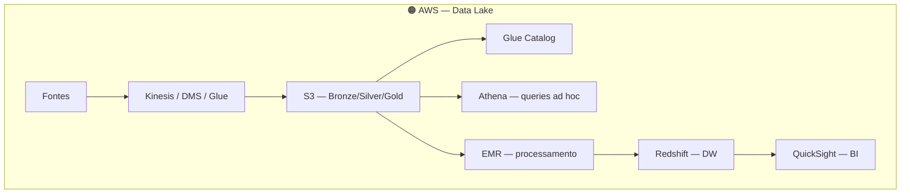

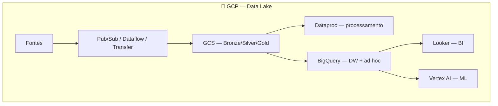

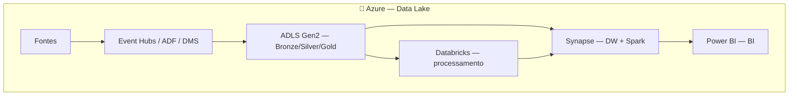


### Arquitetura Lakehouse

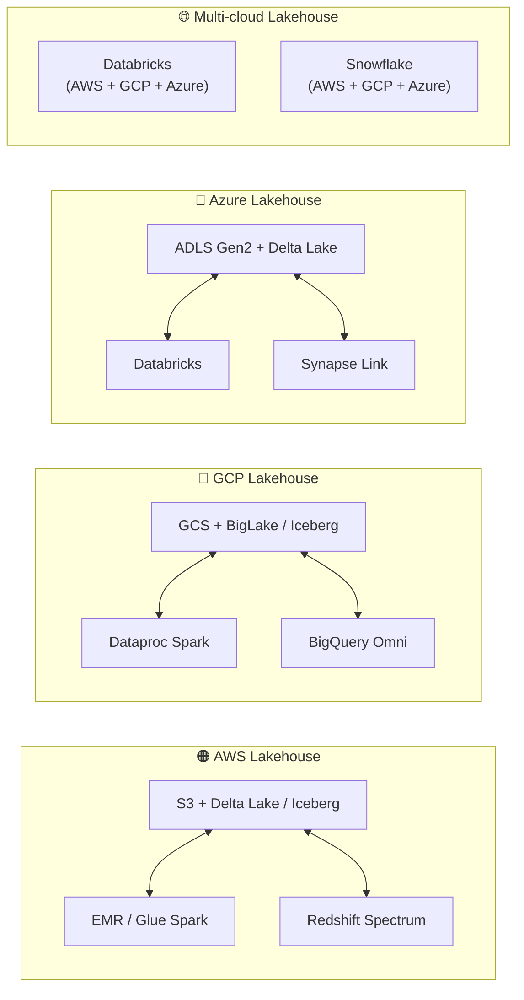


### Pipeline Streaming por Cloud

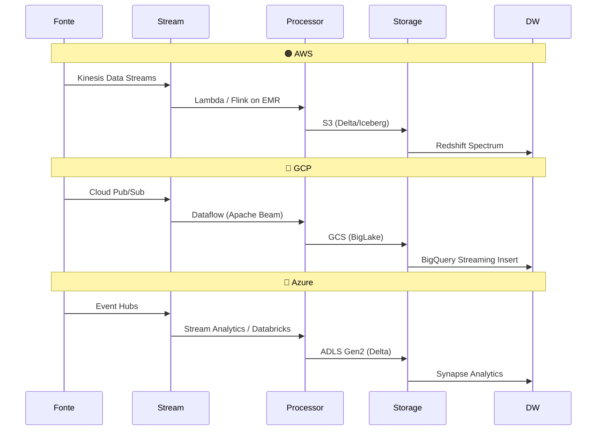


### Pipeline Batch por Cloud

```mermaid
gantt
    title Pipeline Batch Diário — Comparativo de Componentes
    dateFormat HH:mm
    axisFormat %H:%M

    section 🟠 AWS
    Extração (DMS/Glue)         :a1, 02:00, 30m
    Processamento (EMR/Glue)    :a2, after a1, 60m
    Carga (Redshift COPY)       :a3, after a2, 20m
    BI disponível (QuickSight)  :milestone, after a3, 0m

    section 🔵 GCP
    Extração (Dataflow/Transfer):b1, 02:00, 20m
    Processamento (Dataproc)    :b2, after b1, 45m
    Carga (BQ Load Job)         :b3, after b2, 10m
    BI disponível (Looker)      :milestone, after b3, 0m

    section 🔷 Azure
    Extração (ADF Pipeline)     :c1, 02:00, 25m
    Processamento (Databricks)  :c2, after c1, 50m
    Carga (Synapse COPY)        :c3, after c2, 15m
    BI disponível (Power BI)    :milestone, after c3, 0m
```


## Comparativo de Ferramentas Open Source vs Cloud Nativa

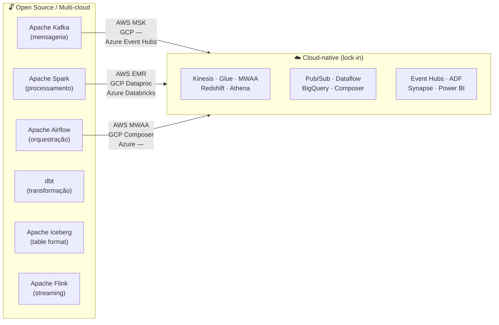

| Ferramenta | AWS Equivalente | GCP Equivalente | Azure Equivalente | Lock-in? |
|------------|----------------|----------------|-------------------|----------|
| Apache Kafka | MSK | — (Pub/Sub diferente) | Event Hubs | Baixo (MSK é Kafka puro) |
| Apache Spark | EMR / Glue | Dataproc | HDInsight / Databricks | Baixo |
| Apache Airflow | MWAA | Cloud Composer | — | Baixo |
| dbt | dbt Cloud / Redshift | dbt Cloud / BigQuery | dbt Cloud / Synapse | Nenhum |
| Apache Flink | Kinesis Analytics | Dataflow | Stream Analytics | Médio |
| Apache Iceberg | Glue + Athena | BigLake | Synapse / Databricks | Nenhum |


## Custo Comparativo

### Modelo de Cobrança por Serviço

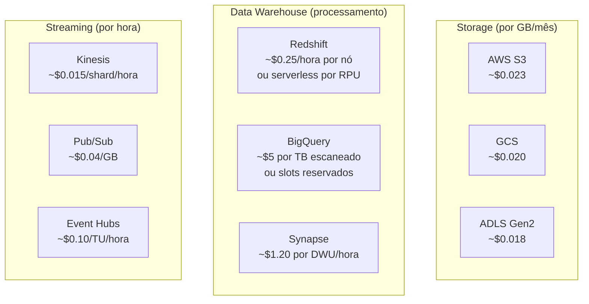

| Cenário | AWS | GCP | Azure | Observações |
|---------|-----|-----|-------|-------------|
| **Storage 100 TB/mês** | ~$230 | ~$200 | ~$180 | Preços variam por região |
| **DW: 10 TB scaneados/dia** | ~$500/mês (Redshift) | ~$1.500/mês (on-demand) | ~$800/mês (Synapse) | BigQuery tem slots reservados mais baratos em alto volume |
| **Spark: 100 horas/mês** | ~$200 (EMR Spot) | ~$150 (Dataproc preemptível) | ~$180 (HDInsight Spot) | Spot/preemptível reduz custo em 60-80% |
| **Kafka: 100 GB/dia** | ~$400/mês (MSK) | ~$120/mês (Pub/Sub) | ~$200/mês (Event Hubs) | MSK mais caro por ser Kafka gerenciado completo |
| **Airflow gerenciado** | ~$350/mês (MWAA mínimo) | ~$270/mês (Composer mínimo) | Via ADF (por execução) | Todos têm custo base alto |

### Estratégias de Redução de Custo

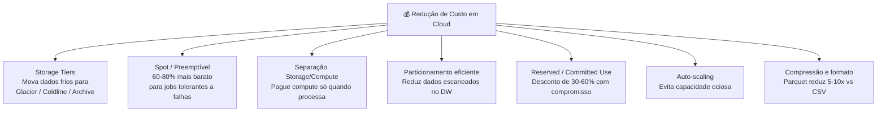


## Governança e Segurança por Cloud

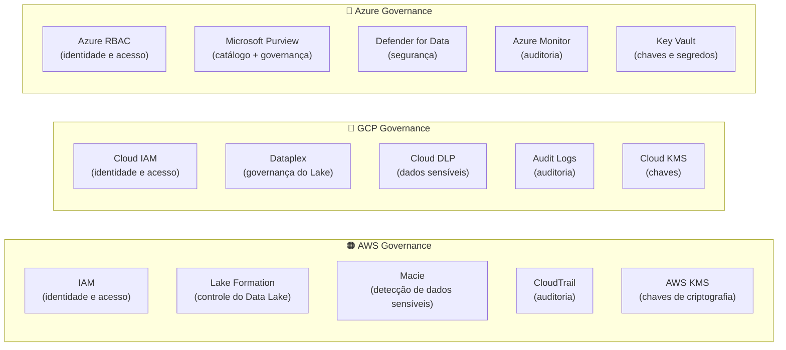

| Critério | AWS | GCP | Azure |
|----------|-----|-----|-------|
| **Gestão de identidade** | AWS IAM | Cloud IAM | Azure AD + RBAC |
| **Controle do Data Lake** | Lake Formation | Dataplex | ADLS ACLs + Purview |
| **Catálogo de dados** | Glue Data Catalog | Dataplex / Data Catalog | Microsoft Purview |
| **Detecção de dados sensíveis** | Amazon Macie | Cloud DLP | Microsoft Purview |
| **Criptografia gerenciada** | AWS KMS | Cloud KMS | Azure Key Vault |
| **Auditoria** | CloudTrail | Cloud Audit Logs | Azure Monitor |
| **Compliance frameworks** | SOC, PCI, LGPD, HIPAA | SOC, PCI, LGPD, HIPAA | SOC, PCI, LGPD, HIPAA |
| **Integração com AD corporativo** | ❌ (via SSO) | ❌ (via SSO) | ✅ Nativo |
| **Diferencial** | Lake Formation granular | DLP automático | Purview unificado |


## Machine Learning e IA por Cloud

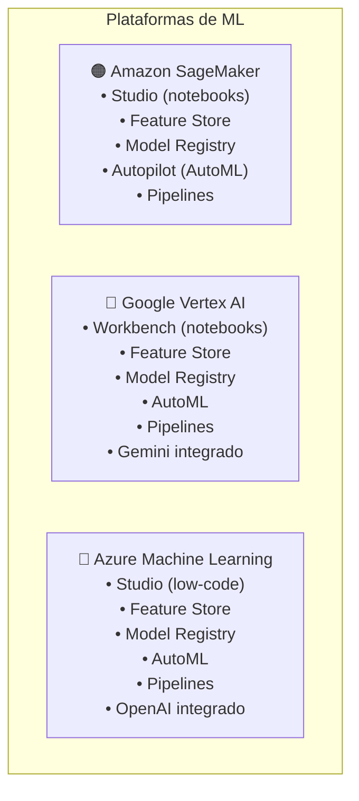

| Critério | Amazon SageMaker | Google Vertex AI | Azure ML |
|----------|-----------------|-----------------|----------|
| **Feature Store gerenciado** | ✅ | ✅ | ✅ |
| **AutoML** | ✅ Autopilot | ✅ AutoML | ✅ |
| **ML Pipelines** | ✅ | ✅ | ✅ |
| **Foundation Models / LLMs** | Bedrock (terceiros) | Gemini / PaLM | OpenAI (Azure OpenAI) |
| **MLOps integrado** | ✅ | ✅ | ✅ |
| **SQL para ML** | ❌ | ✅ BigQuery ML | ✅ Synapse ML |
| **Integração com dados** | S3 + Redshift | BigQuery nativo | ADLS + Synapse |
| **Diferencial** | Mais completo | BigQuery ML + Gemini | OpenAI + Microsoft |


## Quando Escolher Cada Cloud?

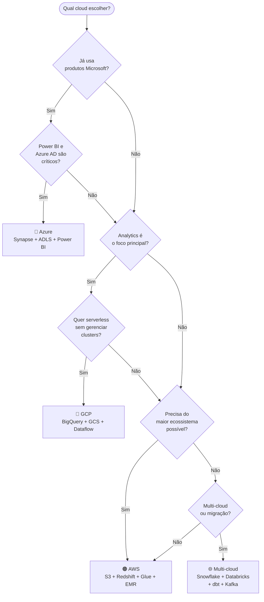

| Cenário | Cloud Recomendada | Justificativa |
|---------|------------------|---------------|
| Startup de analytics sem legado | GCP | BigQuery serverless, menor overhead, excelente custo-benefício |
| Enterprise com Active Directory | Azure | Integração nativa com AD, Power BI, ecossistema Microsoft |
| E-commerce de alto volume | AWS | Maior ecossistema, Kinesis para streaming, maturidade de mercado |
| ML/IA como core do negócio | GCP | Vertex AI + BigQuery ML + Gemini, melhor integração dados-ML |
| Empresa com tudo na AWS | AWS | Integração nativa, menos overhead, economia de egress |
| Multi-cloud / portabilidade | Snowflake + Databricks | Evitar lock-in, rodam nas 3 clouds com a mesma API |
| Dados regulados (saúde/financeiro) | Qualquer uma | As 3 têm compliance. Depende do parceiro comercial |


## Resumo Executivo

```mermaid
graph LR
    subgraph Strengths["✅ Pontos Fortes"]
        AWS_S["🟠 AWS<br/>Maior ecossistema<br/>Maior comunidade<br/>Mais serviços disponíveis<br/>Melhor para generalistas"]
        GCP_S["🔵 GCP<br/>BigQuery incomparável<br/>Melhor analytics puro<br/>Custo-benefício<br/>ML integrado"]
        Az_S["🔷 Azure<br/>Melhor para enterprise<br/>Integração Microsoft<br/>Power BI nativo<br/>Azure OpenAI"]
    end
```

| | 🟠 AWS | 🔵 GCP | 🔷 Azure |
|-|--------|--------|---------|
| **Vença quando...** | Precisa do maior ecossistema e flexibilidade | Analytics e ML são o core | Já usa Microsoft e Power BI |
| **Evite quando...** | Simplicidade é prioridade | Quer maior ecossistema geral | Não usa Active Directory |
| **Serviço ícone** | S3 | BigQuery | Power BI + Synapse |
| **Streaming** | ⭐⭐⭐⭐ | ⭐⭐⭐ | ⭐⭐⭐ |
| **Batch Analytics** | ⭐⭐⭐⭐ | ⭐⭐⭐⭐⭐ | ⭐⭐⭐⭐ |
| **ML/IA** | ⭐⭐⭐⭐ | ⭐⭐⭐⭐⭐ | ⭐⭐⭐⭐ |
| **Enterprise** | ⭐⭐⭐⭐ | ⭐⭐⭐ | ⭐⭐⭐⭐⭐ |
| **Custo storage** | ⭐⭐⭐ | ⭐⭐⭐⭐ | ⭐⭐⭐⭐⭐ |
| **Documentação** | ⭐⭐⭐⭐⭐ | ⭐⭐⭐⭐ | ⭐⭐⭐⭐ |


## Referências

- [AWS Data Analytics Overview](https://aws.amazon.com/big-data/datalakes-and-analytics/)
- [Google Cloud Data Analytics](https://cloud.google.com/solutions/data-analytics)
- [Azure Analytics Services](https://azure.microsoft.com/en-us/solutions/data-analytics/)
- [Gartner Magic Quadrant for Cloud Database Management Systems](https://www.gartner.com/en/documents/cloud-dbms)
- **Fundamentals of Data Engineering** — Joe Reis & Matt Housley (O'Reilly)


← [Cloud e Infraestrutura](./cloud-e-infraestrutura.md) · [Voltar ao índice](./0-engenharia-de-dados.md) 


*Documentação em construção · Portfólio pessoal*