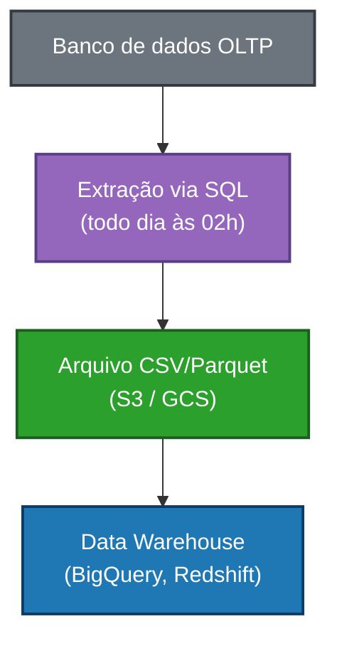
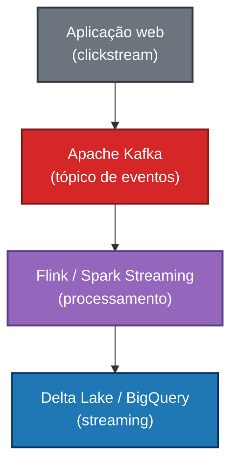

# Ingestão de Dados

> *"Dados que não chegam não existem. A ingestão é a porta de entrada de todo sistema de dados."*

← [Voltar ao índice](./0-engenharia-de-dados.md)

## O que é Ingestão de Dados?

Ingestão de dados é o processo de **capturar dados de fontes diversas e transportá-los para um ambiente centralizado** — seja um Data Lake, Data Warehouse ou qualquer outro destino de armazenamento.

É a primeira etapa de qualquer pipeline de dados e, muitas vezes, a mais crítica: se a ingestão falha, tudo o que vem depois falha junto.

Uma boa camada de ingestão deve ser:
- **Confiável:** garantir que nenhum dado se perca
- **Escalável:** lidar com picos de volume sem degradação
- **Rastreável:** saber exatamente o que foi ingerido, quando e de onde
- **Resiliente:** se recuperar de falhas sem intervenção manual

## Tipos de Ingestão

### 📦 Batch (Em Lote)

Dados são coletados e movidos em **intervalos regulares de tempo** — de hora em hora, uma vez ao dia, semanalmente, etc. É o modelo mais tradicional e ainda amplamente utilizado.

**Características:**
- Alta latência (os dados não estão disponíveis imediatamente)
- Mais simples de implementar e depurar
- Ideal para grandes volumes que não precisam de tempo real
- Processamento geralmente mais barato

**Casos de uso:** relatórios diários, cargas noturnas de ERP, exportações de banco de dados, ETL tradicional.

**Exemplo de fluxo:**

### ⚡ Streaming (Tempo Real)

Dados são capturados e processados **continuamente**, evento por evento, com latência de milissegundos a segundos. Exige uma infraestrutura mais sofisticada, mas entrega dados frescos.

**Características:**
- Baixa latência (dados disponíveis quase instantaneamente)
- Maior complexidade de implementação e operação
- Requer atenção especial a ordenação, duplicatas e falhas
- Custo operacional geralmente mais alto

**Casos de uso:** detecção de fraude em tempo real, monitoramento de sistemas, personalização em tempo real, telemetria de IoT, feeds financeiros.

**Exemplo de fluxo:**

### 🔄 Micro-batch

Um meio-termo entre batch e streaming. Os dados são coletados em **janelas de tempo muito curtas** (segundos ou poucos minutos), dando uma sensação de quase-tempo-real com menor complexidade que o streaming puro.

O Apache Spark Structured Streaming opera, por padrão, nesse modelo.

## Padrões de Extração

### Full Load (Carga Completa)
Todos os dados da fonte são extraídos a cada execução. Simples, mas ineficiente para grandes volumes e fontes que crescem continuamente.

**Quando usar:** tabelas pequenas, dados que não têm identificador de tempo, cargas iniciais (bootstrap).

### Incremental Load (Carga Incremental)
Apenas os dados **novos ou modificados** desde a última extração são capturados. Muito mais eficiente para grandes volumes.

Estratégias comuns:
- **Timestamp/Data de modificação:** filtra registros com `updated_at > última_execução`
- **Chave sequencial (ID):** captura registros com `id > último_id_processado`
- **CDC (Change Data Capture):** captura mudanças diretamente do log de transações do banco

### CDC — Change Data Capture

CDC é uma das técnicas mais poderosas para ingestão incremental. Em vez de consultar a tabela, monitora o **log de transações do banco de dados** (binlog no MySQL, WAL no PostgreSQL) e captura cada INSERT, UPDATE e DELETE em tempo real.

**Vantagens:**
- Latência muito baixa
- Não impacta a performance do banco de dados de origem
- Captura deletes (algo que timestamp não faz)
- Histórico completo de mudanças

**Ferramentas de CDC:** Debezium (open source), AWS DMS, Fivetran, Airbyte.

## Fontes Comuns de Dados

| Tipo de Fonte | Exemplos | Método típico |
|---------------|----------|---------------|
| Banco relacional | PostgreSQL, MySQL, Oracle | SQL incremental, CDC |
| API REST | Stripe, Salesforce, HubSpot | Polling periódico, webhooks |
| Arquivos | CSV, JSON, Parquet, Avro | Upload para object storage |
| Mensageria | Kafka, RabbitMQ, SQS | Consumer contínuo |
| Banco NoSQL | MongoDB, DynamoDB, Cassandra | Change streams, export |
| SaaS | Google Analytics, Ads, ERP | Conectores prontos (Fivetran, Airbyte) |
| IoT / Sensores | MQTT, protocolos proprietários | Gateways de IoT, Kinesis |
| Logs | Aplicações, servidores, infra | Fluentd, Logstash, CloudWatch |

## Ferramentas de Ingestão

### Conectores Gerenciados (EL / ETL sem código)

Ideais para ingerir dados de fontes SaaS e bancos populares com pouca configuração.

**Fivetran**
- Conectores prontos para centenas de fontes
- Totalmente gerenciado, zero manutenção
- CDC nativo para bancos relacionais
- Custo baseado em volume de linhas processadas

**Airbyte**
- Open source (self-hosted) ou cloud gerenciado
- Grande catálogo de conectores da comunidade
- Mais flexível e customizável que o Fivetran
- Opção gratuita para self-hosting

**Stitch**
- Alternativa mais simples e barata
- Foco em batch, menos suporte a streaming

### Mensageria e Streaming

**Apache Kafka**
- Plataforma de streaming distribuída, padrão da indústria
- Armazena eventos de forma durável e reprocessável
- Alta throughput, baixa latência
- Ecossistema rico: Kafka Connect, Kafka Streams, ksqlDB
- Versões gerenciadas: Confluent Cloud, AWS MSK, Aiven

**AWS Kinesis**
- Alternativa gerenciada da AWS ao Kafka
- Integração nativa com o ecossistema AWS
- Kinesis Data Streams (ingestão), Kinesis Firehose (entrega para S3/Redshift)

**Google Pub/Sub**
- Serviço de mensageria gerenciado do GCP
- Integração nativa com Dataflow e BigQuery

### Orquestração de Ingestão Batch

**Apache Sqoop** *(legado)*
Ferramenta para mover dados entre HDFS e bancos relacionais. Ainda encontrado em ambientes Hadoop legados.

**dlt (data load tool)**
Biblioteca Python moderna para construir pipelines de ingestão de forma programática. Leve, sem necessidade de infraestrutura dedicada.

**Singer**
Protocolo open source com taps (fontes) e targets (destinos) que podem ser combinados livremente.

### Processamento de Streams

**Apache Flink**
Motor de processamento de streams stateful de alta performance. Suporte nativo a event time, watermarks e exatamente-uma-vez (*exactly-once*). Preferido para casos de uso complexos de streaming.

**Spark Structured Streaming**
API unificada do Spark para batch e streaming. Facilita times que já usam Spark para batch. Opera em micro-batch por padrão.

## Conceitos Importantes

### Idempotência
Uma operação de ingestão é **idempotente** quando pode ser executada múltiplas vezes sem gerar efeitos colaterais — ou seja, reprocessar os mesmos dados não cria duplicatas. Fundamental para pipelines resilientes.

### Exatamente-Uma-Vez (Exactly-Once Semantics)
Garantia de que cada evento é processado **exatamente uma vez**, nem mais, nem menos. É o ideal, mas também o mais difícil de alcançar. Alternativas:
- **At-least-once:** pode processar duplicatas (mais comum, exige deduplicação downstream)
- **At-most-once:** pode perder dados (raramente aceitável)

### Backfill e Reprocessamento
Capacidade de reingerir dados históricos quando há falha, mudança de lógica ou necessidade de corrigir dados. Uma boa arquitetura de ingestão deve suportar backfill de forma segura.

### Schema Evolution
Fontes de dados mudam ao longo do tempo: colunas são adicionadas, renomeadas ou removidas. A camada de ingestão precisa lidar com essas mudanças sem quebrar o pipeline. Formatos como Avro e Protobuf com Schema Registry ajudam nesse controle.

### Watermarks
No processamento de streams, eventos chegam fora de ordem. **Watermarks** são marcadores de tempo que indicam até que ponto o sistema pode assumir que todos os eventos de um determinado período já chegaram, permitindo finalizar janelas de agregação com segurança.

## Anti-patterns Comuns

❌ **Full load em tabelas grandes:** extrair a tabela inteira toda vez é lento e caro. Use incremental.

❌ **Sem tratamento de falhas:** um pipeline que quebra silenciosamente é pior que um que não existe. Sempre implemente retries, alertas e dead-letter queues.

❌ **Acoplamento forte com a fonte:** consultas complexas direto no banco de produção podem derrubar o sistema. Prefira réplicas de leitura ou CDC.

❌ **Ignorar duplicatas:** redes falham, retries acontecem. Assuma que duplicatas vão existir e trate-as.

❌ **Sem monitoramento de volume:** uma ingestão que retorna zero registros pode ser um bug silencioso. Monitore contagens esperadas.

## Comparativo: Batch vs Streaming

| Critério | Batch | Streaming |
|----------|-------|-----------|
| Latência | Minutos a horas | Milissegundos a segundos |
| Complexidade | Baixa | Alta |
| Custo | Menor | Maior |
| Tolerância a falhas | Mais simples | Requer atenção especial |
| Casos de uso | Relatórios, ETL, ML training | Fraude, alertas, personalização |
| Ferramentas | Airbyte, Fivetran, dlt | Kafka, Flink, Kinesis |

## Referências

- **Fundamentals of Data Engineering** — Joe Reis & Matt Housley (O'Reilly)
- [Debezium Documentation](https://debezium.io/documentation/)
- [Airbyte Docs](https://docs.airbyte.com/)
- [Apache Kafka Documentation](https://kafka.apache.org/documentation/)
- [dlt (data load tool)](https://dlthub.com/docs/intro)

← [Arquitetura de Dados](./1-arquitetura-de-dados.md) · [Voltar ao índice](./0-engenharia-de-dados.md) · [Armazenamento de Dados →](./2-armazenamento-de-dados.md)

*Documentação em construção · Portfólio pessoal*
