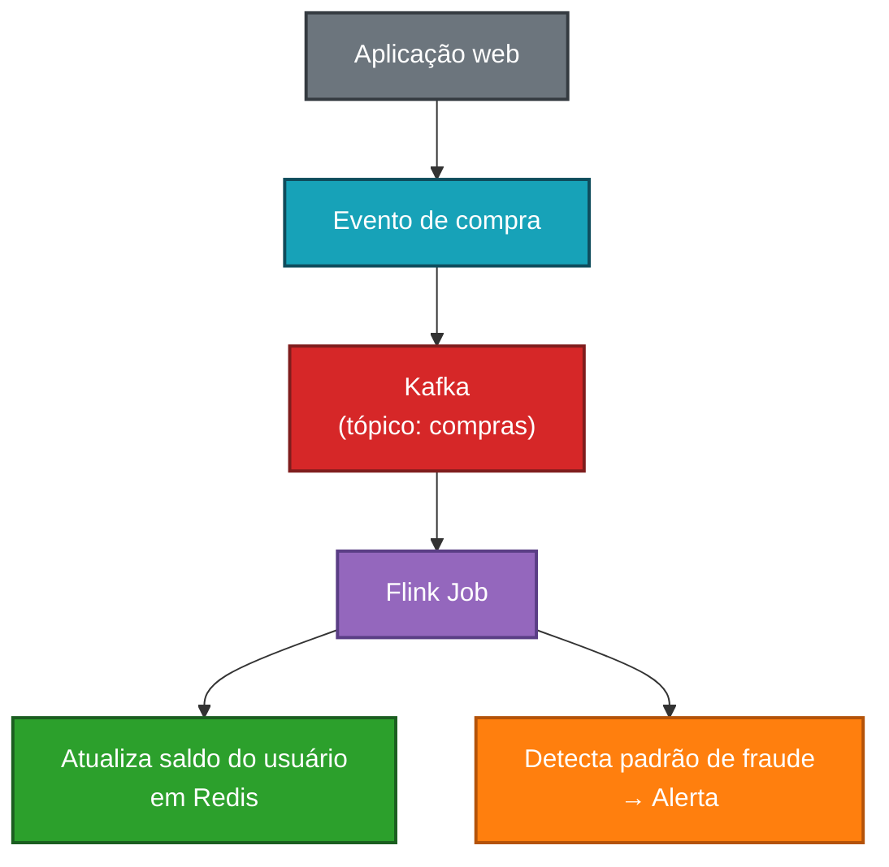
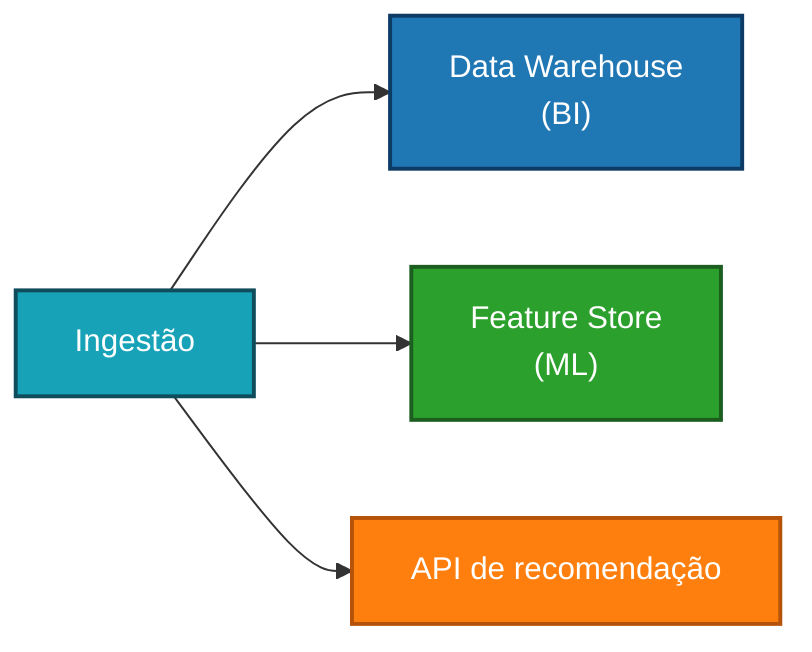
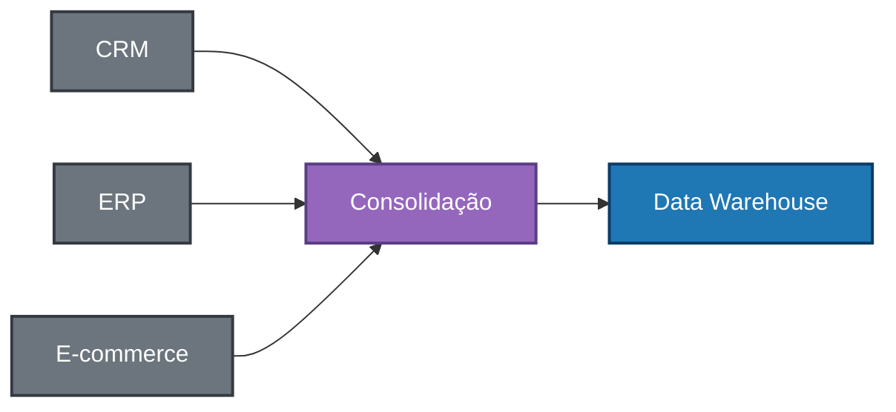
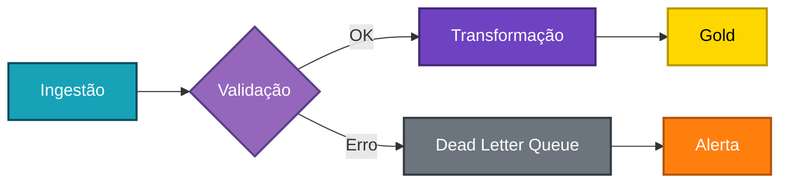

# Pipelines de Dados

> *"Um pipeline bem construído é invisível. Um pipeline mal construído é o único assunto da reunião de segunda-feira."*

← [Voltar ao índice](./0-engenharia-de-dados.md)


## O que é um Pipeline de Dados?

Um pipeline de dados é o **conjunto de etapas automatizadas e encadeadas** que movem, transformam e entregam dados desde sua origem até o destino final — seja um Data Warehouse, um dashboard, um modelo de ML ou uma API.

A analogia com um encanamento é precisa: o pipeline transporta dados de um ponto ao outro, e assim como canos, deve ser robusto, monitorável e capaz de lidar com pressão (volume) sem vazar (perder dados) ou entupir (travar).

Um pipeline típico segue o fluxo:


## Anatomia de um Pipeline

### Fonte (Source)
Onde os dados se originam. Pode ser um banco de dados transacional, uma API, um arquivo, um tópico Kafka, um evento de aplicação, etc.

### Ingestão
A etapa que coleta os dados da fonte e os move para o ambiente de dados. Pode ser batch ou streaming. Ver [Ingestão de Dados](./2-ingestao-de-dados.md).

### Armazenamento Intermediário (Staging)
Os dados brutos são armazenados antes de qualquer transformação. Essa camada garante que sempre é possível reprocessar a partir dos dados originais. Ver [Armazenamento de Dados](./2-armazenamento-de-dados.md).

### Transformação
Os dados são limpos, modelados e enriquecidos para atender aos requisitos do caso de uso. Ver [Processamento de Dados](./3-processamento-de-dados.md).

### Destino (Sink)
Onde os dados transformados chegam para serem consumidos: tabelas analíticas, dashboards, APIs, feature stores, etc.

### Orquestração
O sistema que agenda, monitora e gerencia a execução de todo o pipeline. Ver [Orquestração](./orquestacao.md).


## Tipos de Pipeline

### Pipeline Batch
Executa em **intervalos regulares** (ex: todo dia às 03h). Processa um conjunto de dados com começo e fim definidos. É o tipo mais comum e mais simples de implementar.

**Características:**
- Latência: minutos a horas
- Simples de depurar e re-executar
- Adequado para a maioria dos casos analíticos

**Exemplo de pipeline batch diário:**
```
02h00 → Extração de vendas do PostgreSQL de produção
02h15 → Carga dos dados brutos no S3 (camada Bronze)
02h30 → Transformação com dbt (camada Silver: limpeza)
03h00 → Agregação com dbt (camada Gold: métricas)
03h30 → Dashboard atualizado no Looker/Power BI
```


### Pipeline Streaming
Processa dados **continuamente**, em tempo real ou quase real. Cada evento é processado assim que chega.

**Características:**
- Latência: milissegundos a segundos
- Maior complexidade operacional
- Necessário quando a latência tem impacto real no negócio

**Exemplo de pipeline streaming:**



### Pipeline Híbrido (Lambda)
Combina batch e streaming para atender casos de uso que precisam de ambos: dados históricos completos (batch) e atualizações recentes (streaming). Ver [Arquitetura de Dados](./1-arquitetura-de-dados.md).


## Propriedades de um Bom Pipeline

### ✅ Idempotência
O pipeline pode ser executado **múltiplas vezes com o mesmo resultado**. Re-executar não cria duplicatas nem corrompe dados. Esta é a propriedade mais importante para resiliência.

Como garantir:
- Use `MERGE` / `UPSERT` ao invés de `INSERT` simples
- Use chaves de deduplicação únicas
- Mantenha o estado da última execução (watermark)

### ✅ Atomicidade
As etapas do pipeline devem suceder ou falhar como uma unidade. Não deve haver estados intermediários inconsistentes (ex: dados carregados no destino mas transformação não concluída).

### ✅ Rastreabilidade (Lineage)
Deve ser possível saber de onde cada dado veio, quais transformações sofreu e quando foi processado. Fundamental para depuração e auditoria.

### ✅ Observabilidade
O pipeline deve emitir métricas, logs e alertas suficientes para que problemas sejam detectados rapidamente. Ver [Observabilidade](./observabilidade.md).

### ✅ Resiliência e Retry
Falhas acontecem. O pipeline deve se recuperar automaticamente de erros transitórios (timeout de rede, serviço indisponível) sem intervenção manual.

### ✅ Escalabilidade
O pipeline deve suportar crescimento de volume sem mudanças arquiteturais significativas.

### ✅ Testabilidade
As transformações e a lógica de negócio devem ser testáveis de forma isolada, com dados de teste representativos.


## Padrões de Design de Pipelines

### Fan-out
Um pipeline produz dados que alimentam **múltiplos destinos ou consumidores** em paralelo.



### Fan-in
Múltiplas fontes são **consolidadas em um único pipeline** antes da transformação.



### Pipeline Condicional
O fluxo se bifurca com base em condições dos dados ou resultados de etapas anteriores.



### Backfill Pipeline
Pipeline auxiliar para **reprocessar dados históricos** — seja para corrigir erros, aplicar nova lógica ou popular uma nova tabela retroativamente.


## Dead Letter Queue (DLQ)

Uma **fila de mensagens mortas** é um destino para registros que falharam no processamento e não puderam ser reprocessados automaticamente. Em vez de perder o dado ou travar o pipeline, o registro vai para a DLQ para investigação posterior.

É uma prática essencial em pipelines de streaming e ingestão de alta disponibilidade.


## Versionamento e CI/CD para Pipelines

Pipelines de dados devem ser tratados como software: versionados, testados e implantados com rigor.

**Boas práticas:**
- Todo código de pipeline no Git (Python, SQL, configurações)
- Pull requests com revisão de código
- Testes automatizados em cada PR (unitários, de integração)
- Ambiente de desenvolvimento/staging separado do produção
- Deploy automatizado via CI/CD (GitHub Actions, GitLab CI)
- Rollback fácil em caso de falha

**Estrutura típica de repositório:**
```
meu-projeto-dados/
├── ingestion/
│   ├── sources/
│   │   ├── crm_connector.py
│   │   └── erp_connector.py
│   └── tests/
├── models/              ← dbt models
│   ├── staging/
│   ├── intermediate/
│   └── marts/
├── pipelines/           ← definições de DAGs (Airflow/Prefect)
│   ├── daily_sales.py
│   └── realtime_events.py
├── tests/
└── dbt_project.yml
```


## Monitoramento de Pipelines

Um pipeline sem monitoramento é um pipeline à espera de um desastre silencioso. Métricas essenciais a monitorar:

| Métrica | O que indica |
|---------|--------------|
| Tempo de execução | Performance, degradação ao longo do tempo |
| Volume de registros processados | Anomalias (zero registros pode ser bug) |
| Taxa de erros e rejeições | Qualidade da fonte ou da lógica |
| Atraso (lag) | Em streaming: quão atrasado está o processamento |
| Freshness dos dados | Há quanto tempo os dados foram atualizados |
| Custo de execução | Gastos com processamento cloud |

Ver mais em [Observabilidade](./observabilidade.md).


## Anti-patterns Comuns

❌ **Pipelines sem testes:** uma mudança na fonte quebra silenciosamente o destino.

❌ **Dependências implícitas:** um pipeline assume que outro já rodou sem verificar explicitamente.

❌ **Hard-coded credentials:** senhas e tokens embutidos no código. Use variáveis de ambiente ou secret managers.

❌ **Sem tratamento de erros:** o pipeline falha silenciosamente ou sem alertas.

❌ **Transformações complexas em um único passo:** dificulta depuração. Prefira etapas pequenas e rastreáveis.

❌ **Pipeline monolítico:** um único job faz ingestão + limpeza + agregação + carga. Impossível de testar e manter.

❌ **Re-execução que cria duplicatas:** ausência de idempotência gera dados incorretos.


## Exemplo Completo: Pipeline de Vendas

```
┌─────────────────────────────────────────────────────────────────┐
│                    PIPELINE DIÁRIO DE VENDAS                    │
└─────────────────────────────────────────────────────────────────┘

1. [02:00] INGESTÃO
   PostgreSQL (prod) → Airbyte CDC → S3 Bronze
   Tabelas: orders, order_items, customers, products

2. [02:30] VALIDAÇÃO
   Great Expectations verifica:
   - orders: sem registros com valor negativo
   - customers: campo email não nulo
   → Se falhar: alerta no Slack, pipeline pausado

3. [03:00] TRANSFORMAÇÃO SILVER (dbt)
   - stg_orders: limpeza, tipos corretos, remoção de duplicatas
   - stg_customers: normalização de endereços e nomes
   - stg_products: join com tabela de categorias

4. [03:30] TRANSFORMAÇÃO GOLD (dbt)
   - fct_vendas: tabela fato com todas as métricas
   - dim_cliente: dimensão desnormalizada
   - mart_receita_diaria: receita por dia, categoria, região

5. [04:00] DISPONIBILIZAÇÃO
   - Tabelas Gold disponíveis no BigQuery
   - Dashboard Looker atualizado automaticamente
   - Modelo de ML re-treinado com dados do dia anterior

6. [04:30] RELATÓRIO DE EXECUÇÃO
   - Log de sucesso com volumes processados
   - Alerta se tempo total > 3h
```


## Referências

- **Fundamentals of Data Engineering** — Joe Reis & Matt Housley (O'Reilly)
- [dbt Best Practices](https://docs.getdbt.com/guides/best-practices)
- [The Twelve-Factor App (adaptado para dados)](https://12factor.net/)
- [Data Pipeline Design Patterns — Google Cloud](https://cloud.google.com/architecture/data-lifecycle-cloud-platform)


← [Processamento de Dados](./4-processamento-de-dados.md) · [Voltar ao índice](./0-engenharia-de-dados.md) · [Orquestração →](./6-orquestacao.md)


*Documentação em construção · Portfólio pessoal*
