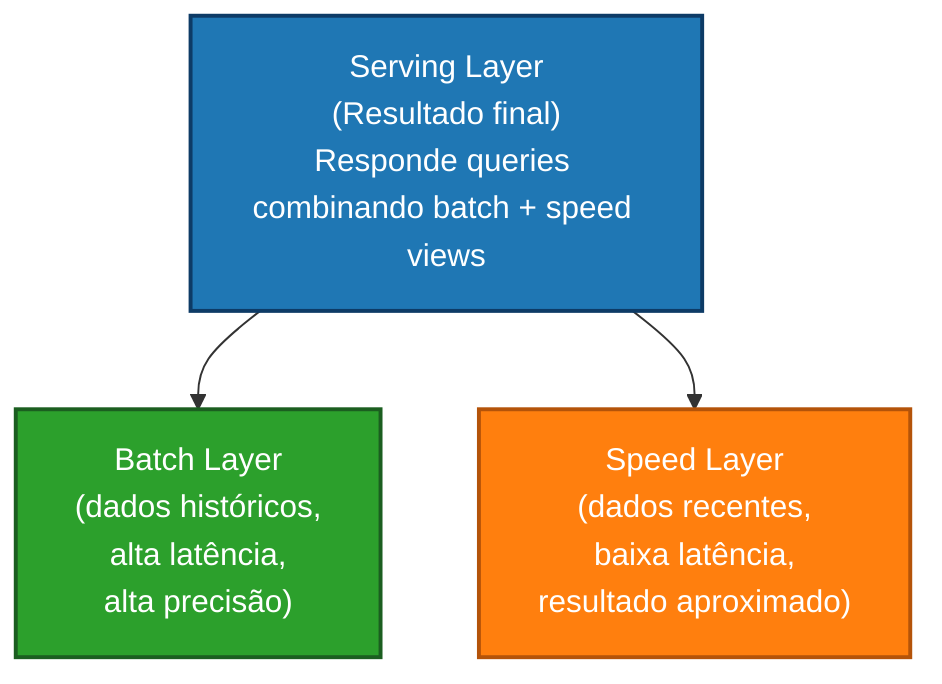
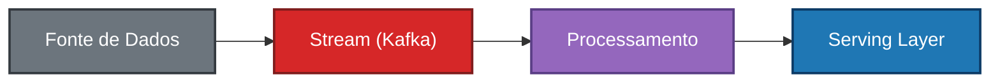
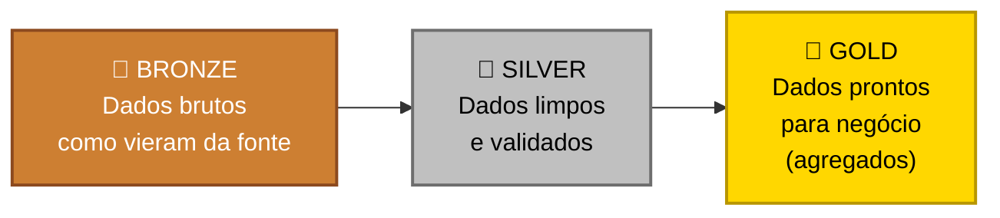
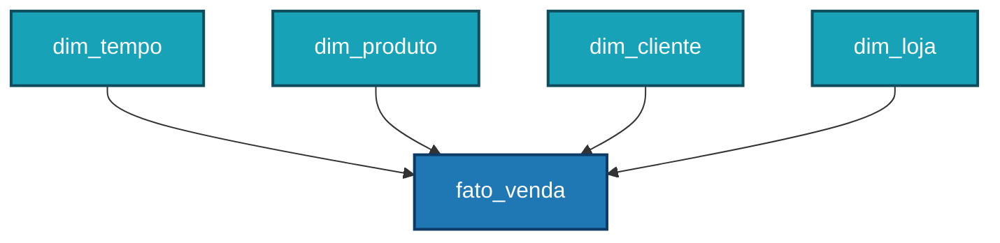
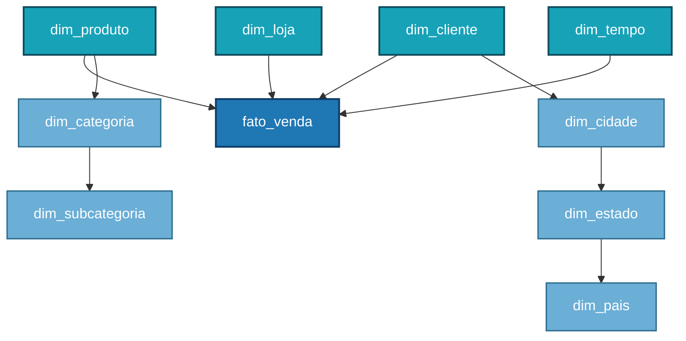
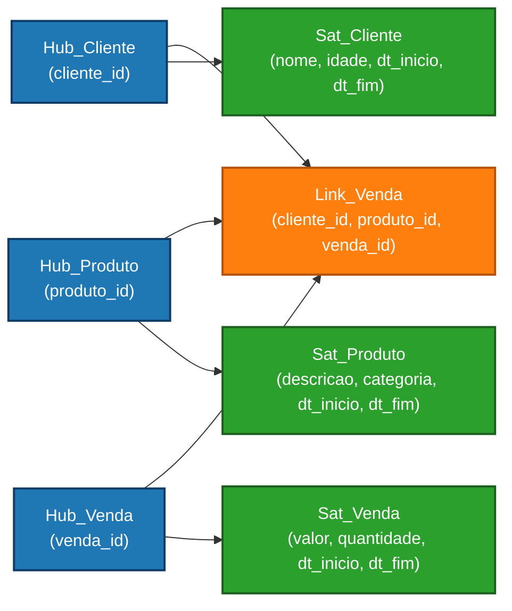
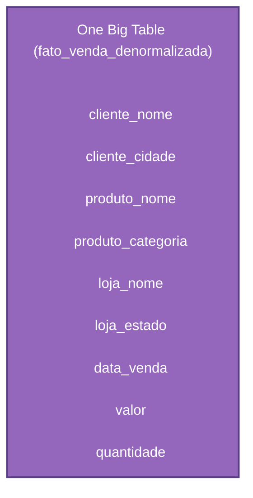

# Arquitetura de Dados

> *"A arquitetura é a base silenciosa que determina se um sistema de dados escala com elegância ou desmorona sob pressão."*

← [Voltar ao índice](./0-engenharia-de-dados.md)

## O que é Arquitetura de Dados?

Arquitetura de Dados é o conjunto de **decisões, padrões e modelos** que definem como os dados são coletados, armazenados, transformados, integrados e consumidos dentro de uma organização.

Ela responde perguntas fundamentais como:
- Onde os dados vão viver?
- Como vão chegar lá?
- Quem vai acessá-los e de que forma?
- Como o sistema se comporta quando o volume cresce 10x?

Uma boa arquitetura é **invisível quando funciona** — e catastrófica quando falha. Ela antecipa necessidades futuras sem over-engenheirizar o presente.

## Por que a Arquitetura importa?

Escolhas arquiteturais mal feitas têm um custo alto e difícil de reverter. Migrar um Data Warehouse mal projetado anos depois custa tempo, dinheiro e credibilidade. Por outro lado, uma arquitetura bem pensada:

- Reduz retrabalho e débito técnico
- Facilita a escalabilidade horizontal
- Permite que diferentes times consumam dados de forma independente
- Garante rastreabilidade e governança desde o início

## Componentes Fundamentais

Antes de explorar os padrões arquiteturais, é importante entender os blocos que compõem qualquer arquitetura de dados:

### Fontes de Dados
Onde os dados se originam. Podem ser:
- **Sistemas transacionais (OLTP):** bancos relacionais de aplicações (PostgreSQL, MySQL, Oracle)
- **APIs externas:** serviços de terceiros, redes sociais, dados de mercado
- **Arquivos:** CSVs, JSONs, XMLs, Parquet
- **Eventos e streams:** logs de aplicação, clickstream, IoT
- **Dados não estruturados:** imagens, áudios, documentos

### Camada de Ingestão
Responsável por mover dados das fontes para o ambiente centralizado. Pode ser batch ou streaming. Detalhado em [Ingestão de Dados](./5-ingestao-de-dados.md).

### Camada de Armazenamento
Onde os dados persistem. A escolha do tipo de armazenamento é uma das decisões mais críticas da arquitetura. Detalhado em [Armazenamento de Dados](./7-armazenamento-de-dados.md).

### Camada de Processamento e Transformação
Onde os dados brutos são limpos, enriquecidos e transformados em informação útil. Detalhado em [Processamento de Dados](./8-processamento-de-dados.md).

### Camada de Consumo
Onde os dados chegam ao usuário final: dashboards, relatórios, APIs, modelos de ML, aplicações.

## Padrões Arquiteturais

### 🏛️ Data Warehouse

O modelo mais tradicional. Um Data Warehouse (DW) é um repositório centralizado e estruturado, otimizado para **consultas analíticas (OLAP)**. Os dados chegam já transformados e modelados, prontos para consumo por ferramentas de BI.

**Características:**
- Schema definido antes da carga (*schema-on-write*)
- Dados estruturados e modelados (ex: Star Schema, Snowflake Schema)
- Alta performance para consultas analíticas
- Governança e qualidade mais fáceis de garantir

**Quando usar:** quando os casos de uso são bem definidos, os dados são majoritariamente estruturados e a equipe prioriza confiabilidade e performance de consulta.

**Ferramentas:** Snowflake, Google BigQuery, Amazon Redshift, Azure Synapse.

**Limitação:** pouco flexível para dados não estruturados e exploração ad hoc. Mudanças no schema podem ser custosas.

### 🏞️ Data Lake

Um repositório centralizado que armazena dados **em seu formato bruto e original**, estruturados ou não, em grande volume e baixo custo. A transformação acontece apenas quando os dados são consumidos (*schema-on-read*).

**Características:**
- Armazena qualquer tipo de dado (JSON, Parquet, imagens, vídeos, logs)
- Custo de armazenamento muito menor (object storage: S3, GCS, ADLS)
- Flexibilidade total para exploração e experimentação
- Escalabilidade quase ilimitada

**Quando usar:** quando o volume é massivo, os casos de uso são variados ou ainda desconhecidos, e há necessidade de dados brutos para ciência de dados e ML.

**Ferramentas:** AWS S3 + Glue, Google Cloud Storage + Dataproc, Azure Data Lake Storage.

**Limitação:** sem governança e organização rigorosas, vira um *Data Swamp* — um pântano de dados impossível de usar.

### 🏠 Data Lakehouse

Uma arquitetura híbrida que combina a **flexibilidade do Data Lake** com a **estrutura e performance do Data Warehouse**. Surgiu para resolver as limitações de ambos.

**Características:**
- Dados armazenados em object storage (barato e escalável)
- Camada transacional sobre os arquivos (suporte a ACID, updates, deletes)
- Suporte a SQL, streaming e workloads de ML na mesma plataforma
- Schema enforcement opcional (flexível, mas com governança possível)

**Quando usar:** é o padrão moderno preferido para a maioria das arquiteturas novas, especialmente quando se quer unificar analytics e ML em uma única plataforma.

**Formatos de tabela open source:** Delta Lake, Apache Iceberg, Apache Hudi.

**Plataformas:** Databricks, Apache Spark + Delta Lake, Dremio.

### ⚡ Lambda Architecture

Proposta por Nathan Marz, a Lambda Architecture resolve o desafio de processar **grandes volumes de dados históricos** e ao mesmo tempo **dados em tempo real**, mantendo consistência.

Ela é dividida em três camadas:

**Limitação:** mantém **dois sistemas de processamento em paralelo** (batch e streaming), o que dobra a complexidade de desenvolvimento e manutenção.

### 🌊 Kappa Architecture

Proposta por Jay Kreps (criador do Kafka) como uma simplificação da Lambda. A ideia central: **tudo é um stream**. Dados históricos e em tempo real são tratados da mesma forma, usando apenas uma camada de processamento de streaming.

**Vantagens:** menor complexidade operacional, um único código para manter.

**Limitação:** reprocessar grandes volumes históricos via streaming pode ser caro e lento. Nem sempre substitui bem o batch para workloads pesados.

### 🥇 Medallion Architecture (Bronze / Silver / Gold)

Popularizada pelo Databricks com Delta Lake, é um padrão de organização dos dados em **camadas progressivas de qualidade**, muito adotado em implementações de Lakehouse.

| Camada | Também chamada de | Característica |
|--------|-------------------|----------------|
| Bronze | Raw / Landing Zone | Dados brutos, sem transformação, como vieram da fonte |
| Silver | Cleansed / Refined | Dados limpos, deduplicados, validados, com schema aplicado |
| Gold | Curated / Aggregated | Dados modelados para casos de uso específicos (métricas, KPIs, features de ML) |

**Vantagens:**
- Rastreabilidade completa (sempre é possível voltar ao dado bruto)
- Separação clara de responsabilidades
- Reprocessamento facilitado
- Progressão natural de qualidade

### 🕸️ Data Mesh

Uma abordagem arquitetural e organizacional mais recente, proposta por Zhamak Dehghani. Ao invés de uma plataforma centralizada, o Data Mesh distribui a **responsabilidade pelos dados para os domínios de negócio** que os produzem.

**Quatro princípios:**
1. **Propriedade orientada a domínio:** cada time de negócio é dono dos seus dados
2. **Dados como produto:** cada domínio expõe seus dados como um produto com SLA e documentação
3. **Infraestrutura self-service:** plataforma compartilhada que facilita os domínios publicarem dados
4. **Governança federada:** políticas globais com execução local

**Quando considerar:** organizações grandes com múltiplos domínios de negócio, onde o modelo centralizado cria gargalos e dependências excessivas em um time de dados.

**Limitação:** requer maturidade organizacional elevada. Não é uma solução tecnológica — é uma mudança cultural e estrutural.

## Como Escolher uma Arquitetura?

Não existe arquitetura universalmente correta. A escolha depende de:

| Fator | Perguntas a responder |
|-------|-----------------------|
| **Volume** | Gigabytes ou Petabytes? Crescimento esperado? |
| **Velocidade** | Batch é suficiente ou precisa de tempo real? |
| **Variedade** | Dados estruturados, semi-estruturados, não estruturados? |
| **Equipe** | Tamanho do time, maturidade técnica, capacidade de manter complexidade? |
| **Casos de uso** | BI e relatórios? ML? Aplicações em tempo real? |
| **Orçamento** | Custo de armazenamento, processamento, ferramentas gerenciadas? |
| **Regulação** | LGPD, GDPR, requisitos de residência de dados? |

**Princípio geral:** comece simples. Um Data Warehouse moderno como BigQuery ou Snowflake resolve 80% dos casos. Adicione complexidade apenas quando houver necessidade real e comprovada.

## Padrões de Modelagem de Dados

A forma como os dados são organizados dentro do armazenamento também é parte da arquitetura.

Para uma visão completa dos níveis conceitual, lógico e físico, veja também [Modelagem de Dados](./2-modelagem-de-dados.md).

### Star Schema
O modelo mais comum em Data Warehouses. Possui uma **tabela fato central** (métricas e eventos) conectada a **tabelas dimensão** (contexto: tempo, produto, cliente, etc.).

### Snowflake Schema
Variação do Star Schema onde as dimensões são **normalizadas** em subdimensões. Reduz redundância, mas aumenta a complexidade das queries.

### Data Vault
Modelo focado em **auditabilidade e rastreabilidade histórica**. Composto por Hubs (entidades de negócio), Links (relacionamentos) e Satellites (atributos e histórico). Ideal para ambientes com muitas fontes e alta necessidade de rastreabilidade.

### One Big Table (OBT)
Modelo desnormalizado onde tudo é consolidado em uma única tabela larga. Simples de consultar, mas pode ser custoso em storage e difícil de manter.

## Tendências Atuais

- **Open Table Formats:** Apache Iceberg está se tornando o padrão dominante, com suporte crescente de todos os grandes provedores cloud.
- **Separação de storage e compute:** plataformas como Snowflake e BigQuery popularizaram esse modelo, que agora é o padrão.
- **Streaming-first:** com ferramentas como Kafka, Flink e Spark Structured Streaming, arquiteturas orientadas a eventos estão cada vez mais acessíveis.
- **Semantic Layer:** camadas semânticas (ex: dbt Semantic Layer, Cube) centralizam definições de métricas, evitando inconsistências entre ferramentas de consumo.

## Referências

- **Fundamentals of Data Engineering** — Joe Reis & Matt Housley (O'Reilly)
- **Designing Data-Intensive Applications** — Martin Kleppmann (O'Reilly)
- [Data Mesh Principles — martinfowler.com](https://martinfowler.com/articles/data-mesh-principles.html)
- [What is a Lakehouse? — Databricks](https://www.databricks.com/glossary/data-lakehouse)
- [Apache Iceberg docs](https://iceberg.apache.org/docs/latest/)

← [Voltar ao índice](./0-engenharia-de-dados.md) · [Modelagem de Dados →](./2-modelagem-de-dados.md)

*Documentação em construção · Portfólio pessoal*
