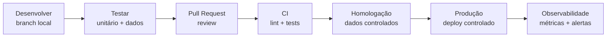

# DataOps e CI/CD para Dados

> *"DataOps aplica disciplina de engenharia ao ciclo de vida dos dados: versionar, testar, publicar, observar e melhorar continuamente."*

← [Voltar ao índice](./0-engenharia-de-dados.md)


## O que é DataOps?

DataOps é o conjunto de práticas que leva princípios de DevOps, engenharia de software, automação e observabilidade para pipelines, modelos, jobs e produtos de dados.

O objetivo é reduzir falhas manuais, aumentar confiabilidade e permitir mudanças frequentes com segurança.

DataOps conecta:

- Git e code review.
- Testes automatizados.
- CI/CD.
- Ambientes separados.
- Deploy controlado.
- Observabilidade.
- Governança.
- Reprocessamento e rollback.


## Por que DataOps importa?

Pipelines de dados mudam com frequência: fontes alteram schemas, regras de negócio evoluem, tabelas crescem, consumidores pedem novas métricas e plataformas mudam. Sem processo, cada mudança vira risco.

**DataOps ajuda a responder:**

- Quem alterou este pipeline?
- O que mudou entre versões?
- Os testes passaram antes do deploy?
- Como promover de desenvolvimento para produção?
- Como voltar para a versão anterior?
- Como auditar uma execução?
- Como saber se o deploy quebrou dados downstream?


## Ciclo de Vida de uma Mudança




## Estrutura de Repositório

Uma estrutura comum separa código, configuração, testes e documentação.

```text
data-platform/
|-- dags/
|-- dbt/
|   |-- models/
|   |-- tests/
|   `-- macros/
|-- spark/
|   |-- jobs/
|   `-- tests/
|-- sql/
|-- infra/
|   |-- terraform/
|   `-- docker/
|-- config/
|   |-- dev.yml
|   |-- staging.yml
|   `-- prod.yml
`-- docs/
```

**Boas práticas:**

- Código versionado no Git.
- Configuração por ambiente separada do código.
- Testes próximos ao código que validam.
- Documentação mantida junto da implementação.
- Nenhum segredo salvo no repositório.


## Ambientes

| Ambiente | Objetivo |
|---|---|
| Desenvolvimento | Construção e testes locais ou isolados |
| Homologação / staging | Validação com dados representativos e permissões controladas |
| Produção | Execução oficial, com SLAs, alertas e governança |

**Separar ambientes evita:**

- Testes escrevendo em tabelas produtivas.
- Credenciais de produção em notebooks locais.
- Mudanças não revisadas afetando consumidores finais.
- Custos inesperados por jobs experimentais.


## CI para Projetos de Dados

CI (Continuous Integration) valida automaticamente cada mudança antes de merge.

**Validações comuns:**

- Lint de Python, SQL, YAML e Terraform.
- Testes unitários.
- Testes de dbt.
- Validação de DAGs do Airflow.
- Verificação de schemas.
- Dry run de queries.
- Checagem de documentação.
- Checagem de formatação.

**Exemplo conceitual de pipeline CI:**

```yaml
name: data-ci

on:
  pull_request:

jobs:
  validate:
    runs-on: ubuntu-latest
    steps:
      - uses: actions/checkout@v4
      - name: Run tests
        run: |
          python -m pytest
          dbt deps
          dbt parse
          dbt test --select state:modified+
```


## CD para Projetos de Dados

CD (Continuous Delivery/Deployment) promove artefatos entre ambientes com controle.

**O que pode ser implantado:**

- DAGs do Airflow.
- Jobs Spark.
- Projetos dbt.
- Notebooks versionados.
- Infraestrutura Terraform.
- Configurações de tabelas.
- Contratos de dados.

**Padrões de deploy:**

| Padrão | Uso |
|---|---|
| Deploy por branch | Ambientes acompanham branches específicas |
| Deploy por tag | Produção recebe versões marcadas |
| Deploy por artefato | Pacotes gerados no CI são promovidos |
| Blue/green | Nova versão roda paralela antes de troca |
| Canary | Pequena parte do workload usa a nova versão primeiro |


## Testes em Dados

Projetos de dados precisam de mais de um tipo de teste.

| Tipo de teste | Exemplo |
|---|---|
| Unitário | Testar função que normaliza CPF ou calcula métrica |
| Integração | Ler fonte fake e gravar destino temporário |
| Schema | Campo obrigatório existe com tipo correto |
| Qualidade | `valor_total >= 0`, `cliente_id not null` |
| Regressão | Métrica não mudou fora do esperado |
| Volume | Linhas de hoje não caíram 90% sem explicação |
| Freshness | Tabela foi atualizada dentro do SLA |

**Princípio:** quanto mais perto da produção, mais os testes devem validar comportamento real do dado, não apenas sintaxe.


## Versionamento

| Item | Como versionar |
|---|---|
| Código | Git, tags, releases |
| Queries SQL | Arquivos versionados, dbt models |
| Schemas | Data contracts, schema registry, migrations |
| Infraestrutura | Terraform, Pulumi, CloudFormation |
| Configuração | Arquivos por ambiente, variáveis controladas |
| Dados | Snapshots, table formats, time travel |
| Modelos ML | Registry, versão de artefato, métricas |


## Configuração e Secrets

Configuração deve ser externa ao código e diferente por ambiente. Segredos devem ficar em gerenciadores apropriados.

**Boas práticas:**

- Use variáveis de ambiente para parâmetros.
- Use Secret Manager, Vault, AWS Secrets Manager, Azure Key Vault ou similares.
- Nunca salve tokens em notebooks ou YAML versionado.
- Diferencie credenciais de leitura e escrita.
- Aplique princípio do menor privilégio.


## Deploy de Notebooks

Notebooks são úteis para exploração, mas podem virar risco quando viram produção sem controle.

**Boas práticas:**

- Versionar notebooks ou exportar lógica para módulos.
- Evitar células manuais críticas.
- Parametrizar inputs e outputs.
- Executar via workflow agendado.
- Registrar dependências.
- Separar exploração de produção.


## Rollback e Recuperação

Toda estratégia de deploy precisa responder como voltar atrás.

**Possibilidades:**

- Reverter commit.
- Reimplantar tag anterior.
- Restaurar tabela via time travel.
- Reprocessar partições afetadas.
- Desativar DAG/job.
- Restaurar snapshot.
- Executar backfill corrigido.

Rollback em dados pode ser mais difícil que rollback de aplicação, porque dados incorretos podem ter sido consumidos por relatórios, modelos ou sistemas downstream.


## Checklist de Produção

- O código está versionado?
- Existe pull request e review?
- Os testes rodam no CI?
- Existem ambientes separados?
- Secrets estão fora do repositório?
- O deploy é reproduzível?
- Há plano de rollback?
- Tabelas críticas têm testes de qualidade?
- Pipelines têm alertas?
- Owners e SLAs estão documentados?
- Mudanças de schema são controladas?
- O custo do pipeline é monitorado?


## Referências

- [DataOps Manifesto](https://www.dataopsmanifesto.org/)
- [dbt Tests](https://docs.getdbt.com/docs/build/data-tests)
- [Apache Airflow Best Practices](https://airflow.apache.org/docs/apache-airflow/stable/best-practices.html)
- [Great Expectations Documentation](https://docs.greatexpectations.io/)
- [Terraform Documentation](https://developer.hashicorp.com/terraform/docs)


← [Orquestração](./11-orquestacao.md) · [Voltar ao índice](./0-engenharia-de-dados.md) · [Qualidade de Dados →](./13-qualidade-de-dados.md)


*Documentação em construção · Portfólio pessoal*

