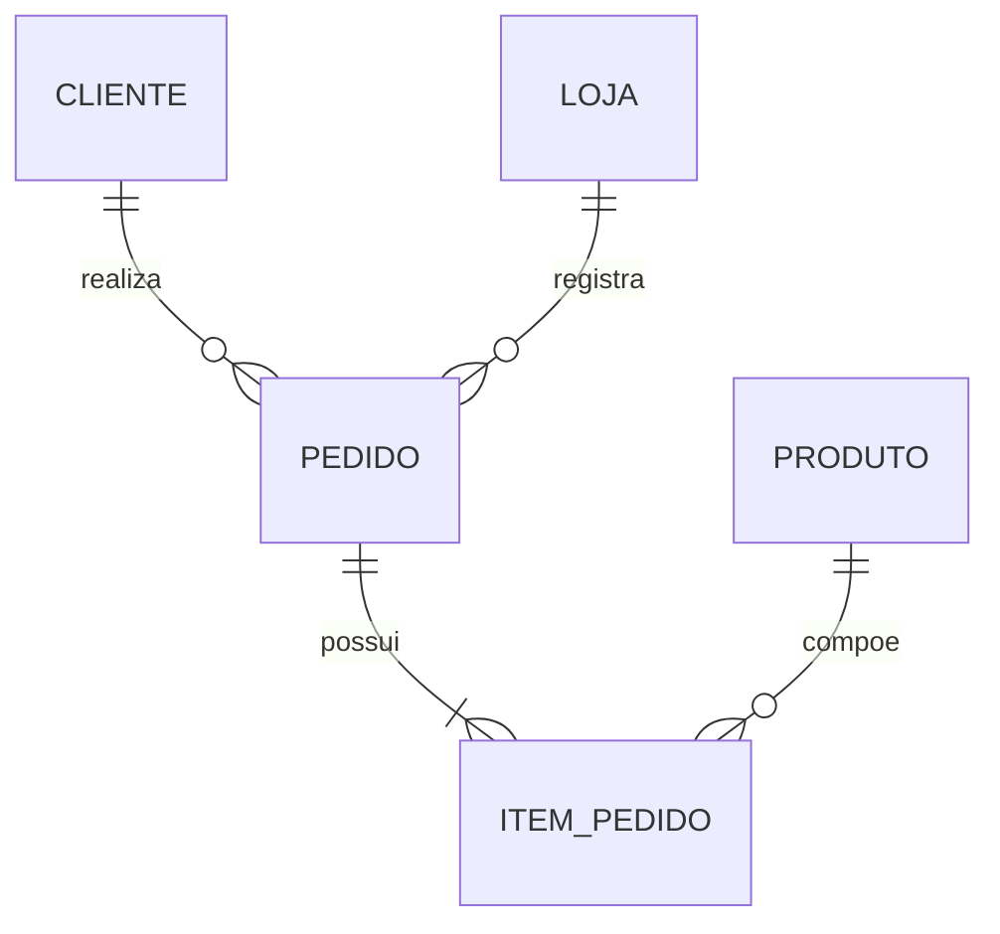
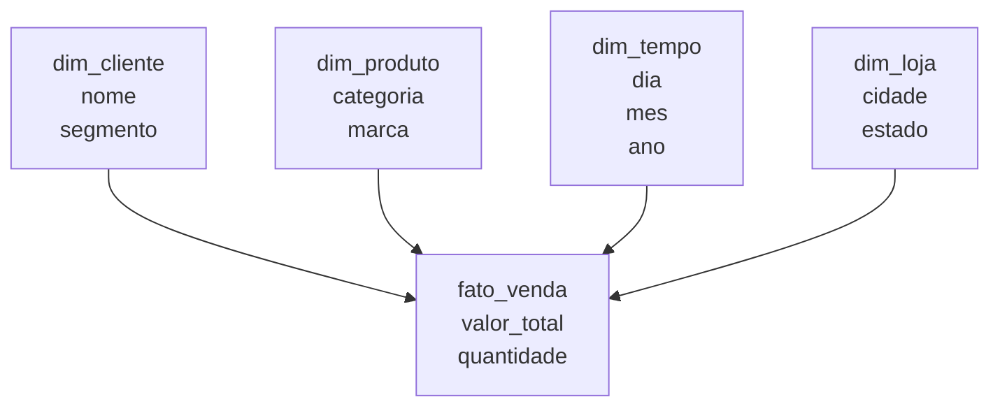

# Modelagem de Dados

> *"Modelar dados é transformar a linguagem do negócio em estruturas que sistemas conseguem armazenar, validar e consultar."*

← [Voltar ao índice](./0-engenharia-de-dados.md)


## O que é Modelagem de Dados?

Modelagem de dados é o processo de representar entidades, atributos, relacionamentos, regras e restrições de um domínio de negócio. Ela cria uma ponte entre o entendimento conceitual do negócio e a implementação física em bancos, Data Warehouses, Data Lakes ou Lakehouses.

Em engenharia de dados, modelagem é essencial porque influencia:

- Qualidade e consistência dos dados.
- Facilidade de consulta por analistas e aplicações.
- Performance de leitura e escrita.
- Governança, documentação e lineage.
- Custo de armazenamento e processamento.
- Capacidade de evolução do sistema.


## Os Três Níveis de Modelagem

| Nível | Foco | Público principal | Resultado |
|---|---|---|---|
| Conceitual | Negócio | Stakeholders, analistas, produto | Entidades e relações em alto nível |
| Lógico | Estrutura | Analistas, engenheiros, arquitetos | Tabelas, atributos, chaves e regras |
| Físico | Implementação | Engenheiros, DBAs, plataforma | DDL, tipos, índices, partições, formatos |


## Modelagem Conceitual

A modelagem conceitual descreve o domínio sem se prender a tecnologia, banco de dados ou detalhes de implementação. O objetivo é alinhar linguagem e entendimento.

**Perguntas principais:**
- Quais são as entidades importantes do negócio?
- Como elas se relacionam?
- Quais eventos precisam ser registrados?
- Quais regras de negócio precisam ser respeitadas?
- Quais conceitos têm nomes diferentes em áreas diferentes?

**Exemplo de domínio de vendas:**



**Entidades comuns:**
- Cliente
- Produto
- Pedido
- Item do pedido
- Loja
- Pagamento

Neste nível, ainda não importa se o destino será PostgreSQL, BigQuery, Snowflake, Delta Lake ou Iceberg.


## Modelagem Lógica

A modelagem lógica traduz o modelo conceitual para uma estrutura mais precisa, com entidades, atributos, chaves, cardinalidades e restrições.

**Define:**
- Tabelas ou estruturas equivalentes.
- Colunas e tipos lógicos.
- Chaves primárias.
- Chaves estrangeiras.
- Regras de nulidade.
- Cardinalidades.
- Restrições de unicidade.
- Histórico e versionamento quando necessário.

**Exemplo lógico simplificado:**

| Tabela | Campos principais | Observações |
|---|---|---|
| `cliente` | `cliente_id`, `nome`, `email`, `documento` | `cliente_id` como chave primária |
| `produto` | `produto_id`, `nome`, `categoria`, `preco_atual` | Produto pode mudar de categoria |
| `pedido` | `pedido_id`, `cliente_id`, `loja_id`, `data_pedido`, `status` | Relaciona cliente e loja |
| `item_pedido` | `pedido_id`, `produto_id`, `quantidade`, `valor_unitario` | Representa granularidade do item |

**Decisão importante:** definir a granularidade. Em analytics, uma tabela fato precisa deixar claro o que cada linha representa.

```text
Grão da fato_venda: uma linha por item vendido em um pedido.
```


## Modelagem Física

A modelagem física adapta o modelo lógico para uma tecnologia específica. Ela considera performance, custo, volume, latência, governança e padrões de acesso.

**Define:**
- Tipos físicos (`INT64`, `STRING`, `NUMERIC`, `TIMESTAMP`, etc.).
- Estratégia de particionamento.
- Clustering, índices ou ordenação.
- Formato de arquivo (`Parquet`, `ORC`, `Avro`).
- Compressão.
- Distribuição de dados.
- Constraints implementadas ou apenas documentadas.
- Estratégia de armazenamento histórico.

**Exemplo físico em um Data Warehouse:**

```sql
CREATE TABLE analytics.fato_venda (
    venda_id STRING,
    pedido_id STRING,
    cliente_id STRING,
    produto_id STRING,
    loja_id STRING,
    data_venda DATE,
    quantidade INT64,
    valor_unitario NUMERIC,
    valor_total NUMERIC
)
PARTITION BY data_venda
CLUSTER BY cliente_id, produto_id;
```

**Exemplo físico em Data Lake:**

```text
s3://datalake/vendas/gold/fato_venda/
  ano=2026/
    mes=07/
      part-00001.parquet
      part-00002.parquet
```


## Entidades, Atributos e Relacionamentos

| Conceito | Definição | Exemplo |
|---|---|---|
| Entidade | Objeto ou conceito relevante | Cliente, Produto, Pedido |
| Atributo | Característica da entidade | nome, email, data_pedido |
| Relacionamento | Associação entre entidades | Cliente realiza Pedido |
| Cardinalidade | Quantidade de ocorrências relacionadas | 1:N, N:N, 1:1 |
| Chave primária | Identificador único | `cliente_id` |
| Chave estrangeira | Referência a outra entidade | `pedido.cliente_id` |


## Normalização

Normalização organiza dados para reduzir redundância e inconsistência, geralmente em sistemas transacionais.

| Forma normal | Ideia principal |
|---|---|
| 1FN | Valores atômicos, sem listas em uma coluna |
| 2FN | Atributos dependem da chave completa |
| 3FN | Atributos não dependem de outros atributos não chave |

**Quando usar:** sistemas OLTP, cadastros, dados mestres e domínios onde integridade transacional é prioridade.

**Quando evitar excesso:** analytics. Consultas analíticas costumam se beneficiar de modelos menos normalizados, como Star Schema.


## Modelagem Dimensional

Modelagem dimensional é otimizada para análise. Ela organiza dados em fatos e dimensões.

### Tabelas Fato

Representam eventos mensuráveis.

**Exemplos:**
- Venda
- Pagamento
- Clique
- Entrega
- Uso de produto

**Métricas comuns:**
- Quantidade
- Valor
- Duração
- Custo
- Contagem

### Tabelas Dimensão

Representam contexto descritivo.

**Exemplos:**
- Cliente
- Produto
- Tempo
- Loja
- Canal
- Região




## Star Schema, Snowflake e OBT

| Modelo | Característica | Quando usar |
|---|---|---|
| Star Schema | Fato central com dimensões desnormalizadas | BI, dashboards, métricas recorrentes |
| Snowflake Schema | Dimensões normalizadas em subdimensões | Hierarquias complexas e redução de redundância |
| One Big Table (OBT) | Tabela larga e desnormalizada | Consumo simples, camada final, performance em algumas engines |

Esses padrões também são discutidos em [Arquitetura de Dados](./1-arquitetura-de-dados.md), mas aqui o foco é a decisão de modelagem.


## Data Vault

Data Vault é um padrão voltado para integração histórica e auditável de múltiplas fontes.

| Componente | Função |
|---|---|
| Hub | Chave de negócio principal |
| Link | Relacionamento entre hubs |
| Satellite | Atributos e histórico |

**Use quando:**
- Há muitas fontes com mudanças frequentes.
- Rastreabilidade histórica é crítica.
- O ambiente precisa preservar a origem e o momento de cada alteração.

**Evite quando:** o projeto é simples, pequeno ou precisa apenas de um modelo dimensional direto para BI.


## Modelagem para Data Lake e Lakehouse

Em Data Lakes e Lakehouses, modelagem também envolve camadas e formatos.

| Camada | Papel de modelagem |
|---|---|
| Bronze | Preserva dados brutos e metadados de ingestão |
| Silver | Aplica limpeza, deduplicação, tipos e chaves |
| Gold | Modela dados para consumo analítico, métricas ou produtos |

**Boas práticas:**
- Preserve dados brutos sempre que possível.
- Defina contratos e schemas na camada Silver.
- Modele a camada Gold conforme o caso de uso.
- Use table formats quando precisar de upserts, deletes e time travel.
- Documente o grão de cada tabela.


## Decisões Importantes de Modelagem

| Decisão | Pergunta |
|---|---|
| Grão | O que uma linha representa? |
| Chave | Como identificar unicamente cada registro? |
| Histórico | Mudanças sobrescrevem ou geram nova versão? |
| Nulidade | Campo pode ser nulo? O que nulo significa? |
| Cardinalidade | Uma entidade se relaciona com quantas da outra? |
| Desnormalização | Vale duplicar dados para facilitar consulta? |
| Performance | Como os dados serão filtrados, agregados e unidos? |
| Governança | Quem é dono, qual SLA e quais regras de acesso? |


## Erros Comuns

- Não definir o grão da tabela fato.
- Misturar métricas de granularidades diferentes na mesma tabela.
- Usar nomes técnicos que o negócio não entende.
- Criar chaves sem estabilidade.
- Ignorar histórico de mudanças.
- Normalizar demais modelos analíticos.
- Desnormalizar cedo demais sem entender padrões de consulta.
- Não documentar regras de cálculo.
- Não distinguir data do evento, data de processamento e data de ingestão.


## Checklist de Modelagem

- O modelo conceitual foi validado com o negócio?
- O modelo lógico tem chaves, cardinalidades e regras claras?
- O modelo físico considera a tecnologia de destino?
- O grão de cada fato está documentado?
- As dimensões têm estratégia para mudanças históricas?
- As tabelas possuem owners e descrição?
- Campos sensíveis foram classificados?
- O modelo suporta reprocessamento e auditoria?
- A nomenclatura é consistente?
- As principais queries foram consideradas?


## Referências

- **The Data Warehouse Toolkit** — Ralph Kimball e Margy Ross
- **Building the Data Warehouse** — W. H. Inmon
- **Data Modeling Made Simple** — Steve Hoberman
- **Fundamentals of Data Engineering** — Joe Reis e Matt Housley
- [Kimball Group Techniques](https://www.kimballgroup.com/data-warehouse-business-intelligence-resources/kimball-techniques/)


← [Arquitetura de Dados](./1-arquitetura-de-dados.md) · [Voltar ao índice](./0-engenharia-de-dados.md) · [Cloud e Infraestrutura →](./3-cloud-e-infraestrutura.md)


*Documentação em construção · Portfólio pessoal*
