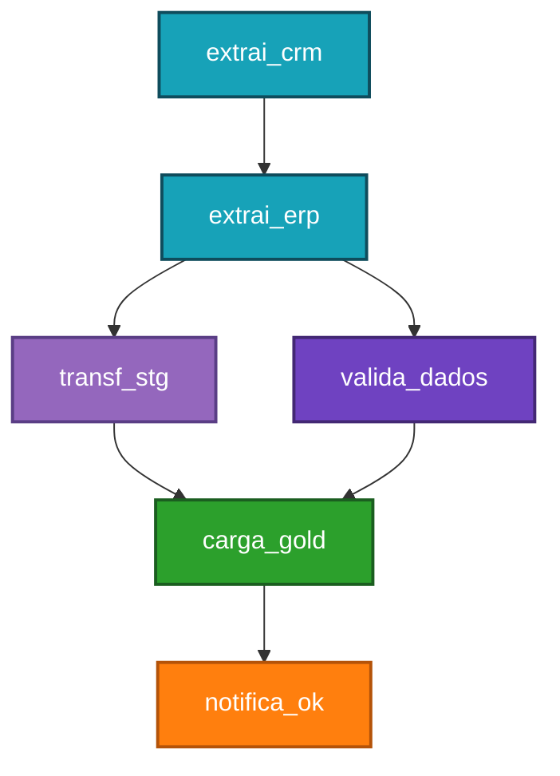

# Orquestração de Dados

> *"Sem orquestração, pipelines são apenas scripts que você torce para que rodem na ordem certa."*

← [Voltar ao índice](./0-engenharia-de-dados.md)


## O que é Orquestração?

Orquestração é o **gerenciamento automatizado da execução, agendamento, monitoramento e recuperação de falhas** de pipelines de dados.

À medida que o número de pipelines cresce, coordená-los manualmente se torna inviável. A orquestração responde perguntas como:
- Em que ordem as tarefas devem executar?
- O que acontece se uma tarefa falhar?
- Como garantir que a Tarefa B só rode após a Tarefa A concluir com sucesso?
- Como reprocessar apenas as execuções que falharam?
- Quem deve ser alertado quando algo dá errado?


## DAG — Grafo Acíclico Dirigido

O conceito central da orquestração moderna é o **DAG (Directed Acyclic Graph)** — Grafo Acíclico Dirigido.

- **Grafo:** conjunto de nós (tarefas) conectados por arestas (dependências)
- **Dirigido:** as dependências têm direção (A → B significa B depende de A)
- **Acíclico:** não há ciclos — nenhuma tarefa pode depender de si mesma, direta ou indiretamente



O orquestrador garante que cada nó só seja executado após todos os seus nós antecessores concluírem com sucesso.


## Conceitos Fundamentais

### Task / Operator
A unidade básica de um DAG. Uma task representa uma ação atômica: executar um script Python, rodar uma query SQL, chamar uma API, acionar um job Spark, etc.

### Run / DAG Run
Uma execução completa do DAG para um determinado intervalo de tempo (execution date). É possível ter múltiplos runs simultâneos ou histórico de runs anteriores.

### Schedule
Define quando o DAG deve ser executado. Pode ser baseado em:
- **Cron expression:** `0 2 * * *` (todo dia às 02h)
- **Intervalo:** `@daily`, `@hourly`, `@weekly`
- **Evento:** acionado por chegada de arquivo, sensor, API call

### Execution Date (Logical Date)
No Airflow e ferramentas similares, a data de execução é o **intervalo de tempo que o run representa**, não necessariamente o momento em que rodou. Um run do dia 2024-01-15 pode rodar às 02h do dia 16, mas representa os dados do dia 15. Esse conceito é crucial para backfills.

### Backfill
Execução retroativa de um DAG para datas passadas. Essencial para:
- Popular uma nova tabela com dados históricos
- Reprocessar após correção de bug
- Re-executar após mudança de lógica

### Sensor
Tipo especial de task que **aguarda uma condição ser satisfeita** antes de prosseguir. Exemplos: aguardar arquivo no S3, aguardar tabela ser atualizada, aguardar horário específico.

### Retry e Retry Delay
Configuração de quantas vezes uma task deve ser re-tentada em caso de falha, e com quanto tempo de espera entre tentativas.

### SLA
Tempo máximo aceitável para a conclusão de uma task ou DAG. Se ultrapassado, o orquestrador dispara alertas.

### Timeout
Tempo máximo que uma task pode rodar antes de ser cancelada automaticamente.


## Ferramentas de Orquestração

### 🌬️ Apache Airflow
O orquestrador mais popular e amplamente adotado na indústria. DAGs são definidos como código Python, o que oferece grande flexibilidade.

**Características:**
- DAGs definidos em Python puro
- Interface web rica para monitoramento e depuração
- Grande ecossistema de providers (AWS, GCP, dbt, Spark, etc.)
- Comunidade enorme e bem documentada
- Curva de aprendizado moderada

**Versões gerenciadas:** Astronomer, Amazon MWAA, Google Cloud Composer.

**Exemplo de DAG:**
```python
from airflow import DAG
from airflow.operators.python import PythonOperator
from airflow.providers.dbt.cloud.operators.dbt import DbtCloudRunJobOperator
from datetime import datetime, timedelta

default_args = {
    "owner": "data-engineering",
    "retries": 2,
    "retry_delay": timedelta(minutes=5),
    "email_on_failure": True,
    "email": ["data-team@empresa.com"],
}

with DAG(
    dag_id="pipeline_vendas_diario",
    default_args=default_args,
    schedule_interval="0 2 * * *",  # todo dia às 02h
    start_date=datetime(2024, 1, 1),
    catchup=False,
    tags=["vendas", "producao"],
) as dag:

    extrai_dados = PythonOperator(
        task_id="extrai_dados_crm",
        python_callable=extrair_crm,
    )

    valida_dados = PythonOperator(
        task_id="valida_dados",
        python_callable=validar_com_great_expectations,
    )

    transforma_dbt = DbtCloudRunJobOperator(
        task_id="roda_dbt",
        job_id=12345,
    )

    extrai_dados >> valida_dados >> transforma_dbt
```


### 🌊 Prefect
Orquestrador moderno com foco em experiência do desenvolvedor e facilidade de uso. Menos verboso que o Airflow.

**Características:**
- API Python mais simples e intuitiva
- Deployments flexíveis (local, cloud, Kubernetes)
- Prefect Cloud para monitoramento gerenciado
- Melhor suporte a flows dinâmicos e parametrizados
- Mais fácil de testar localmente

**Exemplo:**
```python
from prefect import flow, task
from prefect.tasks import task_input_hash
from datetime import timedelta

@task(cache_key_fn=task_input_hash, cache_expiration=timedelta(hours=1))
def extrai_dados(data_inicio: str) -> list:
    # extração de dados
    return dados

@task(retries=3, retry_delay_seconds=60)
def transforma(dados: list) -> None:
    # transformação
    pass

@flow(name="pipeline-vendas")
def pipeline_vendas(data_inicio: str = "2024-01-01"):
    dados = extrai_dados(data_inicio)
    transforma(dados)

if __name__ == "__main__":
    pipeline_vendas()
```


### 🌟 Dagster
Orquestrador com foco em **ativos de dados (data assets)** ao invés de tasks. Em vez de pensar em "o que executar", pensa-se em "quais dados produzir". Excelente integração com dbt e observabilidade nativa.

**Características:**
- Paradigma asset-centric (Software-Defined Assets)
- Type system para inputs e outputs
- Observabilidade e lineage nativos
- Integração profunda com dbt, Spark, Airbyte
- Interface web moderna

**Quando preferir:** times que querem observabilidade e governança desde o início, projetos novos sem legado Airflow.


### ⚡ Mage
Orquestrador mais recente, com interface visual + código. Foco em produtividade e facilidade de onboarding.

**Quando preferir:** times menores, prototipagem rápida, quem quer uma experiência mais visual.


## Comparativo das Ferramentas

| Critério | Airflow | Prefect | Dagster | Mage |
|----------|---------|---------|---------|------|
| Popularidade | ⭐⭐⭐⭐⭐ | ⭐⭐⭐⭐ | ⭐⭐⭐ | ⭐⭐ |
| Curva de aprendizado | Alta | Média | Média | Baixa |
| Paradigma | Task-centric | Flow-centric | Asset-centric | Visual + código |
| Observabilidade | Básica | Boa | Excelente | Boa |
| Ecossistema | Enorme | Crescendo | Crescendo | Pequeno |
| Self-hosted | Sim | Sim | Sim | Sim |
| Managed cloud | Astronomer, MWAA | Prefect Cloud | Dagster Cloud | Mage Cloud |


## Padrões de Orquestração

### Dependências Sequenciais
```
task_a >> task_b >> task_c
```

### Dependências Paralelas
```
task_a >> [task_b, task_c] >> task_d
```

### Cross-DAG Dependencies
Um DAG aguarda a conclusão de outro DAG antes de iniciar. Útil para separar responsabilidades entre pipelines.

### Sensor Pattern
Uma task fica em polling aguardando uma condição externa:
```
aguarda_arquivo_s3 >> processa_arquivo >> notifica
```

### Dynamic Tasks
Geração de tasks em tempo de execução, com base nos dados. Por exemplo: criar uma task por arquivo encontrado em um diretório, sem saber antecipadamente quantos arquivos existirão.


## Monitoramento e Alertas

Um orquestrador eficiente deve notificar proativamente quando algo sai do esperado:

**Tipos de alerta:**
- Task falhou após N retries
- DAG não iniciou no horário esperado
- Tempo de execução excedeu o SLA
- Dados não foram atualizados dentro do prazo (data freshness)

**Canais comuns:** Slack, e-mail, PagerDuty, OpsGenie.

**Métricas a monitorar:**
- Taxa de sucesso de DAGs e tasks
- Tempo médio de execução por DAG
- Número de retries por período
- Backlog de tasks aguardando execução (queue depth)


## Boas Práticas

**DAGs atômicos:** cada DAG tem uma responsabilidade clara e bem definida. Evite mega-DAGs com dezenas de responsabilidades misturadas.

**Idempotência em todas as tasks:** qualquer task deve poder ser re-executada sem efeitos colaterais. Ver [Pipelines de Dados](./5-pipelines-de-dados.md).

**Parâmetros, não hard-codes:** datas, ambientes e configurações devem ser parametrizados, não embutidos no código.

**Catchup com cuidado:** ao ativar um DAG com `catchup=True` e `start_date` antiga, o Airflow criará runs para todos os intervalos passados. Isso pode sobrecarregar o ambiente.

**Versione seus DAGs:** use Git para todo o código de orquestração. Nunca edite DAGs diretamente em produção.

**Separe ambientes:** mantenha DAGs de desenvolvimento e produção em ambientes isolados, com dados e credenciais diferentes.

**Documente:** adicione descrição e tags aos DAGs para facilitar a descoberta e o entendimento.


## Referências

- [Apache Airflow Documentation](https://airflow.apache.org/docs/)
- [Prefect Documentation](https://docs.prefect.io/)
- [Dagster Documentation](https://docs.dagster.io/)
- **Data Pipelines Pocket Reference** — James Densmore (O'Reilly)
- [Awesome Apache Airflow (GitHub)](https://github.com/jghoman/awesome-apache-airflow)


← [Pipelines de Dados](./5-pipelines-de-dados.md) · [Voltar ao índice](./0-engenharia-de-dados.md) · [Qualidade de Dados →](./7-qualidade-de-dados.md)


*Documentação em construção · Portfólio pessoal*
