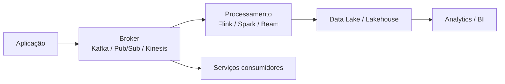

# Streaming e Arquiteturas Orientadas a Eventos

> *"Em sistemas orientados a eventos, dados não são apenas armazenados; eles fluem, sinalizam mudanças e acionam decisões."*

← [Voltar ao índice](./0-engenharia-de-dados.md)


## O que é Streaming?

Streaming é o processamento contínuo de dados à medida que eventos chegam. Diferente do batch, que processa conjuntos fechados, streaming lida com fluxo constante, baixa latência, eventos fora de ordem, estado e tolerância a falhas.

**Casos de uso:**

- Detecção de fraude.
- Monitoramento de sensores.
- Clickstream.
- CDC de bancos transacionais.
- Alertas operacionais.
- Atualização de dashboards quase em tempo real.
- Personalização de experiência do usuário.


## Evento

Um evento representa algo que aconteceu.

```json
{
  "event_id": "evt_123",
  "event_type": "order_created",
  "order_id": "ord_456",
  "customer_id": "cus_789",
  "event_time": "2026-07-09T10:30:00Z"
}
```

**Boas práticas:**

- Eventos devem ser imutáveis.
- Inclua identificador único.
- Inclua timestamp do evento.
- Inclua versão do schema.
- Evite depender apenas do horário de processamento.


## Arquitetura Orientada a Eventos



Arquiteturas orientadas a eventos desacoplam produtores e consumidores. Um sistema publica eventos e vários consumidores podem reagir sem o produtor conhecer todos os destinos.


## Kafka: Conceitos Essenciais

| Conceito | Descrição |
|---|---|
| Topic | Canal lógico onde eventos são publicados |
| Partition | Divisão de um topic para paralelismo e ordenação por chave |
| Producer | Aplicação que publica eventos |
| Consumer | Aplicação que lê eventos |
| Consumer group | Grupo que divide o consumo entre instâncias |
| Offset | Posição de leitura em uma partição |
| Retention | Período ou tamanho de armazenamento dos eventos |
| Broker | Servidor Kafka |

**Ponto-chave:** Kafka preserva ordem dentro de uma partição, não necessariamente no topic inteiro.


## Particionamento de Eventos

A chave do evento define a partição.

```text
key = customer_id
```

Isso garante que eventos do mesmo cliente tendam a cair na mesma partição e manter ordem relativa.

**Escolha uma boa chave quando:**

- A ordem por entidade importa.
- O processamento mantém estado por entidade.
- Você precisa distribuir carga sem criar skew.


## Schema Registry

Schema Registry controla versões dos schemas de eventos e evita quebra de consumidores.

**Benefícios:**

- Validação de compatibilidade.
- Evolução controlada.
- Documentação do contrato.
- Redução de erros entre times.

**Formatos comuns:**

- Avro
- Protobuf
- JSON Schema


## CDC com Debezium

CDC (Change Data Capture) captura mudanças de bancos a partir de logs transacionais.

```text
PostgreSQL WAL → Debezium → Kafka → Stream processor → Lakehouse
```

**Cuidados:**

- Eventos de insert, update e delete.
- Snapshot inicial.
- Ordenação por chave.
- Reprocessamento a partir de offsets.
- Evolução de schema.
- Tratamento de deletes físicos e lógicos.


## Event Time, Processing Time e Ingestion Time

| Tipo de tempo | Significado |
|---|---|
| Event time | Quando o evento aconteceu na origem |
| Processing time | Quando o sistema processou o evento |
| Ingestion time | Quando o evento entrou na plataforma |

Para analytics e janelas de negócio, `event_time` costuma ser o mais correto. Para operação e SLA, `processing_time` e `ingestion_time` também importam.


## Watermarks e Eventos Atrasados

Eventos podem chegar fora de ordem. Watermark define até quando o sistema espera eventos atrasados.

```text
Janela: 10 minutos
Watermark: aceitar atraso de até 5 minutos
```

**Trade-off:** tolerância maior melhora correção, mas aumenta estado, memória e custo.


## Semânticas de Entrega

| Semântica | Resultado |
|---|---|
| At-most-once | Pode perder, mas não duplica |
| At-least-once | Não perde, mas pode duplicar |
| Exactly-once | Resultado final sem duplicidade observável |

Exactly-once depende da combinação entre broker, processamento, checkpoint, destino transacional e lógica idempotente.


## DLQ e Tratamento de Erros

DLQ (Dead Letter Queue) armazena eventos que não puderam ser processados.

**Use DLQ para:**

- Payload inválido.
- Schema incompatível.
- Dados obrigatórios ausentes.
- Erro de transformação não recuperável.

**Não use DLQ para:** esconder falhas sistêmicas, indisponibilidade de destino ou bugs generalizados.


## Replay

Replay é reprocessar eventos antigos a partir de offsets ou retenção.

**Útil para:**

- Corrigir bug de transformação.
- Recriar uma tabela.
- Alimentar um novo consumidor.
- Recalcular uma janela histórica.

**Pré-requisito:** retenção suficiente e consumidores idempotentes.


## Streaming vs Batch

| Critério | Batch | Streaming |
|---|---|---|
| Latência | Minutos, horas ou dias | Segundos ou menos |
| Complexidade | Menor | Maior |
| Estado | Mais simples | Stateful e contínuo |
| Custo | Pode ser pontual | Geralmente sempre ativo |
| Reprocessamento | Mais simples | Requer replay/checkpoints |
| Melhor para | Relatórios, backfills | Alertas, fraude, eventos ao vivo |


## Boas Práticas

- Modele eventos como fatos imutáveis.
- Use chaves de partição com cuidado.
- Versione schemas.
- Defina política de retenção.
- Garanta idempotência no consumidor.
- Monitore lag, throughput e erros.
- Separe evento de comando.
- Evite payloads enormes.
- Documente contratos entre produtores e consumidores.
- Planeje replay antes de precisar dele.


## Checklist

- O evento tem ID único?
- O evento possui `event_time`?
- Existe schema versionado?
- A chave de partição está correta?
- Há estratégia para eventos atrasados?
- Consumidores são idempotentes?
- DLQ é monitorada?
- Há política de replay?
- Lag é monitorado?
- Existe owner para cada topic/evento?


## Referências

- [Apache Kafka Documentation](https://kafka.apache.org/documentation/)
- [Confluent Schema Registry](https://docs.confluent.io/platform/current/schema-registry/index.html)
- [Debezium Documentation](https://debezium.io/documentation/)
- [Apache Flink Documentation](https://nightlies.apache.org/flink/flink-docs-stable/)
- [Spark Structured Streaming](https://spark.apache.org/docs/latest/structured-streaming-programming-guide.html)
- [Google Cloud Pub/Sub](https://cloud.google.com/pubsub/docs)
- [Amazon Kinesis Documentation](https://docs.aws.amazon.com/kinesis/)


← [Ingestão de Dados](./5-ingestao-de-dados.md) · [Voltar ao índice](./0-engenharia-de-dados.md) · [Armazenamento de Dados →](./7-armazenamento-de-dados.md)


*Documentação em construção · Portfólio pessoal*

