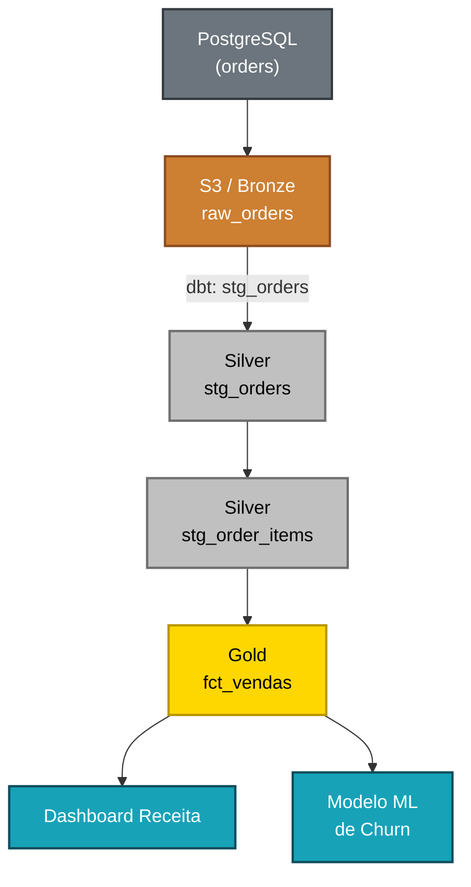

# Observabilidade e Monitoramento

> *"Você não pode melhorar o que não consegue ver. Em dados, cegueira operacional é um risco silencioso."*

← [Voltar ao índice](./0-engenharia-de-dados.md)


## O que é Observabilidade em Dados?

Observabilidade é a capacidade de **entender o estado interno de um sistema a partir de suas saídas externas** — logs, métricas e traces. Na engenharia de dados, significa ter visibilidade suficiente sobre pipelines, dados e infraestrutura para detectar, diagnosticar e resolver problemas rapidamente.

A diferença entre monitoramento e observabilidade:

- **Monitoramento:** verifica se algo específico que você já esperava está OK (ex: "o pipeline rodou?")
- **Observabilidade:** permite responder perguntas que você não havia antecipado (ex: "por que a receita de ontem está 15% menor?")

Um sistema de dados observável responde rapidamente a perguntas como:
- Os pipelines estão rodando no horário esperado?
- Os dados estão frescos o suficiente?
- Onde no pipeline um dado específico foi transformado?
- Por que esta métrica mudou de ontem para hoje?


## Os Três Pilares

### 📋 Logs
Registros detalhados e estruturados de eventos que ocorreram. Permitem reconstruir o que aconteceu durante uma execução.

**O que logar em pipelines de dados:**
- Início e fim de cada etapa
- Volume de registros processados em cada etapa
- Erros e exceções com stack trace completo
- Parâmetros de execução (datas, configurações)
- Duração de cada etapa

**Boas práticas:**
- Logs estruturados em JSON (mais fáceis de consultar e filtrar)
- Nível de log adequado: DEBUG para desenvolvimento, INFO e ERROR para produção
- Incluir contexto: pipeline name, run ID, execution date

```python
import logging
import json

logger = logging.getLogger(__name__)

def processa_vendas(execution_date: str):
    logger.info(json.dumps({
        "event": "pipeline_start",
        "pipeline": "vendas_diario",
        "execution_date": execution_date,
    }))

    try:
        registros = extrair_dados(execution_date)
        logger.info(json.dumps({
            "event": "extracao_concluida",
            "registros_extraidos": len(registros),
        }))
    except Exception as e:
        logger.error(json.dumps({
            "event": "extracao_falhou",
            "error": str(e),
        }))
        raise
```


### 📊 Métricas
Valores numéricos coletados ao longo do tempo que representam o comportamento do sistema.

**Métricas essenciais para pipelines de dados:**

| Métrica | Descrição |
|---------|-----------|
| `pipeline.duration_seconds` | Tempo total de execução |
| `pipeline.success_rate` | % de execuções bem-sucedidas |
| `task.records_processed` | Registros processados por task |
| `task.records_failed` | Registros rejeitados por erros |
| `data.freshness_seconds` | Tempo desde última atualização |
| `data.row_count` | Contagem de registros por tabela |
| `pipeline.retry_count` | Número de retries por execução |
| `infra.cost_usd` | Custo de processamento (cloud) |


### 🔍 Traces (Rastreamento)
Rastreamento distribuído que permite seguir o caminho de uma requisição ou dado através de múltiplos sistemas e etapas. Em dados, isso se traduz em **Data Lineage**.


## Data Lineage (Rastreabilidade)

Lineage é a capacidade de **rastrear a origem e o caminho de um dado** desde sua fonte até o destino final, incluindo todas as transformações que sofreu no caminho.



**Por que lineage é essencial:**
- **Análise de impacto:** "Se eu mudar a tabela X, quais dashboards serão afetados?"
- **Depuração:** "De onde veio esse valor incorreto no dashboard?"
- **Conformidade:** "Onde os dados pessoais de clientes são processados e armazenados?"
- **Confiança:** times de negócio sabem de onde os números vêm

**Ferramentas de Lineage:**
- **OpenLineage:** padrão open source para emissão de eventos de lineage
- **Marquez:** backend open source para coletar e visualizar lineage via OpenLineage
- **DataHub:** plataforma completa de catálogo e lineage (LinkedIn, open source)
- **Atlan / Collibra:** plataformas comerciais de data catalog com lineage
- **dbt:** gera lineage automaticamente entre modelos SQL


## Catálogo de Dados

Um catálogo de dados é um **inventário centralizado e pesquisável** de todos os ativos de dados de uma organização — tabelas, pipelines, dashboards, métricas — com documentação, metadados e informações de qualidade.

**O que um catálogo de dados oferece:**
- Descoberta de dados: "Existe alguma tabela com dados de clientes por região?"
- Documentação: descrição de tabelas, colunas e regras de negócio
- Proprietário dos dados: quem é responsável por cada ativo
- Popularidade: quais tabelas são mais usadas
- Qualidade: indicadores de saúde dos dados
- Lineage: de onde os dados vêm e para onde vão

**Ferramentas:**

| Ferramenta | Tipo | Destaque |
|------------|------|----------|
| DataHub | Open source | LinkedIn, lineage e metadados |
| Apache Atlas | Open source | Ecossistema Hadoop/HDP |
| OpenMetadata | Open source | Moderno, API-first |
| Atlan | Comercial | UX moderna, colaboração |
| Collibra | Comercial | Governança enterprise |
| Alation | Comercial | Busca inteligente e ML |


## Data Freshness (Atualidade)

Freshness é o monitoramento do **quão recentes são os dados** em cada tabela. É uma das métricas mais críticas — dados desatualizados podem levar a decisões erradas sem que ninguém perceba.

**Implementação simples com dbt:**
```yaml
# schema.yml
models:
  - name: fct_vendas
    config:
      meta:
        owner: "time-dados@empresa.com"
    freshness:
      warn_after: {count: 12, period: hour}
      error_after: {count: 24, period: hour}
    loaded_at_field: updated_at
```

**Query de monitoramento:**
```sql
SELECT
    table_name,
    MAX(updated_at) AS ultima_atualizacao,
    DATEDIFF('hour', MAX(updated_at), NOW()) AS horas_desde_update,
    CASE
        WHEN DATEDIFF('hour', MAX(updated_at), NOW()) > 24 THEN 'CRÍTICO'
        WHEN DATEDIFF('hour', MAX(updated_at), NOW()) > 12 THEN 'ATENÇÃO'
        ELSE 'OK'
    END AS status
FROM information_schema.tables
-- adaptado por banco de dados
```


## Alertas e Notificações

A observabilidade só tem valor se os problemas chegam às pessoas certas no momento certo.

**Hierarquia de severidade:**

| Severidade | Exemplo | Canal | Tempo de Resposta |
|------------|---------|-------|-------------------|
| **Crítico** | Pipeline de receita falhou | PagerDuty + Slack | Imediato |
| **Alto** | Dados com mais de 24h de atraso | Slack (canal de alertas) | < 1 hora |
| **Médio** | Volume 20% abaixo do esperado | Slack | < 4 horas |
| **Baixo** | Warning de qualidade não-bloqueante | E-mail / ticket | Próximo dia útil |

**Boas práticas de alertas:**
- Evite alert fatigue: poucos alertas de alta qualidade > muitos alertas ignorados
- Inclua contexto no alerta: o que falhou, quando, qual o impacto provável
- Link direto para o log ou painel de monitoramento
- Defina claramente quem é responsável por cada tipo de alerta


## Ferramentas de Observabilidade

### Observabilidade de Pipelines

**Apache Airflow UI:** monitoramento nativo de DAGs, histórico de execuções, logs por task.

**Grafana + Prometheus:** stack clássica para métricas de infraestrutura. Cria dashboards customizados com dados de Airflow, Spark, Kafka, etc.

**Datadog:** plataforma comercial completa para logs, métricas, traces e APM. Tem integração com Airflow, Spark e principais ferramentas de dados.

### Observabilidade de Dados (Data Observability)

**Monte Carlo:** líder de mercado em data observability. Monitora automaticamente volume, freshness, distribuição e schema de tabelas. Detecta anomalias com ML sem necessidade de definir thresholds.

**Bigeye:** similar ao Monte Carlo, com foco em velocidade de setup.

**Elementary:** open source, integrado ao dbt. Gera relatórios de qualidade e observabilidade a partir dos testes do dbt.

**Metaplane:** foco em Data Warehouse (BigQuery, Snowflake).


## Implementando Observabilidade na Prática

### Passo 1: Logs Estruturados
Garanta que todos os pipelines emitem logs estruturados (JSON) com contexto suficiente.

### Passo 2: Métricas de Pipeline
Instrumente os pipelines para emitir métricas de duração, volume e erros. Crie dashboards centralizados.

### Passo 3: Freshness Monitoring
Implemente monitoramento de atualidade para todas as tabelas críticas, com alertas configurados.

### Passo 4: Data Quality Checks
Adicione testes de qualidade (dbt tests, Great Expectations) e monitore as taxas de sucesso ao longo do tempo.

### Passo 5: Lineage
Implemente lineage para as tabelas mais críticas, permitindo análise de impacto e depuração.

### Passo 6: Catálogo
Centralize a documentação dos ativos de dados em um catálogo, com proprietários definidos.


## SLAs e SLOs de Dados

Assim como serviços de software têm SLAs (Service Level Agreements), times de dados devem definir **SLOs (Service Level Objectives)** para seus produtos de dados:

**Exemplos de SLOs:**
- Dashboard de receita atualizado até às 08h todos os dias úteis (99,5% do tempo)
- Tabela `fct_vendas` com dados do dia anterior disponíveis até às 06h
- Taxa de sucesso dos pipelines críticos ≥ 99% no mês
- Tempo de resolução de incidentes críticos de dados < 2 horas

Definir SLOs cria responsabilidade, alinha expectativas com os stakeholders e orienta o investimento em confiabilidade.


## Referências

- [OpenLineage Specification](https://openlineage.io/)
- [DataHub Documentation](https://datahubproject.io/docs/)
- [Elementary Data](https://www.elementary-data.com/)
- [Monte Carlo Data](https://www.montecarlodata.com/)
- **Fundamentals of Data Engineering** — Joe Reis & Matt Housley (O'Reilly)


← [Qualidade de Dados](./7-qualidade-de-dados.md) · [Voltar ao índice](./0-engenharia-de-dados.md) · [Governança e Segurança →](./9-governanca-e-seguranca.md)


*Documentação em construção · Portfólio pessoal*
